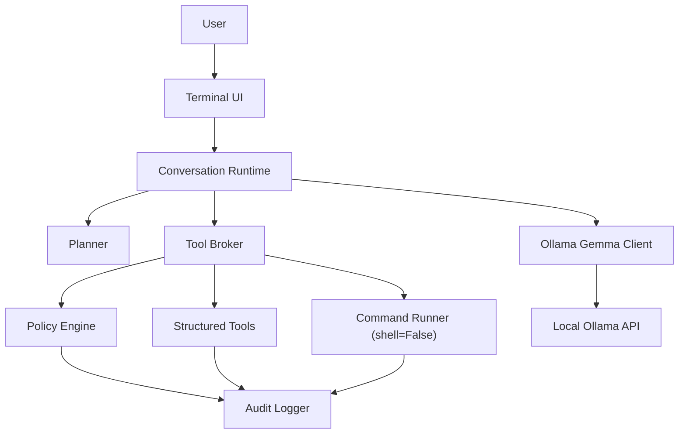

# ShellPilot

[](https://github.com/lavindeep/ShellPilot/actions/workflows/ci.yml)

[](LICENSE)

**A local-first AI shell harness for your terminal, powered by Ollama.**

ShellPilot gives you one terminal conversation that can answer questions, inspect your project, plan multi-step work, edit files, and run commands with risk-based approvals — all against a local model (Gemma 4 via [Ollama](https://ollama.com)). Local by default: your code and your shell never leave your machine — no telemetry, no API keys. Optional, off-by-default web grounding (`[tools] web = true`) contacts only the search provider and the pages you approve, one approved request at a time.


## What it does

- **One conversation loop.** No separate chat/agent modes — ask a question and it answers; ask for work and it inspects, plans, and acts.
- **A terminal UI that earns its keep.** Live-rendered markdown responses, Claude-Code-style diff panels with line numbers and word-level highlights, risk badges (`MEDIUM`/`HIGH`/`BLOCKED`), a plan panel with checklist progress, input history and tab-completed slash commands, and an aviation-themed spinner (`taxiing… climbing… cruising…`). Degrades cleanly under `NO_COLOR`, pipes, and ASCII-only terminals.
- **Plans are artifacts.** Complex tasks get a visible, editable plan saved to `.shellpilot/tasks/<task-id>/PLAN.md`, approved by you before execution and updated as work progresses — once approved, the plan executes straight through in a single turn without pausing to ask for permission it already has. If the model hits a roadblock, it records the blocker and replans instead of pushing through.
- **Deterministic security first.** Command risk is classified by deterministic policy (executable, flags, targets, shell metacharacters, workspace boundary) — never by asking the model whether something is safe. Agent commands run with `shell=False`; there is no agent-accessible raw shell.
- **Dangerous commands are explained.** High-risk actions show the exact command, a short model-written purpose explanation, and require you to literally type `run`. The explanation can never downgrade the deterministic risk.
- **Read-before-write edits.** File edits are anchored patches validated against a content-hashed snapshot of what was actually read — no blind writes, no stale writes, diffs shown before approval.
- **Memory with consent.** The model can propose remembering preferences and project facts (`memory_propose_update`), but every update shows a preview and needs your approval — it never writes memory silently. `/memory show|add|forget|compact`, `/prefs` to inspect; stored as plain JSON you can edit by hand.
- **Sessions that survive.** Every conversation is journaled (redacted) to `.shellpilot/sessions/`; `shellpilot --resume` picks up where you left off, and `/export` writes a markdown transcript. Long sessions stay healthy via selective compaction that digests old tool output first and never drops your instructions (`/compact auto on|off`).
- **Local audit log.** Every approval, command, and edit is recorded as redacted JSONL on your machine (`/logs` to view).
- **Manual Shell.** `/shell` drops you into a clearly-bannered raw `shell=True` mode that the model never touches.
- **Model picker at boot.** When multiple Ollama models are installed, ShellPilot presents a numbered list at startup — tested families (`gemma4`, `qwen3.5`) are tagged `tested`; everything else gets a dim `untested` note. Press Enter to accept the default; the choice is remembered per workspace in `.shellpilot/state.json`. Pass `--model <name>` to skip the picker entirely.
- **No cold-start stall.** ShellPilot warms the selected model via Ollama's keep-alive preload before your first question, shown as a `fueling <model>` spinner. The first-question latency spike that previously stalled on model loading is gone.
- **Opt-in web grounding — privacy first.** `[tools] web = true` registers `web_search` (DuckDuckGo, no API key) and `web_fetch` (readable text extraction) — both off by default. Every outbound request requires individual approval in every security profile; no web call ever runs silently. Queries and URLs are audit-logged with secrets redacted. The local-first promise stays intact: opt-out is the default state, and there is no env-var toggle that can bypass the config-file act of opting in.
- **Skills v2.** ShellPilot loads small markdown skills from builtin and user roots, then deterministically injects only the relevant guidance for the current runtime state. v0.7.0 ships four builtins: `planning` mode references, always-on `context-management`, `web-grounding` when web tools are registered, and opt-in `skill-authoring`. References and templates are bundled read-only resources; scripts are discovered and shown but not executed.
- **Image input.** `/attach <path>` stages an image file (png, jpg, gif, webp, ≤ 10 MB) to send with your next message; vision-capable models see it automatically. The model can also open workspace images itself via the `view_image` tool — auto-approved at the same level as `read_file`, workspace-boundary enforced. Images are never stored in transcripts; only the path and sha256 are recorded.
- **Testable without a model.** A fake LLM client exercises the entire runtime in CI — including malformed tool calls and stuck loops. No GPU, no Ollama needed for the test suite.

## How it works



The model talks to seven flat-schema tools (`read_file`, `list_dir`, `search_text`, `env_info`, `run_command`, `write_file`, `patch_file`) plus two plan tools. Small local models make mistakes, so recovery is the main loop, not an edge case: malformed calls get one schema-reminder retry, repeated failures trigger the roadblock protocol, and tool/turn budgets stop runaways. The [Phase 0.5 benchmark](docs/benchmarks/2026-06-10-gemma4-e4b.md) measured `gemma4:e4b` at 100% well-formed tool calls and 100% byte-exact span reproduction, which is what makes anchored editing viable.

## Install

Requirements: Python 3.11+, [Ollama](https://ollama.com) running locally, and a Gemma 4 model:

```bash
ollama pull gemma4:e4b
```

`gemma4:e4b` is the default; `qwen3.5` is also natively supported.

Then clone and install:

```bash
git clone https://github.com/lavindeep/ShellPilot.git
cd ShellPilot
python3 -m venv .venv
source .venv/bin/activate
python -m pip install -e ".[dev]"
shellpilot doctor   # verify Python, Ollama, models, and paths
shellpilot          # start the conversation
```

## Usage

```text
$ shellpilot
ShellPilot 0.7.0
gemma4:e4b · balanced · /help for commands

~/my-project · gemma4:e4b · balanced
❯ what does this repo do?
...
~/my-project · gemma4:e4b · balanced
❯ fix the off-by-one bug in count_lines and run the tests
(plan panel → you approve → diff panel with risk badge → you approve → tests run)
```

| Command | Purpose |
|---|---|
| `shellpilot` | Interactive session in the current directory (`--cwd` to point elsewhere). |
| `shellpilot --resume [id]` | Resume the latest (or a specific) saved session in this workspace. |
| `shellpilot --model <name>` | Start with a specific model, skipping the boot picker. |
| `shellpilot doctor` | Check Python, Ollama reachability, installed models, and writable paths. |
| `shellpilot config show` | Print resolved config with the source layer of every key. |
| `shellpilot config edit` | Show the user config file path for hand-editing. |
| `/help` | All slash commands. |
| `/status` | Model, profile, workspace, and context usage. |
| `/clear` | Clear the visible conversation (with confirmation). |
| `/plan`, `/plan path`, `/plan cancel`, `/plan revise <text>` | Inspect, locate, or steer the active plan. |
| `/diff` | Diffs from this session's agent edits. |
| `/memory show`, `/memory add <text>`, `/memory forget <id>`, `/memory compact` | Inspect, curate, and model-compact stored memory. |
| `/prefs show`, `/prefs edit` | Inspect behavior preferences; show memory file paths. |
| `/compact`, `/compact status`, `/compact auto on\|off` | Compact context now; show usage; toggle auto-compaction. |
| `/export <path>` | Export this session's transcript to markdown. |
| `/model`, `/model list`, `/model use <name>` | Show active model; list all installed models with tested/untested tags; switch model. |
| `/profile`, `/profile use <supervised\|balanced>` | Show or switch the security profile for this session (switch lasts until exit; set `[runtime] security_profile` in config.toml to make it permanent). |
| `/tools` | List tools available under the active profile. |
| `/config show`, `/config edit`, `/config reload` | Print resolved config; show config path; reload from disk. |
| `/config set <key> <value>`, `/config unset <key>`, `/config reset` | Set, remove, or clear all runtime overrides for this session (persisted across restarts in `overrides.json`). |
| `/context` | Per-block context breakdown: each system-prompt block with its source, token estimate, injection state, and skip reason. |
| `/skills` | List all discovered skills with root, triggers, status, active state, resources, scripts, and reasons. |
| `/cwd`, `/cwd set <path>` | Show or change the workspace boundary. |
| `/logs` | Recent audit events for this session. |
| `/logs all` | Recent audit events across all sessions. |
| `/shell` | Manual Shell (raw `shell=True`, model not involved). `/exit-shell` returns. |
| `/attach <path>` | Stage an image to send with your next message (vision models). Bare `/attach` lists staged images. |
| `/doctor` | Check Python, Ollama, models, and paths from within a session. |
| `/exit`, `/quit` | Exit ShellPilot. |

### Security profiles

| Profile | Behavior |
|---|---|
| `supervised` | Auto-run read-only tools; ask before every side-effecting tool and every command. |
| `balanced` (default) | Auto-run read-only tools and low-risk commands (`ls`, `git status`, `pytest`); ask for writes, installs, deletes, network, and anything risky. |

Both profiles ask before every network request (web search, web fetch). High-risk commands (`rm -rf`, `sudo`, force-pushes, credential paths, …) always show a purpose explanation and require typing `run`. Explicitly blocked commands are rejected outright in both profiles.

### Configuration

Layered, highest wins: CLI flags → `SHELLPILOT_*` env vars → `<repo>/.shellpilot/config.toml` → user `config.toml` → defaults. See [`docs/DESIGN.md`](docs/DESIGN.md) section 17 for the full schema.

```toml
[model]
default = "gemma4:e4b"
keep_alive = "5m"        # how long Ollama keeps the model warm between prompts

[model.options]          # verbatim Ollama options; ShellPilot doesn't validate keys
# repeat_penalty = 1.3   # e.g. to curb repetition; num_ctx is reserved to the budget

[runtime]
security_profile = "balanced"

[tools]
web = false              # set true to enable web_search + web_fetch (always asks)

[skills]
enabled = ["my-skill"]  # user skill folder names to activate (config-file only)

[ui]
theme = "default"
glyphs = "auto"          # auto | unicode | ascii
```

**Skills.** User skills live in `<config_dir>/skills/<name>/SKILL.md` (frontmatter plus a small body injected only when its trigger fires). The config dir is platform-native via `platformdirs` — on macOS that is `~/Library/Application Support/shellpilot/`; on Linux `~/.config/shellpilot/`. List opt-in user skills, and the builtin `skill-authoring`, under `[skills] enabled`; this key is config-file only and cannot be set via env vars, `/config set`, or the overrides layer. Builtins are harness-managed: `planning` follows plan status, `context-management` is always on, and `web-grounding` activates only when web tools are actually registered. Skills may include read-only `references/` and `templates/`; `scripts/manifest.json` is discovered and validated for visibility, but script execution is deferred to v0.8.0. See `docs/DESIGN.md` §23 for the full schema and trigger rules.

**Runtime overrides.** `/config set <key> <value>` and `/config unset <key>` write a lightweight override that survives restarts (stored in `.shellpilot/overrides.json`); `/config reset` clears all overrides at once. Most `[runtime]` and `[model]` keys are reachable this way; `[skills]` is explicitly excluded.

Behavior instructions: ShellPilot reads `AGENTS.md` from your config directory (global) and the workspace root (project) at session start and follows them. It never writes those files.

## Development

```bash
ruff check . && ruff format --check . && mypy shellpilot --strict && pytest
```

The same four checks run in CI on Python 3.11 and 3.14 — against the fake model only, so CI needs no GPU or Ollama. To re-measure a local model's capabilities (tool-call reliability, exact-span reproduction, chaining, stopping):

```bash
python scripts/benchmark_model.py --model gemma4:e4b --trials 10
```

## Roadmap

v2 shipped across v0.2.0 (terminal UI redesign, [DESIGN.md](docs/DESIGN.md) section 31), v0.3.0 (memory system, session resume/export, selective compaction), and v0.4.0 (boot model picker with tested/untested tags, model preload eliminating cold-start stall, multi-model support for gemma4 + qwen3.5, plan-execution straight-through). v0.5.0 added opt-in web grounding and image input/attachments. v0.6.0 added Skills v1, `/context`, `/skills`, runtime config editing, plan-state restore on `--resume`, and config-validation hardening. v0.7.0 adds Skills v2: trigger-driven builtin guidance, read-only references/templates, enriched skill/context visibility, and script manifest discovery without execution. v0.8.0 is reserved for controlled script execution with its own safety design; v0.9.0 can add richer workflow skills such as debugging, verification, review, and git. A `trusted-local` security profile, heavier capability packs (tools/handlers/permissions), and `/undo` remain future candidates — per section 25.2.

## License

[MIT](LICENSE)
