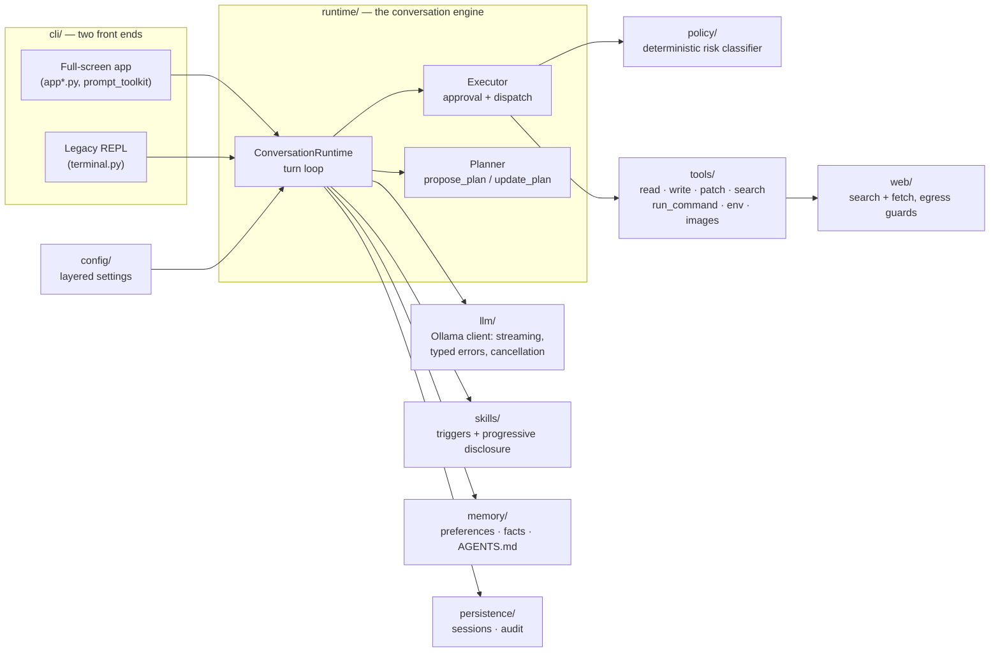

# ShellPilot

**A local-first AI shell harness for your terminal.** ShellPilot turns a small local model — served by [Ollama](https://ollama.com), running entirely on your machine — into a careful terminal agent: it reads code, edits files, runs commands, plans multi-step work, and searches the web when you allow it, with every risky action classified deterministically and approved by you before it happens.

[](https://github.com/lavindeep/ShellPilot/actions/workflows/ci.yml)
[](https://www.python.org/downloads/)
[](LICENSE)

No accounts. No API keys. No telemetry. Nothing leaves your machine unless you explicitly opt in — and when you do, the UI says so.

```text
╭──────────────────────────────────────────────────────────────────────╮
│  scrolling transcript — responses, tool calls, diffs, plan cards     │
│                                                                      │
│  ⏺ run_command   pytest tests/test_parser.py                         │
│  ✓ 14 passed                                                         │
│                                                                      │
╰──────────────────────────────────────────────────────────────────────╯
╭─ approve? ───────────────────────────────────────────────────────────╮
│ ▌                                                                    │
╰───────────────────────────────────────────────────────────────────────╯
 ~/project · gemma4:e4b · balanced · ⎇ main · ● local          11% ctx
```

*Illustrative sketch of the full-screen app: transcript pane, modal input dock (the border label and color change with what it is asking — amber for a pending approval, red when a high-risk action needs the word `run` typed), and the persistent status bar.*

---

## Table of contents

- [Why ShellPilot](#why-shellpilot)
- [Feature tour](#feature-tour)
  - [The full-screen terminal app](#the-full-screen-terminal-app)
  - [Safety and approvals](#safety-and-approvals)
  - [Planning](#planning)
  - [Skills](#skills)
  - [Web grounding](#web-grounding)
  - [Memory, sessions, and context](#memory-sessions-and-context)
  - [Cloud models (opt-in)](#cloud-models-opt-in)
- [Getting started](#getting-started)
- [Everyday usage](#everyday-usage)
- [Configuration](#configuration)
- [The security model](#the-security-model)
- [Architecture](#architecture)
- [Development](#development)
- [Platform support](#platform-support)
- [Roadmap](#roadmap)
- [License](#license)

---

## Why ShellPilot

Most terminal agents assume a frontier model and a cloud connection. ShellPilot starts from the opposite premise: a **small model running on a laptop** can do genuinely useful shell work — *if* the harness around it is honest about what the model can and cannot be trusted with.

That premise produces three design rules that shape everything here:

1. **Determinism where it matters.** Safety, correctness, and control flow are never delegated to the model. The command classifier that decides what needs your approval is pure deterministic code; the explanation you see for a risky command is generated from the classifier's own reasons, not model prose; an edited command always re-enters the classifier. You cannot prompt-inject your way past a policy that never asks the model's opinion.
2. **Local-first as a guarantee, not a default.** The only network endpoint a stock session touches is your own Ollama server on localhost. Web tools are off until you enable them; cloud models are off until you enable them *and* consent per session; both states are visible in the UI at all times.
3. **Finished beats featureful.** Small releases, every behavior specified in [`docs/DESIGN.md`](docs/DESIGN.md) (the spec of record), and a phase gate — lint, format, strict typing, 1,600+ tests — that must be green for every commit.

The tested baseline is `gemma4:e4b`, a model that fits on modest hardware — so the design assumes a capable-but-fallible model and treats recovery as the main loop, not an edge case. It is also, plainly, a side project and a portfolio piece: a place to work out what careful engineering looks like when the "user" of half your APIs is a small language model.

---

## Feature tour

### The full-screen terminal app

Since v0.11.0 ShellPilot opens as a **persistent full-screen app** (prompt_toolkit on the alternate screen) rather than a line-based prompt loop. The layout is a scrolling transcript pane, a framed multi-line **input dock**, and a **status bar** pinned to the bottom (`workspace · model · profile · git branch · locality`, with context usage right-aligned).

The dock is modal — its border tells you what it is asking:

| Dock state | Border |
|---|---|
| Normal input | faint rounded frame (accent chevron) |
| Approval pending | amber, labeled `╭─ approve? ─╮` |
| High-risk approval | red, labeled `╭─ type "run" to execute ─╮` |

Details that make it pleasant to live in:

- **Type-ahead queue** — keep typing while a turn runs; your next message stages in the dock and fires when the turn ends. Up-arrow recalls a staged message.
- **Model turns run on a worker thread**, so the UI never freezes: streaming, scrolling, and Ctrl-C all stay live mid-generation.
- **Ctrl-C cancels cleanly** — mid-stream it aborts the generation; mid-command it kills the child process group immediately (no waiting out a timeout); during an approval it declines just that action. Conversation history and the on-disk session are both rolled back consistently.
- **Thinking trails** — reasoning models stream their thinking into a live, collapsible trail (collapsed to the first few lines; click to expand). Thinking is display-only; it is never fed back to the model.
- **Slash-command menu** above the dock, **Tab path completion** for `/cwd set`, `/attach`, and `/export`, and **model-name completion** for `/model use` backed by a background-refreshed cache (typing never blocks on Ollama).
- **Click or `Ctrl-O` to expand diffs**; approval previews show the *entire* diff, uncapped — only the copy sent back to the model is truncated to protect the context budget.
- **`!<command>`** runs a one-shot manual shell command with its output captured into the transcript; `/shell` enters a full manual-shell mode.

The classic line-based REPL is still there behind `--legacy-ui` (or `SHELLPILOT_UI=legacy`) and shares the same renderers, and non-TTY sessions (pipes, scripts) fall back to plain streaming output.

### Safety and approvals

Every tool call passes through a **deterministic policy layer** before anything touches your system:

- **Command classification.** A pure-code classifier assigns each shell command a risk level — LOW, MEDIUM, or HIGH — from its actual structure: the executable, its flags, redirections, path arguments, whether it mutates git state, whether it reads sensitive files. There is no model in this loop.
- **Approval prompts that carry the evidence.** An approval shows the exact command, the *resolved* working directory and paths (anti-spoofing), a deterministic explanation derived from the classifier's reasons, and the full diff for file writes.
- **`[y]es / [e]dit / [n]o`.** `y` approves. `n` declines — a plain decline ends the turn (and pauses an active plan) instead of letting the model immediately try again. `e` is **reject-and-steer**: you describe what should change, and the model's corrected command re-enters the classifier from scratch — an edit can never smuggle a riskier command past the badge it was approved under.
- **HIGH risk means typing `run`.** A destructive command cannot be approved by a reflexive keystroke.
- **Two profiles.** `supervised` asks before every side-effecting action; `balanced` (the default) auto-runs low-risk commands and asks for the rest. Reads of sensitive files (keys, credentials, dotfiles) prompt separately (`allow_sensitive_reads = "ask"`).
- **Workspace boundary.** Tools operate inside the workspace you started in (or moved with `/cwd set`); escaping it is blocked by validation, not convention.

The wider hardening — output sanitization, secret redaction, egress control, audit — is covered in [The security model](#the-security-model).

### Planning

For multi-step work the model proposes a plan through a dedicated `propose_plan` tool: a goal and concrete steps, rendered as a card and approved (or revised, or declined) by you before execution begins. During execution the model records progress with `update_plan`; the transcript tracks step state, `/plan` shows the live plan on demand, and the plan itself persists as an artifact on disk — it survives a `--resume`.

The plan loop is harness-enforced where it counts: budgets are bounded (`max_plan_steps`, `max_tool_turns`), a stuck plan is finalized deterministically, re-proposing an identical plan is a no-op instead of a double-approval, and exactly one summary ends a completed plan. Declining an action mid-plan pauses the plan at that step rather than silently skipping work.

### Skills

Skills are markdown-defined behavior packs with **deterministic triggers** — a skill is active because a concrete condition holds (`ALWAYS_ON`, `ENABLED`, `PLAN_PROPOSED`, `PLAN_ACTIVE`, `PLAN_BLOCKED`, `WEB_ENABLED`), never because the model felt like it. The built-ins:

| Skill | Trigger |
|---|---|
| `planning` | plan proposed / active / blocked (mode-specific guidance) |
| `context-management` | always on |
| `web-grounding` | web tools enabled |
| `debugging` · `verification` · `code-review` · `git-workflow` · `skill-authoring` | opt-in via `[skills] enabled` |

Skills support **progressive disclosure**: a lean body is injected into the prompt, and deeper reference docs are exposed through a `skill_read` tool the model calls on demand — validated, name-addressed lookups, never filesystem paths. You can write your own; the `skill-authoring` skill documents the format, and `/skills` shows everything discovered with its triggers, resources, and why it is or isn't active.

### Web grounding

Off by default. With `[tools] web = true`, the model gets `web_search` (backed by DuckDuckGo — keyless, no account) and `web_fetch`, plus standing guidance that makes a small model a surprisingly honest researcher: snippets are leads, not evidence — fetch the source before asserting facts; decompose multi-entity questions into separate searches; never invent URLs; if a fetch is blocked, search again for another authoritative source rather than guess; cite what you fetched; admit what you couldn't verify.

Fetches are hardened: redirects are re-validated hop-by-hop against private and internal addresses (DNS-rebinding resistant), responses are size-bounded, and web requests ride the same approval flow as everything else.

### Memory, sessions, and context

- **Sessions** are append-only JSONL transcripts (secrets redacted, file mode `0600`) written incrementally under `.shellpilot/sessions/`. `shellpilot --resume` restores the latest session for the workspace — including an in-flight plan; `/export` renders a session to markdown. Mid-turn corrections (a declined action, a cancelled tool call) are reconciled on disk too, so a resumed transcript never replays half-finished work.
- **Memory** is two explicit stores: global behavior preferences, and per-project preferences and facts (`.shellpilot/memory.json`) — inspected and edited with `/memory show|add|forget|compact`, with model-proposed updates approved before saving. Nothing is memorized silently.
- **`AGENTS.md`** project instructions load on a trust-on-first-use basis: you approve the file once, and again only if its content changes.
- **Context is budgeted, not vibes.** Token budgets derive from the model's real context window; `/context` breaks down usage per block, and selective compaction (`/compact`, or automatic at 70% of budget by default) trims conversation memory while never touching the on-disk transcript.

### Cloud models (opt-in)

ShellPilot can drive Ollama's `-cloud` models, but treats that as a boundary crossing with a fail-closed gate: `[model] allow_cloud = true` must be set in the config file, **and** each session asks for explicit consent before the first byte leaves your machine — refusing means no HTTP at all. While a cloud model is active, an amber **`☁ CLOUD`** indicator sits in the status bar, driven by the harness's own egress check (never by model output), and `/status` reports locality. Consent and model requests are audit-logged. A default session never egresses, period.

---

## Getting started

**Prerequisites**

- Python **3.11+**
- [Ollama](https://ollama.com) running locally
- A local model — the tested baseline is **`gemma4:e4b`**:

```bash
ollama pull gemma4:e4b
```

**Install** (from source; the runtime dependencies are just `rich`, `httpx`, `platformdirs`, and `prompt-toolkit`):

```bash
git clone https://github.com/lavindeep/ShellPilot.git
cd ShellPilot
python -m venv .venv && source .venv/bin/activate
pip install .
```

**Run**

```bash
shellpilot doctor   # checks Python, Ollama, models, and paths
shellpilot          # opens the full-screen app in the current directory
```

On boot you get a sectioned banner (commands, tips, active workflow skills, recent sessions) and a one-key model picker; `--model NAME` skips the picker.

---

## Everyday usage

**CLI**

```text
shellpilot [--cwd PATH] [--resume [ID]] [--model NAME] [--legacy-ui]
shellpilot doctor
shellpilot config show|edit
```

**Slash commands** (the in-app menu completes these as you type):

| Group | Commands |
|---|---|
| Session | `/help` · `/exit` · `/clear` · `/status` · `/export <path>` |
| Model | `/model` · `/model list` · `/model use <name>` |
| Config | `/config show` · `/config edit` · `/config reload` · `/config set` · `/config unset` · `/config reset` |
| Context | `/context` · `/compact` · `/compact status` · `/compact auto <on\|off>` |
| Planning | `/plan` · `/plan path` · `/plan cancel` · `/plan revise <text>` |
| Workspace | `/cwd` · `/cwd set <path>` · `/diff` · `/tools` |
| Safety | `/profile` · `/profile use <name>` · `/logs` · `/logs all` |
| Memory | `/memory show` · `/memory add <text>` · `/memory forget <id>` · `/memory compact` |
| Skills | `/skills` |
| Escape hatches | `/shell` (manual shell mode) · `!<cmd>` (one-shot command) · `/attach <path>` (stage an image for vision models) |
| Health | `/doctor` |

**Keys in the app**

| Key | Action |
|---|---|
| `Enter` / `Alt+Enter` | submit / insert a newline |
| `Tab` | complete slash commands and paths |
| `↑` | recall the staged (queued) message |
| `PageUp` / `PageDown` / mouse wheel | scroll the transcript |
| click / `Ctrl-O` | expand or collapse a diff (click also toggles thinking trails) |
| `Ctrl-C` | cancel the turn / kill the running command / decline the pending approval |

---

## Configuration

Configuration is layered, with strict precedence: **env/CLI → `/config set` overrides → project config → user config → defaults**. The user config lives in your platform's config directory (`shellpilot config edit` prints the exact path); a project can add its own `.shellpilot/config.toml`. Your `config.toml` is yours — ShellPilot never writes it, and errors in it are fatal rather than silently patched. Runtime overrides go to a separate program-managed `overrides.json` that self-heals with visible warnings.

A representative `config.toml`:

```toml
[model]
default = "gemma4:e4b"
reasoning = true              # stream model thinking when available
allow_cloud = false           # -cloud models refuse to run until this is true

[runtime]
security_profile = "balanced" # or "supervised"
auto_compact = true

[privacy]
redact_secrets = true
allow_sensitive_reads = "ask"

[ui]
theme = "default"
glyphs = "auto"               # unicode | ascii | auto

[tools]
web = false                   # web_search / web_fetch stay unregistered until true

[skills]
enabled = []                  # e.g. ["debugging", "code-review"]
```

Safety- and egress-relevant keys are deliberately hard to move: **none of them can be set by environment variable** (an ambient env var is not a deliberate act), `model.options` and `skills.enabled` are config-file-only outright, and the high-stakes keys (`tools.web`, `model.allow_cloud`, `model.base_url`, `runtime.security_profile`) change at runtime only through an explicitly confirmed, amber-warned `/config set` — with the per-session cloud-consent gate as the real egress boundary regardless.

---

## The security model

ShellPilot's security stance is **deterministic policy + per-action approval + visible state**, hardened by a dedicated security-audit release (v0.10.0). No OS-level sandbox is used or claimed — instead, the model never gets an unreviewed side effect. The load-bearing pieces:

- **Deterministic command classification** (see [Safety and approvals](#safety-and-approvals)) — path-qualified executables, git-mutation detection, option-encoded paths, and reader-exec boundaries are all classified structurally; nothing risky rides on model judgment.
- **Terminal output sanitization at every sink.** Model-controlled text (responses, thinking, tool output, plan goals) is stripped of ANSI and control sequences before it reaches your terminal, in both UIs — a model cannot repaint your screen or spoof an approval prompt.
- **Secret redaction** at persistence and egress chokepoints: key-named values, JSON-shaped credentials, and prefixed secrets (`*_API_KEY`, `*_PASSWORD`, …) are scrubbed from transcripts, logs, and outbound requests.
- **Egress control.** HTTP clients run with `trust_env` disabled (no ambient proxies), web fetches re-validate every redirect hop against non-global addresses, and the only default endpoint is your local Ollama.
- **Fail-closed cloud gating** with an unspoofable active-cloud indicator, as described [above](#cloud-models-opt-in).
- **An audit trail.** Session-scoped JSONL audit events (`/logs`) record approvals, executions, consent grants, and model requests; session and audit files are written `0600`.
- **Hardened response parsing.** Malformed Ollama responses — including malformed *streaming chunks* — raise typed errors instead of propagating garbage, and upstream error bodies are never echoed into your terminal.

Deliberately out of scope: a malicious local Ollama build, and anything you approve after reading it — the design goal is that you always *get* that reading, with resolved paths and full diffs, before consequences.

---

## Architecture



**A turn, end to end:** your message enters the conversation runtime (in the app, on a worker thread, with every UI update marshaled back to the render loop). The model streams thinking and content; tool calls are validated, classified by the policy layer, gated through approval when required, and executed with bounded output. Results feed the next model step until the turn ends — every step redacted, audited, budgeted against the context window, and mirrored to the session transcript so `--resume` reconstructs exactly what happened.

| Package | Responsibility |
|---|---|
| `shellpilot/cli` | both UIs, rendering, theme, slash routing, completions, status bar, doctor |
| `shellpilot/runtime` | conversation loop, executor, planner, events |
| `shellpilot/policy` | command classification and deterministic risk explanations |
| `shellpilot/tools` | tool specs and implementations |
| `shellpilot/llm` | Ollama client: streaming, reasoning, cancellation, typed errors |
| `shellpilot/skills` | discovery, validation, triggers, prompt injection |
| `shellpilot/memory` | preference/fact stores, AGENTS.md trust, redaction helpers |
| `shellpilot/persistence` | session transcripts and the audit log |
| `shellpilot/web` | search provider and hardened fetching |
| `shellpilot/config` | dataclass settings, layered loading, overrides |
| `shellpilot/prompts` | system prompt assembly |

Design decisions, rationale, and per-release engineering notes live in [`docs/DESIGN.md`](docs/DESIGN.md) — the specification the code is held to.

---

## Development

```bash
pip install -e ".[dev]"
ruff check . && ruff format --check . && mypy shellpilot --strict && pytest
```

That four-part **phase gate** (lint, formatting, strict typing across the whole package, 1,600+ tests) is the bar for every commit, and CI runs it on Python 3.11 and 3.14. Tests use a fake model — CI never needs Ollama — and the suite is hermetic against the ambient terminal and color environment. Development is test-first, and behavior changes land in the same commit as their `docs/DESIGN.md` update.

`scripts/benchmark_model.py` measures what actually matters for a harness model — tool-call format discipline, exact-span reproduction, multi-step chaining, knowing when to stop — and `docs/benchmarks/` holds the runs. Public leaderboard rank has not predicted in-harness behavior, so candidate models are gated on these numbers instead.

---

## Platform support

| Platform | Status |
|---|---|
| macOS | Primary development platform, tested continuously |
| Linux | CI-validated (full suite on Python 3.11 and 3.14) |
| Windows | Not supported — process-group control (`killpg`) and the POSIX-shell-centric safety policy are real porting work, deferred until they can be done properly |

---

## Roadmap

v0.11.0 is the full-screen UI release. Next, roughly in order of intent:

- **Skill script execution** under its own safety design (runner, approvals, resource caps) — scripts are currently discovered and validated but never executed.
- **Per-model execution profiles** — dial scaffolding per model instead of hard-coding for the weakest.
- A **`trusted-local` profile** and **`/undo`**.
- **1.0.0**, once the full-screen app has earned it.

---

## License

[MIT](LICENSE) — © Lavindeep Dhillon.
