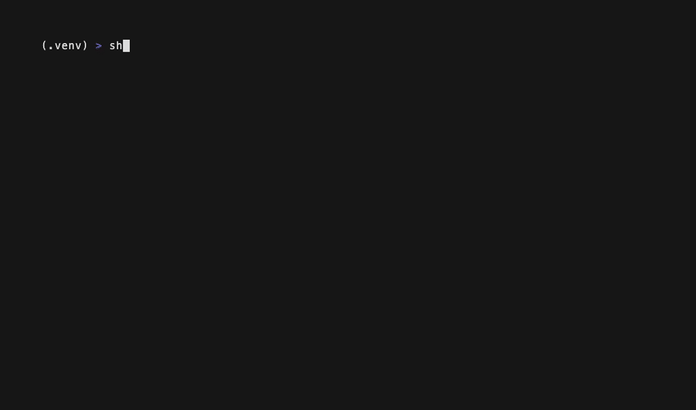
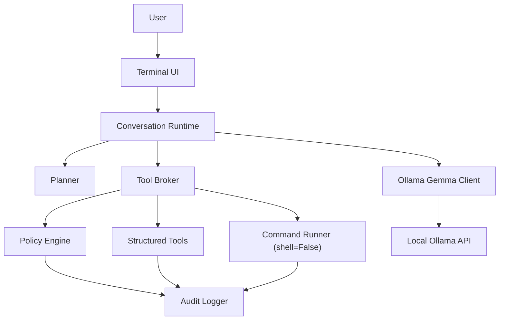

# ShellPilot

[](https://github.com/lavindeep/ShellPilot/actions/workflows/ci.yml)

[](LICENSE)

**A local-first AI shell harness for your terminal, powered by Ollama.**

ShellPilot gives you one terminal conversation that can answer questions, inspect your project, plan multi-step work, edit files, and run commands with risk-based approvals — all against a local model (Gemma 4 via [Ollama](https://ollama.com)). No cloud calls, no telemetry, no API keys. Your code and your shell never leave your machine.



## What it does

- **One conversation loop.** No separate chat/agent modes — ask a question and it answers; ask for work and it inspects, plans, and acts.
- **A terminal UI that earns its keep.** Live-rendered markdown responses, Claude-Code-style diff panels with line numbers and word-level highlights, risk badges (`MEDIUM`/`HIGH`/`BLOCKED`), a plan panel with checklist progress, input history and tab-completed slash commands, and an aviation-themed spinner (`taxiing… climbing… cruising…`). Degrades cleanly under `NO_COLOR`, pipes, and ASCII-only terminals.
- **Plans are artifacts.** Complex tasks get a visible, editable plan saved to `.shellpilot/tasks/<task-id>/PLAN.md`, approved by you before execution and updated as work progresses. If the model hits a roadblock, it records the blocker and replans instead of pushing through.
- **Deterministic security first.** Command risk is classified by deterministic policy (executable, flags, targets, shell metacharacters, workspace boundary) — never by asking the model whether something is safe. Agent commands run with `shell=False`; there is no agent-accessible raw shell.
- **Dangerous commands are explained.** High-risk actions show the exact command, a short model-written purpose explanation, and require you to literally type `run`. The explanation can never downgrade the deterministic risk.
- **Read-before-write edits.** File edits are anchored patches validated against a content-hashed snapshot of what was actually read — no blind writes, no stale writes, diffs shown before approval.
- **Memory with consent.** The model can propose remembering preferences and project facts (`memory_propose_update`), but every update shows a preview and needs your approval — it never writes memory silently. `/memory show|add|forget|compact`, `/prefs` to inspect; stored as plain JSON you can edit by hand.
- **Sessions that survive.** Every conversation is journaled (redacted) to `.shellpilot/sessions/`; `shellpilot --resume` picks up where you left off, and `/export` writes a markdown transcript. Long sessions stay healthy via selective compaction that digests old tool output first and never drops your instructions (`/compact auto on|off`).
- **Local audit log.** Every approval, command, and edit is recorded as redacted JSONL on your machine (`/logs` to view).
- **Manual Shell.** `/shell` drops you into a clearly-bannered raw `shell=True` mode that the model never touches.
- **Testable without a model.** A fake LLM client exercises the entire runtime in CI — including malformed tool calls and stuck loops. No GPU, no Ollama needed for the test suite.

## How it works



The model talks to seven flat-schema tools (`read_file`, `list_dir`, `search_text`, `env_info`, `run_command`, `write_file`, `patch_file`) plus two plan tools. Small local models make mistakes, so recovery is the main loop, not an edge case: malformed calls get one schema-reminder retry, repeated failures trigger the roadblock protocol, and tool/turn budgets stop runaways. The [Phase 0.5 benchmark](docs/benchmarks/2026-06-10-gemma4-e4b.md) measured `gemma4:e4b` at 100% well-formed tool calls and 100% byte-exact span reproduction, which is what makes anchored editing viable.

## Install

Requirements: Python 3.11+, [Ollama](https://ollama.com) running locally, and a Gemma 4 model:

```bash
ollama pull gemma4:e4b
```

Then clone and install:

```bash
git clone https://github.com/lavindeep/ShellPilot.git
cd ShellPilot
python3 -m venv .venv
source .venv/bin/activate
python -m pip install -e ".[dev]"
shellpilot doctor   # verify Python, Ollama, models, and paths
shellpilot          # start the conversation
```

## Usage

```text
$ shellpilot
ShellPilot 0.3.0
gemma4:e4b · balanced · /help for commands

~/my-project · gemma4:e4b · balanced
❯ what does this repo do?
...
~/my-project · gemma4:e4b · balanced
❯ fix the off-by-one bug in count_lines and run the tests
(plan panel → you approve → diff panel with risk badge → you approve → tests run)
```

| Command | Purpose |
|---|---|
| `shellpilot` | Interactive session in the current directory (`--cwd` to point elsewhere). |
| `shellpilot --resume [id]` | Resume the latest (or a specific) saved session in this workspace. |
| `shellpilot doctor` | Check Python, Ollama reachability, installed Gemma models, writable paths. |
| `shellpilot config show` | Print resolved config with the source layer of every key. |
| `/help` | All slash commands. |
| `/status`, `/compact status` | Model, profile, context usage, thresholds, active plan. |
| `/plan`, `/plan cancel`, `/plan revise <text>` | Inspect or steer the active plan. |
| `/diff` | Diffs from this session's agent edits. |
| `/memory show`, `/memory add <text>`, `/memory forget <id>` | Inspect and curate stored memory. |
| `/compact auto on\|off`, `/export` | Compaction control; markdown transcript export. |
| `/model list`, `/model use <name>` | Switch among local Gemma models. |
| `/profile use <supervised\|balanced>` | Switch the security profile. |
| `/logs` | Recent audit events and the log file path. |
| `/shell` | Manual Shell (raw `shell=True`, model not involved). `/exit-shell` returns. |

### Security profiles

| Profile | Behavior |
|---|---|
| `supervised` | Ask before every side-effecting tool and every command. |
| `balanced` (default) | Auto-run read-only tools and low-risk commands (`ls`, `git status`, `pytest`); ask for writes, installs, deletes, network, and anything risky. |

High-risk commands (`rm -rf`, `sudo`, force-pushes, credential paths, …) always show a purpose explanation and require typing `run`.

### Configuration

Layered, highest wins: CLI flags → `SHELLPILOT_*` env vars → `<repo>/.shellpilot/config.toml` → user `config.toml` → defaults. See [`docs/DESIGN.md`](docs/DESIGN.md) section 17 for the full schema.

```toml
[model]
default = "gemma4:e4b"

[runtime]
security_profile = "balanced"
```

Behavior instructions: ShellPilot reads `AGENTS.md` from your config directory (global) and the workspace root (project) at session start and follows them. It never writes those files.

## Development

```bash
ruff check . && ruff format --check . && mypy shellpilot --strict && pytest
```

The same four checks run in CI on Python 3.11 and 3.14 — against the fake model only, so CI needs no GPU or Ollama. To re-measure a local model's capabilities (tool-call reliability, exact-span reproduction, chaining, stopping):

```bash
python scripts/benchmark_model.py --trials 10
```

## Roadmap

v2 shipped across v0.2.0 (terminal UI redesign, [DESIGN.md](docs/DESIGN.md) section 31) and v0.3.0 (memory system, session resume/export, selective compaction). v3 candidates per section 25.2: `trusted-local` profile, capability packs, `/undo`.

## License

[MIT](LICENSE)
