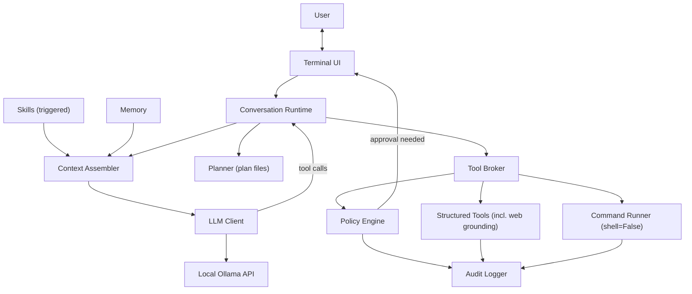

# ShellPilot

[](https://github.com/lavindeep/ShellPilot/actions/workflows/ci.yml)

[](LICENSE)

**A local-first AI shell harness for inspecting and changing real projects from one terminal conversation.**

ShellPilot is for developers and power users who want an AI assistant close to their shell without sending their code, commands, or project state to a hosted agent. It runs against a local Ollama model, inspects files through structured tools, proposes plans for complex work, shows diffs before edits land, and routes commands through deterministic risk-based approvals.

The core promise is local control: no telemetry, no cloud model calls, no API keys, and no silent network egress. Optional web grounding is off by default; when enabled, each search or page fetch is individually approved.


## What it is for

- Understanding a repository from inside the terminal.
- Asking a local model to inspect files, search code, explain behavior, and make scoped edits.
- Running tests, formatters, and project commands with visible approvals instead of hidden shell access.
- Letting the model plan multi-step work while keeping the plan, diffs, approvals, logs, and memory on disk where you can inspect them.
- Looking up current external information only when you explicitly enable web tools and approve each network request.

ShellPilot is not a cloud coding agent, a general multi-provider SDK, a sandbox, or a replacement for your shell. It is a local harness around a small model, structured tools, deterministic policy, and your approval loop.

## Design principles

- **Local first.** Ollama is the model backend. State, sessions, memory, logs, and audit trails stay on your machine.
- **Deterministic safety.** Command risk is classified by policy, not by asking the model whether a command is safe.
- **Read before write.** Edits are anchored to content the model actually read, then shown as diffs before approval.
- **Plans are artifacts.** Complex tasks produce a visible plan file under `.shellpilot/tasks/`, then update it as work progresses.
- **Small-model friendly.** Prompts, skills, tool schemas, retries, and grounding guidance are built around the constraints of local models such as `gemma4:e4b`.

## Feature map

- **One conversation loop.** No separate chat/agent modes. Ask a question and it answers; ask for work and it inspects, plans, edits, and runs commands.
- **Terminal UI.** Live-rendered markdown, diff panels with line numbers and word-level highlights, risk badges, plan progress, input history, tab-completed slash commands, and clean fallbacks for `NO_COLOR`, pipes, and ASCII-only terminals.
- **Approval-aware execution.** Agent commands run with `shell=False`; the model never gets raw shell access. High-risk commands show the exact command, a deterministic purpose explanation derived from classifier reasons, and require typing `run`.
- **Memory with consent.** The model can propose memories, but every update shows a preview and needs approval. Memory is stored as plain JSON.
- **Resumable sessions.** Conversations are journaled to `.shellpilot/sessions/`; `shellpilot --resume` restores a session, and `/export` writes markdown.
- **Local audit log.** Approvals, commands, edits, and config changes are recorded as redacted JSONL.
- **Manual Shell.** `/shell` opens a clearly-bannered raw shell mode that the model never touches.
- **Model picker and warmup.** ShellPilot lists installed Ollama models at boot, tags tested families, remembers the workspace choice, and preloads the selected model to avoid the first-turn cold-start stall.
- **Opt-in web grounding.** `[tools] web = true` registers `web_search` and `web_fetch`, both off by default and always approval-gated. v0.8.0 teaches the model to treat search snippets as leads, fetch the source before factual/current claims, and use a more specific URL when a page is truncated; v0.8.1 adds fetch-recovery (re-search rather than guess a URL when a fetch is blocked) and confirming the current generation from the source instead of trusting the version named in the question.
- **Skills v2.** Triggered markdown skills add only the guidance relevant to the current runtime state. Builtins cover planning, context management, web grounding, and skill authoring; references and templates are read-only resources; scripts are visible but not executed.
- **Image input.** `/attach <path>` stages png, jpg, gif, or webp images for the next message when the active model supports vision.
- **Model-free CI.** A fake LLM client exercises the runtime in tests, so CI needs no GPU or Ollama.

## How it works



The model talks to a small set of flat-schema tools: workspace inspection, command execution, anchored file edits, planning, memory, image viewing, and optional web grounding. Small local models make mistakes, so recovery is the main loop, not an edge case: malformed calls get one schema-reminder retry, repeated failures trigger the roadblock protocol, and tool/turn budgets stop runaways. The [Phase 0.5 benchmark](docs/benchmarks/2026-06-10-gemma4-e4b.md) measured `gemma4:e4b` at 100% well-formed tool calls and 100% byte-exact span reproduction, which is what makes anchored editing viable.

## Install

Requirements: Python 3.11+, [Ollama](https://ollama.com) running locally, and a Gemma 4 model:

```bash
ollama pull gemma4:e4b
```

`gemma4:e4b` is the default; `qwen3.5` is also natively supported.

Then clone and install:

```bash
git clone https://github.com/lavindeep/ShellPilot.git
cd ShellPilot
python3 -m venv .venv
source .venv/bin/activate
python -m pip install -e ".[dev]"
shellpilot doctor   # verify Python, Ollama, models, and paths
shellpilot          # start the conversation
```

## Usage

```text
$ shellpilot
ShellPilot 0.8.1
gemma4:e4b · balanced · /help for commands

~/my-project · gemma4:e4b · balanced
❯ what does this repo do?
...
~/my-project · gemma4:e4b · balanced
❯ fix the off-by-one bug in count_lines and run the tests
(plan panel → you approve → diff panel with risk badge → you approve → tests run)
```

| Command | Purpose |
|---|---|
| `shellpilot` | Interactive session in the current directory (`--cwd` to point elsewhere). |
| `shellpilot --resume [id]` | Resume the latest (or a specific) saved session in this workspace. |
| `shellpilot --model <name>` | Start with a specific model, skipping the boot picker. |
| `shellpilot doctor` | Check Python, Ollama reachability, installed models, and writable paths. |
| `shellpilot config show` | Print resolved config with the source layer of every key. |
| `shellpilot config edit` | Show the user config file path for hand-editing. |
| `/help` | All slash commands. |
| `/status` | Model, profile, workspace, and context usage. |
| `/clear` | Clear the visible conversation (with confirmation). |
| `/plan`, `/plan path`, `/plan cancel`, `/plan revise <text>` | Inspect, locate, or steer the active plan. |
| `/diff` | Diffs from this session's agent edits. |
| `/memory show`, `/memory add <text>`, `/memory forget <id>`, `/memory compact` | Inspect, curate, and model-compact stored memory. |
| `/prefs show`, `/prefs edit` | Inspect behavior preferences; show memory file paths. |
| `/compact`, `/compact status`, `/compact auto on\|off` | Compact context now; show usage; toggle auto-compaction. |
| `/export <path>` | Export this session's transcript to markdown. |
| `/model`, `/model list`, `/model use <name>` | Show active model; list all installed models with tested/untested tags; switch model. |
| `/profile`, `/profile use <supervised\|balanced>` | Show or switch the security profile for this session (switch lasts until exit; set `[runtime] security_profile` in config.toml to make it permanent). |
| `/tools` | List tools available under the active profile. |
| `/config show`, `/config edit`, `/config reload` | Print resolved config; show config path; reload from disk. |
| `/config set <key> <value>`, `/config unset <key>`, `/config reset` | Set, remove, or clear all runtime overrides for this session (persisted across restarts in `overrides.json`). |
| `/context` | Per-block context breakdown: each system-prompt block with its source, token estimate, injection state, and skip reason. |
| `/skills` | List all discovered skills with root, triggers, status, active state, resources, scripts, and reasons. |
| `/cwd`, `/cwd set <path>` | Show or change the workspace boundary. |
| `/logs` | Recent audit events for this session. |
| `/logs all` | Recent audit events across all sessions. |
| `/shell` | Manual Shell (raw `shell=True`, model not involved). `/exit-shell` returns. |
| `/attach <path>` | Stage an image to send with your next message (vision models). Bare `/attach` lists staged images. |
| `/doctor` | Check Python, Ollama, models, and paths from within a session. |
| `/exit`, `/quit` | Exit ShellPilot. |

### Security profiles

| Profile | Behavior |
|---|---|
| `supervised` | Auto-run read-only tools; ask before every side-effecting tool and every command. |
| `balanced` (default) | Auto-run read-only tools and low-risk commands (`ls`, `git status`, `pytest`); ask for writes, installs, deletes, network, and anything risky. |

Both profiles ask before every network request (web search, web fetch). High-risk commands (`rm -rf`, `sudo`, force-pushes, credential paths, …) always show a deterministic purpose explanation and require typing `run`. Explicitly blocked commands are rejected outright in both profiles.

### Configuration

Layered, highest wins: CLI flags → `SHELLPILOT_*` env vars → `<repo>/.shellpilot/config.toml` → user `config.toml` → defaults. See [`docs/DESIGN.md`](docs/DESIGN.md) section 17 for the full schema.

```toml
[model]
default = "gemma4:e4b"
keep_alive = "5m"        # how long Ollama keeps the model warm between prompts

[model.options]          # verbatim Ollama options; ShellPilot doesn't validate keys
# repeat_penalty = 1.3   # e.g. to curb repetition; num_ctx is reserved to the budget

[runtime]
security_profile = "balanced"

[tools]
web = false              # set true to enable web_search + web_fetch (always asks)

[skills]
enabled = ["my-skill"]  # user skill folder names to activate (config-file only)

[ui]
theme = "default"
glyphs = "auto"          # auto | unicode | ascii
```

**Skills.** User skills live in `<config_dir>/skills/<name>/SKILL.md` (frontmatter plus a small body injected only when its trigger fires). The config dir is platform-native via `platformdirs` — on macOS that is `~/Library/Application Support/shellpilot/`; on Linux `~/.config/shellpilot/`. List opt-in user skills, and the builtin `skill-authoring`, under `[skills] enabled`; this key is config-file only and cannot be set via env vars, `/config set`, or the overrides layer. Builtins are harness-managed: `planning` follows plan status, `context-management` is always on, and `web-grounding` activates only when web tools are actually registered. Skills may include read-only `references/` and `templates/`; `scripts/manifest.json` is discovered and validated for visibility, but script execution is deferred to a later release with its own safety design. See `docs/DESIGN.md` §23 for the full schema and trigger rules.

**Runtime overrides.** `/config set <key> <value>` and `/config unset <key>` write a lightweight override that survives restarts (stored in `.shellpilot/overrides.json`); `/config reset` clears all overrides at once. Most `[runtime]` and `[model]` keys are reachable this way; `[skills]` is explicitly excluded.

Behavior instructions: ShellPilot reads `AGENTS.md` from your config directory (global) and the workspace root (project) at session start and follows them. It never writes those files.

## Development

```bash
ruff check . && ruff format --check . && mypy shellpilot --strict && pytest
```

The same four checks run in CI on Python 3.11 and 3.14 — against the fake model only, so CI needs no GPU or Ollama. To re-measure a local model's capabilities (tool-call reliability, exact-span reproduction, chaining, stopping):

```bash
python scripts/benchmark_model.py --model gemma4:e4b --trials 10
```

## Roadmap

Recent shipped milestones:

- **v0.5.0:** opt-in web grounding and image input.
- **v0.6.0:** Skills v1, `/context`, `/skills`, runtime config editing, plan-state restore on `--resume`, and config-validation hardening.
- **v0.7.0:** Skills v2 with trigger-driven builtin guidance, read-only references/templates, enriched skill/context visibility, and script manifest discovery without execution.
- **v0.7.1:** instant high-risk approval prompts by generating purpose text deterministically from classifier reasons instead of through a blocking model call.
- **v0.8.0:** web-grounding quality for small local models. The `web-grounding` skill now carries fetch-before-answer guidance and discover-first query shaping, `web_search` is provider-neutral and points to `web_fetch`, and truncated fetches point the model toward a more specific source.
- **v0.8.1:** web-grounding hardening. The skill now tells the model to fetch only URLs that appeared in search results and re-search instead of guessing when a fetch is blocked or fails, and to confirm the current generation from the source rather than trust the version named in the question.

Next likely release:

- **v0.8.5:** privacy-first search provider support, with self-hosted [SearXNG](https://docs.searxng.org/) behind a configurable seam and keyless DuckDuckGo staying the zero-config default.

Later candidates include controlled skill-script execution with its own safety design, richer workflow skills for debugging/verification/review/git, a `trusted-local` security profile, heavier capability packs, and `/undo`.

## License

[MIT](LICENSE)
