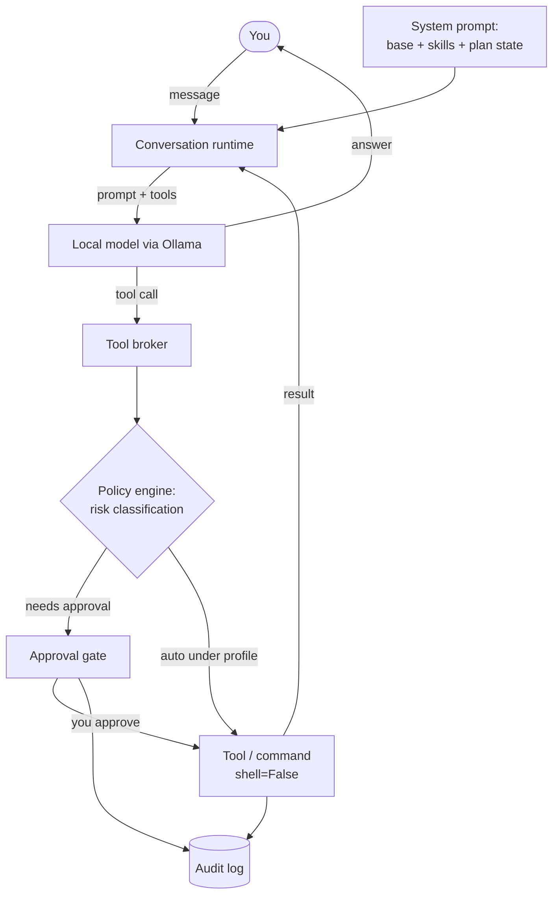

# ShellPilot

A local-first AI shell harness: one terminal conversation that can answer, inspect your code, plan multi-step work, and run commands under deterministic, risk-based approval.

[](https://github.com/lavindeep/ShellPilot/actions/workflows/ci.yml)
[](https://www.python.org/downloads/)
[](LICENSE)

ShellPilot runs a small local model through [Ollama](https://ollama.com) and gives it a tight set of structured tools — file reads, anchored edits, command execution, planning, memory, and optional web grounding. The model proposes; you approve. Command risk is classified by a deterministic policy engine, not by asking the model whether something is safe. By default, nothing leaves your machine: local Ollama only, no accounts, no API keys, no telemetry. Cloud models are opt-in and off by default, gated behind an explicit config switch and a per-session consent prompt. Web access is off by default, and when enabled, every request is approved one at a time.

It is built for and tested against `gemma4:e4b` — a model that fits on modest hardware — so the design assumes a capable-but-fallible local model and treats recovery as the main loop, not an edge case.

## Highlights

**Planning you can see and approve.** For multi-step work the model writes a structured plan to a file, shows it to you, and waits. You approve, reject, or ask for a revision before any work runs. As steps complete, the plan file updates, and a finished plan ends with a single clean summary — not the repeated, half-narrated summaries small models tend to emit.

**Deterministic safety and command approval.** Every command is classified by a policy engine that inspects the executable, arguments, shell metacharacters, file targets, the workspace boundary, and known destructive patterns. The classification — and the plain-language explanation of *why* a command is risky — is produced by code, not the model, so the model can never talk a `rm -rf` down to "low risk." Agent commands always run with `shell=False`; the model never gets a raw shell. High-risk commands require you to type `run`.

**Local-first by default and private.** The default model backend is local Ollama — sessions, memory, logs, plans, and audit trails stay on disk where you can read them. There is no telemetry. Cloud models are opt-in, off by default, and require an explicit config change and per-session consent before anything leaves the device. The single optional source of network egress in a local session — web grounding — is off until you set it in config, and every search and page fetch is individually approved in every profile.

Beyond the spotlight:

- **One conversation loop.** No chat/agent mode switch. Ask a question and it answers; ask for work and it inspects, plans, edits, and runs commands.
- **Read before write.** Edits are anchored to content the model actually read, validated against a content hash, and shown as a diff before they land.
- **Skills with progressive disclosure (new in v0.9.0).** Trigger-driven markdown skills inject only the guidance relevant to the current state; deeper docs are read on demand via a `skill_read` tool instead of bloating every prompt.
- **Web grounding for small models.** When enabled, the model is taught to treat search snippets as leads, fetch the source before asserting a fact, and re-search rather than guess a URL when a fetch fails.
- **Memory with consent.** The model can propose memories; every update shows a preview and needs approval. Stored as plain JSON.
- **Manual shell.** `/shell` opens a clearly-bannered raw shell the model never touches.
- **Resumable sessions and a local audit log.** Conversations journal to disk; `--resume` restores one (active plan included). Approvals, commands, edits, and config changes are recorded as redacted JSONL.
- **Model-free CI.** A fake model client exercises the runtime in tests, so CI needs no GPU or Ollama.

## How a turn works



The model talks to a small set of flat-schema tools. Small local models make mistakes, so recovery is designed in: a malformed call gets one schema-reminder retry, repeated failures trigger a roadblock-and-replan protocol, and per-turn tool/turn budgets stop runaways. The model never reaches execution without passing the same deterministic gate every time.

## Quick start

You need Python 3.11+ and [Ollama](https://ollama.com) running locally. Pull the default model:

```bash
ollama pull gemma4:e4b
```

Then clone and install:

```bash
git clone https://github.com/lavindeep/ShellPilot.git
cd ShellPilot
python3 -m venv .venv
source .venv/bin/activate
python -m pip install -e ".[dev]"
shellpilot doctor   # check Python, Ollama, installed models, and writable paths
shellpilot          # start the conversation in the current directory
```

`gemma4:e4b` is the default and primary tested model; the `qwen3.5` family is also recognized as tested. Any installed Ollama model can be selected with `/model use <name>` — untested models work but print a qualification note.

## Platforms

ShellPilot is developed and tested on **macOS** (Apple Silicon) and is **continuously tested on Linux** — the full test suite runs on `ubuntu-latest` in CI on every commit. Intel Macs are expected to work: it is pure Python and Ollama ships for x86 macOS.

**Windows is not supported yet.** The deterministic command-safety policy and process control are built on POSIX shell semantics, so a correct Windows port needs a Windows-aware risk classifier and process handling — it is deliberately deferred rather than shipped half-safe.

## A session

A representative session in the default `balanced` profile (risk badges are colored chips in the terminal, shown here as text):

```text
ShellPilot 0.10.0
gemma4:e4b · balanced · /help for commands

~/my-project · gemma4:e4b · balanced
❯ what does this repo do?

  This is a CLI that counts lines in source files. The entry point is
  src/cli.py, which calls count_lines() in src/counter.py ...
  3.1s · 0.4k tokens · ctx 6%

~/my-project · gemma4:e4b · balanced
❯ fix the off-by-one in count_lines and run the tests

  ╭─ Plan · 20260620-141502-fix-off-by-one ───────────╮
  │ Goal: Fix the off-by-one in count_lines and verify │
  │                                                    │
  │ ○ 1  Read src/counter.py to locate count_lines     │
  │ ○ 2  Patch the off-by-one in the loop bound        │
  │ ○ 3  Run the test suite to confirm the fix         │
  ╰────────────────────────────────────────────────────╯
  .shellpilot/tasks/20260620-141502-fix-off-by-one.md
  Approve plan? [y]es / [e]dit / [n]o y

  ⏺ read_file(path='src/counter.py')
  ⎿ ✓ read src/counter.py

  ⏺ patch_file(path='src/counter.py', …)

    @@ -12,1 +12,1 @@
    -    for i in range(1, len(lines)):
    +    for i in range(0, len(lines)):
     MEDIUM  tool
    CWD: ~/my-project
  Approve? [y/n] y
  ⎿ ✓ applied 1 change

  ⏺ run_command(argv=['python', '-m', 'pytest'])
  ⎿ ✓ 14 passed in 0.31s

  All steps complete. Fixed the off-by-one (the loop skipped the first line)
  and the suite passes.
  9.4s · 1.2k tokens · ctx 11%
```

Read-only tools and low-risk commands (like `pytest`) run automatically under `balanced`; a write asks first and shows the diff. A high-risk command is different again — it carries the deterministic purpose explanation and refuses a plain `y`:

```text
  ⏺ run_command(argv=['rm', '-rf', 'build/'])

     HIGH  command · recursive delete · "Recursively and permanently
     deletes the target and everything inside it; this cannot be undone."
    CWD: ~/my-project
  Type "run" to execute, or press Enter to cancel:
```

(Glyphs degrade to ASCII automatically under `NO_COLOR`, pipes, or a non-Unicode terminal.)

## Capabilities

| Area | What it does |
|---|---|
| **Tools** | `read_file`, `list_dir`, `search_text`, `write_file`, `patch_file` (anchored edits), `run_command` (`shell=False`), `env_info`, plus planning (`propose_plan`, `update_plan`), memory (`memory_read`, `memory_propose_update`), and `view_image`. Flat schemas, kept few on purpose — small models degrade as tool count and schema complexity grow. |
| **Security profiles** | `supervised` asks before every side-effecting tool and command; `balanced` (default) auto-runs read-only tools and low-risk commands and asks for writes, installs, deletes, network, and anything risky. |
| **Planning** | Tasks needing three or more steps produce a visible plan file under `.shellpilot/tasks/`, approved before execution, updated as work progresses, with a single end-of-plan summary. |
| **Skills** | Trigger-driven markdown guidance injected only when relevant (a plan is live, web is enabled, always-on, or opted in). Built-ins cover planning, context management, web grounding, and skill authoring. |
| **Progressive disclosure** | Deeper skill docs are read on demand through the `skill_read` tool rather than injected into every prompt; active skills advertise their readable docs in a one-line menu. New in v0.9.0. |
| **Web grounding** | Opt-in `web_search` and `web_fetch`, off by default, network-approved per request in every profile. The model is guided to fetch sources before asserting facts and to re-search rather than invent URLs. |
| **Memory** | Global and project memory as plain JSON; the model proposes, you approve each change. Secrets are redacted before disk. |
| **Manual shell** | `/shell` opens a raw `shell=True` session the model is not part of; `/exit-shell` returns. |
| **Image input** | `/attach <path>` stages a PNG/JPG/GIF/WebP image for the next message when the active model supports vision. |
| **Sessions & audit** | Conversations journal to `.shellpilot/sessions/`; `--resume` restores them (active plan included); `/export` writes markdown. Approvals, commands, edits, and config changes log as redacted JSONL. |

### Command-line interface

| Command | Purpose |
|---|---|
| `shellpilot` | Interactive session in the current directory (`--cwd <path>` to point elsewhere). |
| `shellpilot --resume [id]` | Resume the latest, or a specific, saved session in this workspace. |
| `shellpilot --model <name>` | Start with a specific model, skipping the boot picker. |
| `shellpilot doctor` | Check Python, Ollama reachability, installed models, and writable paths. |
| `shellpilot config show` | Print the resolved config with the source layer of every key. |
| `shellpilot config edit` | Print the user and project config file paths for hand-editing. |
| `shellpilot --version` | Print the version and exit. |

### Slash commands

Inside a session, plain language is the primary interface; slash commands control the harness itself.

| Command | Purpose |
|---|---|
| `/help` | List all slash commands. |
| `/status` | Model, profile, workspace, and context usage. |
| `/clear` | Clear the visible conversation (with confirmation); also cancels the active plan. |
| `/plan`, `/plan path`, `/plan cancel`, `/plan revise <text>` | Inspect, locate, cancel, or steer the active plan. |
| `/diff` | Diffs from this session's agent edits. |
| `/model`, `/model list`, `/model use <name>` | Show the active model; list installed models with tested/untested tags; switch model. |
| `/profile`, `/profile use <supervised\|balanced>` | Show or switch the security profile for this session. |
| `/tools` | List tools available under the active profile. |
| `/skills` | List discovered skills with their triggers, status, active state, resources, and reasons. |
| `/context` | Per-block context breakdown: each system-prompt block with source, token estimate, and injection state. |
| `/compact`, `/compact status`, `/compact auto on\|off` | Compact context now; show usage; toggle auto-compaction. |
| `/memory show`, `/memory add <text>`, `/memory forget <id>`, `/memory compact` | Inspect and curate stored memory. |
| `/prefs show`, `/prefs edit` | Inspect behavior preferences; show memory file paths. |
| `/config show`, `/config edit`, `/config reload` | Print resolved config; show the config path; reload from disk. |
| `/config set <key> <value>`, `/config unset <key>`, `/config reset` | Set, remove, or clear runtime overrides (persisted in `overrides.json`). |
| `/cwd`, `/cwd set <path>` | Show or change the workspace boundary. |
| `/logs`, `/logs all` | Recent audit events for this session, or across all sessions. |
| `/export <path>` | Export this session's transcript to markdown. |
| `/attach <path>` | Stage an image for your next message; bare `/attach` lists staged images. |
| `/shell`, `/exit-shell` | Enter and leave Manual Shell. |
| `/doctor` | Run the doctor checks from within a session. |
| `/exit`, `/quit` | Exit ShellPilot. |

## Configuration

Config is a user-owned TOML file. ShellPilot never rewrites it — only the program-managed `overrides.json` (set via `/config set`) is self-healing. The file lives in the platform-native config directory via `platformdirs`: on macOS `~/Library/Application Support/shellpilot/`, on Linux `~/.config/shellpilot/`. `shellpilot config edit` prints the exact paths. A `<repo>/.shellpilot/config.toml` can override the user file per project.

Settings resolve highest-wins: CLI flags → a fixed set of `SHELLPILOT_*` env vars (model, profile, Ollama URL, color, glyphs) → `overrides.json` → project config → user config → defaults. Most keys — including `tools.web` — have no env override by design.

```toml
[model]
default = "gemma4:e4b"
keep_alive = "5m"        # how long Ollama keeps the model warm between prompts

[model.options]          # verbatim Ollama options, passed through untouched
# repeat_penalty = 1.3   # num_ctx is reserved to the context budget and ignored here

[runtime]
security_profile = "balanced"   # or "supervised"

[tools]
web = false              # set true to register web_search + web_fetch (always asks)

[skills]
enabled = ["my-skill"]   # user skill folders (and the built-in skill-authoring) to activate

[privacy]
allow_sensitive_reads = "ask"   # ask | never | always — gates reads of .env, .ssh, etc.

[ui]
theme = "default"
glyphs = "auto"          # auto | unicode | ascii
```

`[tools] web` and `[skills] enabled` are config-file-only by design: enabling network egress or activating skills must be a deliberate edit, not something an env var or `/config set` can flip. User skills live in `<config_dir>/skills/<name>/SKILL.md`. ShellPilot also reads behavior instructions from `AGENTS.md` in your config directory (global) and the workspace root (project) at session start; it follows them and never writes those files.

### Cloud models (opt-in)

Cloud models are **off by default**. To use an Ollama cloud model (any model whose name ends in `-cloud`, e.g. `nemotron-3-nano:30b-cloud`), add this to your `config.toml`:

```toml
[model]
allow_cloud = true
default = "nemotron-3-nano:30b-cloud"
```

`[model] allow_cloud` is **config-file-only** — it cannot be set via an environment variable, `overrides.json`, or `/config set`. Enabling cloud egress must be a deliberate edit.

With `allow_cloud = true`, ShellPilot shows an honest disclosure prompt before any data leaves the device and asks for explicit **y/N** consent (defaulting to **N**). Declining — or running non-interactively — fails closed and the session does not start. Consent is per-session and never persisted; every launch re-asks.

**What the disclosure covers:** when a cloud model is active, the entire prompt — file contents, command output, memory the model reads — is sent to the provider. Best-effort outbound redaction runs, but it is regex-based and not a confidentiality guarantee (novel secret formats and image data may egress unredacted). The provider's data retention, training, and jurisdiction are outside ShellPilot's control. ShellPilot records a `cloud_consent_granted` event and per-turn `model_request` audit events locally so you can audit what sessions egressed.

**Local-first (the default) remains the only full-privacy posture.**

The same gate fires if you switch models mid-session with `/model use <cloud-name>`: fresh consent is required before anything loads, and on decline the model does not switch.

## Troubleshooting

- **`Ollama API: unreachable`** — Ollama is not serving. Start it (`ollama serve`, or launch the app) and re-run `shellpilot doctor`.
- **`Ollama binary: not on PATH`** — Ollama is not installed. Get it from [ollama.com](https://ollama.com).
- **`Models: none installed`** — pull the default model: `ollama pull gemma4:e4b`.
- **First turn is slow** — the model cold-starts on the first prompt. ShellPilot preloads the selected model at boot and `keep_alive` keeps it warm between turns; subsequent turns are much faster.
- **Web tools missing** — `web_search`/`web_fetch` only register when `[tools] web = true` in `config.toml`. There is no env-var or runtime toggle for it.
- **A command was rejected before any prompt** — a command that can't start (missing executable, packed shell line, stray shell operator) is rejected deterministically and never spends an approval; correct the arguments and retry. Look for a `did you mean` suggestion.

## Design principles

- **Determinism where it earns its place.** Safety, correctness, and control flow are deterministic — risk classification, the approval gate, anchored read-before-write, pre-flight command checks, plan completion. The model's general capability is not babysat; the harness scaffolds the structure of the interaction, not the model's every output.
- **Fix problems in the harness, not the prompt.** Bad behavior is corrected by deterministic mechanism, never by telling the model "don't do that."
- **Local-first by default, no account.** Local Ollama is the default and recommended backend. State stays on disk; the only optional egress in a local session is per-request-approved web grounding with no keys. Cloud models are opt-in, off by default, and require explicit per-session consent.
- **Small-model focus.** Built and validated on `gemma4:e4b` on an 8 GB machine. Prompts, tool schemas, retries, and grounding guidance are sized for that baseline, with room to dial scaffolding down as models improve.
- **Docs as spec.** [`docs/DESIGN.md`](docs/DESIGN.md) is the spec of record and ships in the same commit as the behavior it describes.

## Development

```bash
ruff check . && ruff format --check . && mypy shellpilot --strict && pytest
```

The same four checks run in CI on Python 3.11 and 3.14, against the fake model only — no GPU or Ollama required. To re-measure a local model's capabilities (tool-call reliability, exact-span reproduction, chaining, stopping):

```bash
python scripts/benchmark_model.py --model gemma4:e4b --trials 10
```

## Status and roadmap

Current release: **v0.10.0** — opt-in cloud models. Recent milestones:

- **v0.7.x** — Skills v2 with trigger-driven built-in guidance and read-only resources; instant high-risk approvals generated deterministically from classifier reasons.
- **v0.8.x** — web-grounding quality and hardening for small local models: fetch-before-answer, discover-first query shaping, fetch-recovery, current-generation checks; planner hardening for a single end-of-plan summary and idempotent re-proposals.
- **v0.9.0** — progressive disclosure: a `skill_read` tool and a readable-docs menu let skills carry depth without inflating every prompt.
- **v0.10.0** — opt-in cloud models behind `[model] allow_cloud` and a per-session consent gate; egress chokepoint with best-effort outbound redaction; `cloud_consent_granted` and `model_request` audit events; honest system-prompt when egressing.

Later candidates include richer workflow skills (debugging, verification, review, git), controlled skill-script execution under its own safety design, a `trusted-local` profile, and `/undo`.

## License

[MIT](LICENSE)
