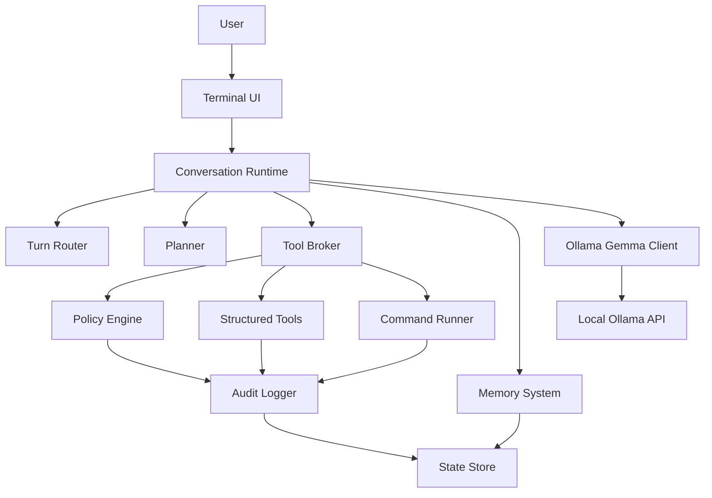

# ShellPilot Design

Status: Refined draft (v1 scope settled in design review)
Date: 2026-06-10
Repository: `/Users/lavin/Projects/ShellPilot`

## 1. Purpose

This document defines the target design for rebuilding the current AI CLI assistant from the ground up as a modular, local-first Python AI harness.

The rebuilt project should feel closer to a local coding and shell partner than a menu-driven chatbot. The user should be able to open one CLI conversation, ask questions, ask for project inspection, request command execution, approve plans for complex work, and use a manual shell when they want direct control.

The system remains local-only through Ollama. Gemma 4 is the default and primary supported model family. The design intentionally avoids broad multi-provider abstractions in the first version because different model families vary widely in tool calling, reasoning behavior, streaming, and instruction following.

## Safety Scope

This project is a local developer productivity harness. Security-related features are limited to defensive command review, local audit logs, local privacy controls, and user-approved diagnostics. The project does not include offensive exploitation, credential theft, malware behavior, evasion, persistence, unauthorized scanning, or remote targeting.

## 2. Current Repo Baseline

The current repository already proves several valuable ideas:

- A local Ollama-backed CLI assistant can work without cloud services.
- Tool calling is useful for file inspection, shell execution, memory, environment lookup, and system information.
- Planning before execution is important for complex tasks.
- Project memory is valuable and should be kept.
- Security profiles and command approval are necessary because shell automation can be destructive.
- Local audit logs are useful, but the security model should not add avoidable latency to every action.

The current implementation also has structural problems that the rebuild should address:

- `README.md` and code have drifted. The README documents fields and counts that do not match the implementation.
- The app is split into separate Chat and Agent modes even though the desired UX is one conversation that can answer or act.
- Runtime configuration is global mutable state.
- Ollama, Gemma 4, prompt behavior, and model roles are hard-coded across modules.
- Some local tests exist and pass, but `tests/` is ignored by `.gitignore`, so they are not part of the tracked project.
- `.docs/` is ignored, so durable project docs should live in `docs/`.
- The current security pipeline includes LLM classification in places where deterministic command policy would be faster and more predictable.
- Manual Shell audits all commands as low risk even though it runs with `shell=True`.
- Chat mode is described as read-only, but it can write persistent memory through `remember_memory`.

The rebuild should keep the useful ideas and discard accidental coupling.

## 3. Product Direction

The product is a local AI harness for a developer or power user working inside a terminal.

It should support:

- Natural conversation about the current project and local environment.
- Project inspection through structured tools.
- Task execution with planning for complex work.
- Shell command execution with clear approvals based on risk.
- A manual shell mode for direct user control.
- Persistent user behavior preferences and project memory.
- Local logs and local state only.
- Clean installation from a cloned repository.
- Modular internals that can be extended without turning the core into a monolith.

The initial rebuild should not try to become:

- A cloud-hosted assistant.
- A general multi-provider AI SDK.
- A full security product.
- A workflow automation SaaS.
- A plugin marketplace.
- A replacement for a real shell.

## 4. Naming Brainstorm

Settled 2026-06-10: the project name is **ShellPilot**. The brainstorm below is kept for historical context.

Simple name candidates:

| Name | Feel | Notes |
|---|---|---|
| Harness | Direct, accurate | Best description of the product: a local model harness around tools. |
| Claw | Short, memorable | Similar energy to OpenClaw; may be too close depending on desired distinction. |
| LocalClaw | Clear, local-first | Strong signal, but a little more derivative. |
| Anvil | Durable, tool-focused | Good for a developer tool, implies building. |
| Forge | Build-focused | Common but intuitive. |
| Tether | Local control | Suggests the model is anchored to the machine and policy. |
| Mason | Builder/helper | Friendly and simple, less technical. |
| Pilot | Assistant-like | Clear UX metaphor, but common. |
| Loom | Threads/context | Good if memory and context become major identity. |
| Pike | Small, sharp CLI | Distinct but less self-explanatory. |
| LocalPilot | Clear and practical | Good if the product should feel like a guided local assistant. |
| Shellmate | Friendly terminal partner | Memorable, but less serious. |

Recommendation (superseded by the settled name):

- Package `shellpilot`, executable `shellpilot`, project state dir `.shellpilot/`, env prefix `SHELLPILOT_`.

## 5. Design Goals

### 5.1 Local First

All model calls happen through local Ollama. No telemetry, cloud sync, or hosted API is part of the product. The only network egress is the optional, off-by-default web grounding tools: they contact only the search provider and pages the user approves per request, with no API keys.

### 5.2 Gemma 4 First

Gemma 4 is the default and primary supported family. The system can be designed cleanly enough that another Ollama model could be added later, but v1 optimizes prompts, tool schemas, and reasoning assumptions for Gemma 4.

### 5.3 One Conversation Loop

Chat and Agent modes should be combined. The user should not have to decide which mode they are in before asking.

The runtime should infer whether the turn is:

- A direct question.
- A project inspection request.
- A task that needs a plan.
- A simple command/action request.
- A preference or memory update.
- A manual shell request.

### 5.4 Modular By Construction

Major concerns must have explicit boundaries:

- CLI interface.
- Conversation runtime.
- Planner.
- Tool broker.
- Tool implementations.
- Command runner.
- Policy engine.
- Memory system.
- LLM client.
- Prompt library.
- Persistence.
- Logging and audit.
- Configuration.

Each module should be testable without launching the whole CLI.

### 5.5 Performance Conscious

Avoid extra model calls when deterministic logic is enough.

Examples:

- Command risk classification should be deterministic first.
- Tool selection should be handled in the main model turn where possible.
- Summarization and memory optimization should run only when needed.
- Log classification should not block command execution unless a profile explicitly requires it.

### 5.6 Privacy Preserving

The assistant must assume local files can contain secrets. It should avoid reading broad sensitive files unless asked and should redact obvious secrets from memory, logs, and prompts.

### 5.7 User Control

The user is allowed to execute dangerous commands. The assistant's job is not to forbid all risk. Its job is to identify risk, explain the likely goal and effect of a dangerous command, require explicit confirmation when policy requires it, and record what happened.

## 6. Non-Goals For v1

These should be deferred:

- Packet capture diagnostics as a core feature.
- Skill Builder as currently designed.
- Cloud provider support.
- Remote execution.
- Multi-user collaboration.
- Long-running background daemon.
- GUI.
- Plugin marketplace.
- Full sandbox/container runtime.
- Complex policy language.

Packet capture diagnostics and custom skills can return later as capability packs once the core extension model exists.

## 7. Proposed Dependency Strategy

The project should remain Python-centered but should not force "stdlib only" when a small dependency improves correctness or maintainability.

Target Python version:

- Python 3.11+ for vNext.
- Reason: `tomllib`, stronger typing ergonomics, modern packaging baseline, better performance than older Python versions.

Recommended runtime dependencies:

| Dependency | Purpose | Rationale |
|---|---|---|
| `rich` | Terminal rendering, status, tables, panels, colors | Obvious choice for a polished CLI without hand-rolled ANSI complexity. |
| `httpx` | Ollama HTTP client | Cleaner timeouts, streaming, errors, and testability than raw `urllib`. |
| `platformdirs` | Config/data/cache/log paths | Avoid hard-coded `~/.local/state` logic and handle OS differences correctly. |

Recommended dev dependencies:

| Dependency | Purpose |
|---|---|
| `pytest` | Tests |
| `pytest-cov` | Coverage |
| `ruff` | Formatting and linting |
| `mypy` or `pyright` | Type checking, optional at first |

Dependencies intentionally not recommended for v1:

| Dependency | Reason |
|---|---|
| `typer` | Nice, but `argparse` is enough if the primary UX is interactive. Avoid extra CLI framework complexity until needed. |
| `prompt_toolkit` | Powerful, but heavier. Start with `rich` plus standard input unless multiline editing/history becomes a priority. |
| `pydantic` | Useful for validation, but start with dataclasses and explicit validation unless schema complexity becomes painful. |
| `langchain` | Too broad and heavy for this project. The harness should own its execution model. |
| `llama-index` | Not needed for the initial local project-memory design. |

## 8. Install And Run Strategy

The primary install path should be clone-first:

```bash
git clone <repo-url>
cd <repo>
python3.11 -m venv .venv
source .venv/bin/activate
python -m pip install -e ".[dev]"
shellpilot
```

Also support direct module execution during development:

```bash
python -m shellpilot
```

The important point is that the project should have:

- `pyproject.toml`.
- A console script entrypoint.
- A tracked test suite.
- A standard dev install path.
- A standard command list in README.

Recommended initial commands:

```bash
shellpilot
shellpilot --cwd /path/to/project
shellpilot config show
shellpilot config edit
shellpilot doctor
```

`shellpilot doctor` should validate local prerequisites:

- Python version.
- Ollama availability.
- Ollama API reachability.
- Installed local models (with tested/untested family tags).
- State/config directories.
- Write access to project workspace.

## 9. High-Level Architecture

The architecture should be layered.



### 9.1 Package Layout

Proposed package layout:

```text
shellpilot/
  __init__.py
  __main__.py
  app.py
  cli/
    __init__.py
    commands.py
    terminal.py
    doctor.py
  config/
    __init__.py
    model.py
    loader.py
    defaults.py
  llm/
    __init__.py
    ollama.py
    gemma.py
    messages.py
    streaming.py
  runtime/
    __init__.py
    conversation.py
    router.py
    planner.py
    executor.py
    events.py
  tools/
    __init__.py
    base.py
    registry.py
    filesystem.py
    search.py
    command.py
    environment.py
  policy/
    __init__.py
    profiles.py
    command_policy.py
    approvals.py
    risk.py
  memory/
    __init__.py
    agents_md.py
    redaction.py
  persistence/
    __init__.py
    paths.py
    json_store.py
    toml_store.py
    audit_store.py
  prompts/
    __init__.py
    system.py
    planning.py
    execution.py
    memory.py
  capabilities/
    __init__.py
tests/
docs/
pyproject.toml
README.md
```

### 9.2 Module Responsibilities

| Module | Responsibility |
|---|---|
| `cli` | Terminal rendering, command-line flags, slash commands, doctor command. |
| `config` | Layered settings, schema validation, defaults, user/project overrides. |
| `llm` | Ollama HTTP calls, Gemma-specific prompt/tool formatting, streaming events. |
| `runtime` | Conversation loop, turn routing, planning, task execution, event dispatch. |
| `tools` | Structured tool definitions and implementations. |
| `policy` | Risk classification, security profiles, approval decisions. |
| `memory` | v1: `AGENTS.md` instruction loading and secret redaction helpers. v2: behavior/project/session memory and optimization. |
| `persistence` | Filesystem paths, atomic JSON/TOML writes, audit logs. |
| `prompts` | System prompts and prompt templates. |
| `capabilities` | v2 extension packs. Design only in v1; no loader implementation. |

## 10. Unified Conversation Runtime

The current Chat and Agent split should be replaced with one runtime.

### 10.1 Turn Lifecycle

Each user turn should pass through this pipeline:

1. Read user input.
2. Check slash commands and direct CLI commands.
3. Load relevant context:
   - Behavior instructions from `AGENTS.md` (global and project).
   - Recent session summary.
   - Current workspace facts.
   - (v2) Behavior and project memory once the memory system exists.
4. Ask Gemma 4 for a response with tool access.
5. If the model answers directly, print the answer.
6. If the model requests tools, pass them through the tool broker.
7. If the task needs 3 or more distinct steps, propose a plan (section 11.1).
8. If approval is needed, ask the user.
9. Execute approved tools/commands.
10. Feed results back to the model.
11. Summarize the turn.
12. (v2) Propose memory updates when appropriate.
13. Write audit events.

Plain text is the default output mode. If the user is just talking, asking for an opinion, asking a conceptual question, or asking something that can be answered from already-loaded context, the assistant should respond normally in plain text and should not call tools.

Tools are for grounded inspection and actions:

- Bash or argv command execution.
- File reads, writes, and anchored edits.
- Search across project files.
- Git inspection.
- Environment/system lookup.
- (v2) Memory lookup or proposed memory updates.

The model should not use tools just to look busy. Tool use should have a clear purpose: gather missing local evidence, perform a requested action, verify a result, or update approved memory.

### 10.2 Turn Types

The runtime should support these turn types:

| Turn Type | Description | Example |
|---|---|---|
| `answer` | Direct response, no tools needed | "What does this project do?" after enough context is loaded. |
| `inspect` | Read-only tool use | "Find where config is loaded." |
| `plan` | Complex task needs explicit plan | "Refactor the command runner." |
| `execute` | Simple action can be performed with approval policy | "Run the tests." |
| `edit` | File modifications via structured patch/edit tools | "Fix the failing test." |
| `memory_update` (v2) | User preference or discovered fact should be stored | "Always answer concisely unless I ask for detail." In v1, point the user at `AGENTS.md`. |
| `manual_shell` | User wants raw shell mode | "Open manual shell." |
| `clarify` | Required input is missing | "Deploy it" with no target. |

### 10.3 Routing Strategy

Avoid a separate classifier model call for every turn.

The system prompt should tell Gemma 4 how to behave:

- Answer directly when the user is asking a question and no inspection is needed.
- Use normal plain text for conversation; do not wrap ordinary answers in structured tool/action output.
- Use read-only tools when inspection would materially improve accuracy.
- Propose a plan for multi-step work (3 or more distinct steps, section 11.1); act directly otherwise.
- Ask a short clarification question only when a required target is missing.
- Use structured tools for file changes and commands.
- Stop after completing the current user request.

The runtime can add deterministic routing hints before the model call:

- Slash command detected.
- Message starts with `!` or explicit manual shell command.
- User asks to remember a preference (v1: suggest editing `AGENTS.md`).
- User asks for a multi-step code change.
- User asks to run, install, delete, modify, or commit.

Do not overbuild a standalone intent classifier in v1.

### 10.4 Reliability Design

Gemma 4 e4b handles tool calls correctly most of the time. "Most of the time" is the central design constraint, because failures compound multiplicatively across a task: at a 90% per-step success rate, a 10-step chain completes cleanly only about 35% of the time. Retry and recovery are therefore the main loop of the runtime, not edge-case handling.

Design rules that follow:

- Keep the tool count small and every input schema flat. No nested objects, no unions, no optional-heavy schemas. Small models degrade as tool count and schema complexity grow.
- Every model-driven step must be independently recoverable. The plan artifact (section 11.3) exists so a failed step can be retried or replanned without losing the task.
- Recovery loops are designed behavior, not error handling:

| Failure | Recovery |
|---|---|
| Malformed tool call | Return a compact schema reminder and allow exactly one retry. |
| Precheck failure (unrunnable command, missing executable, empty argv, packed shell line) | Tool returns a normal failed result pre-approval; the model may correct the arguments and retry. |
| Edit anchor not found or ambiguous | Re-read the target region and allow one corrected retry. |
| Same failure twice | Stop and enter the roadblock protocol (section 11.6). |
| Tool-call loop | Enforce turn/tool budgets (section 24.6) and replan or stop. |
| Approved plan stalls on narration | Inject a bounded continuation nudge (below) and keep the turn going. |

Small models often reply to an approved plan with prose — "I will now execute Step 1." — and no tool call, which would otherwise end the turn and force the user to type "continue" once per step. When a no-tool-call reply arrives while the active plan still has a pending or in-progress step, the tool loop injects a tool-role nudge naming that step and instructing the model to call the tool for it now, in the same turn, then loops again instead of returning. The nudge is bounded to **two per turn**: a model that genuinely needs the user (an honest question, an unrecoverable blocker) keeps the third no-tool-call reply, which ends the turn normally. The nudge never fires for a merely *proposed* plan awaiting approval, nor once the per-turn tool budget has emptied the tool set (in that state the model has already been told to answer in plain text). This is the deterministic runtime backstop behind the prompt and tool-result hardening that nudges the model toward single-turn plan execution.

The roadblock protocol (section 11.6) and the model edge cases (section 24.6) are instances of this principle, not exceptional paths. Phase 0.5 (section 27.2) measures the actual failure rates of the target model before the edit strategy is locked in.

### 10.5 Context And Output Budgeting

The current code uses broad character limits like `MAX_INPUT_LENGTH` and `MAX_OUTPUT_CHARS`. The rebuild should move to model-aware token budgets.

The runtime should query Ollama for the selected model's metadata when possible, using the local model information exposed by Ollama. The context budget should come from the selected Gemma 4 model's configured context length, not from one global constant.

Ollama has a context trap the design must handle explicitly: model metadata reports the model's maximum context length, but the actual runtime context is whatever `num_ctx` the client requests, and Ollama's default `num_ctx` is small regardless of what the model supports. The Ollama client must set `num_ctx` explicitly on every request from the resolved context budget. Detecting a large maximum while silently running at the default would make all of the budgeting below meaningless.

Token counting mechanism: v1 does not ship a local tokenizer. All token estimates use a `chars / 4` heuristic with a safety margin, and compaction triggers before the hard limit to absorb estimation error. The budget terms below are estimates, not exact counts.

Budget terms:

| Budget | Meaning |
|---|---|
| `model_context_tokens` | Total usable context window for the selected model. |
| `reserved_response_tokens` | Tokens reserved for the model's next answer. |
| `reserved_system_tokens` | Budget for system prompt, tools, policy, and behavior instructions. |
| `working_prompt_tokens` | Remaining budget for conversation, task state, file snippets, and tool results. |
| `compact_at_tokens` | Threshold where automatic compaction should start. |
| `hard_limit_tokens` | Threshold where new context must be rejected or compacted before another model call. |

Recommended formula:

```text
model_context_tokens = detected from Ollama, else fallback to 8192
reserved_response_tokens = clamp(1024, 4096, floor(model_context_tokens * 0.20))
reserved_system_tokens = clamp(1024, 4096, floor(model_context_tokens * 0.15))
working_prompt_tokens = model_context_tokens - reserved_response_tokens - reserved_system_tokens
compact_at_tokens = floor(model_context_tokens * 0.70)
hard_limit_tokens = floor(model_context_tokens * 0.90)
```

`clamp(min, max, value)` means use `value` but never lower than `min` or higher than `max`.

Note the floor case: at the 8192-token fallback, after the system prompt, tool schemas, and behavior instructions, the working prompt budget is roughly 3-4k tokens. Small-context operation is a first-class mode, not a degraded one: shorter tool results, more aggressive truncation, and no long conversational tails.

If the selected model exposes a much larger context window, the runtime can scale up conversation and tool context, but it should still cap noisy data. Larger context should improve continuity, not encourage dumping full command logs into every prompt.

Recommended tool-output prompt budgets:

| Item | Prompt Budget |
|---|---|
| Single read-only tool result | `min(2000 tokens, 10% of model_context_tokens)` |
| Total tool results in one turn | `min(8000 tokens, 30% of model_context_tokens)` |
| Behavior instructions (`AGENTS.md`) | `min(1500 tokens, 10% of model_context_tokens)` |
| (v2) Project memory | `min(2500 tokens, 15% of model_context_tokens)` |
| Recent conversation | Whatever remains after system, memory, active task, and tool budgets. |

Raw command output needs separate limits because the user may need to see more output than the model should receive:

| Setting | Recommended Default | Purpose |
|---|---|---|
| `max_command_capture_chars` | `200000` | Maximum command output captured locally for logs/UI. |
| `max_command_prompt_tokens` | model-aware, default around `2000` tokens | Bounded command output sent back to the model. |
| `max_tool_prompt_tokens` | model-aware, default around `2000` tokens per tool | Bounded tool result sent to the model. |
| `max_user_message_tokens` | `min(4096, 25% of model_context_tokens)` | Prevent giant pasted prompts from crowding out system and task context. |

When a user pastes content that exceeds `max_user_message_tokens`, the CLI should suggest saving it to a file or importing it as an explicit context artifact instead of silently truncating it.

Output generation should also be explicit:

- Normal conversational response: usually under `1024` tokens.
- Plan or final task summary: usually under `2048` tokens.
- Large generated file: use file-writing/edit tools, not one giant chat response.
- Dangerous command purpose explanation: usually one or two sentences.

The runtime should expose `/compact status` so the user can see current context usage, selected model context length, compaction threshold, and whether automatic compaction is enabled.

## 11. Planning Model

Complex tasks require a plan. The plan should be visible and editable before execution.

### 11.1 When To Plan

Planning is required when the task needs 3 or more distinct steps. All related setup
must be folded into one plan; a second follow-up plan for work already known at proposal
time is not allowed. (Settled 2026-06-11)

Planning is NOT required (do the action directly) when:

- The task is a direct answer or single read-only inspection.
- The task is a single command or a single file edit.
- The task is a simple low-risk command like `pwd` or `python -m pytest`.

### 11.2 Plan Shape

Plans should be structured data internally:

```python
class TaskPlan:
    goal: str
    risk: str
    steps: list[PlanStep]
    assumptions: list[str]
    verification: list[str]

class PlanStep:
    id: str
    title: str
    intent: str
    kind: str
    status: str
    expected_tools: list[str]
```

### 11.3 Plan Artifacts

Complex plans should be written to a project-local plan file. The plan file becomes the reference of record for the task, instead of relying only on transient chat history.

Recommended location:

```text
<workspace>/.shellpilot/tasks/<task-id>/PLAN.md
```

Example:

```text
.shellpilot/tasks/20260610-153012-command-runner-refactor/PLAN.md
```

Why this location:

- It is local to the project the work applies to.
- It does not pollute source directories like `src/` or `docs/`.
- It can hold task-local artifacts later, such as diffs, snapshots, and verification logs.
- It can be gitignored by default.
- It can be exported to `docs/plans/` only when the user wants to keep a plan as tracked project documentation.

The initial rebuild should create `.shellpilot/` as a local project state directory and recommend adding it to `.gitignore`.

Plan file contents:

```markdown
# Task Plan: Refactor command execution into a modular runner

Status: active
Task ID: 20260610-153012-command-runner-refactor
Workspace: /Users/lavin/Projects/ShellPilot
Profile: balanced
Created: 2026-06-10T15:30:12Z
Updated: 2026-06-10T15:35:44Z

## Goal

Refactor command execution into a modular runner while preserving local-only behavior.

## User Intent

The user wants a cleaner execution layer with `shell=False` by default and explicit raw-shell handling.

## Assumptions

- Keep Ollama/Gemma 4 as the only v1 provider.
- Preserve manual shell as a separate mode.
- Preserve command approval for risky commands.

## Plan

- [ ] Inspect current command execution and policy code.
- [ ] Define the command runner interface.
- [ ] Move command execution behind the interface.
- [ ] Add tests for risky commands and safe commands.
- [ ] Run tests.

## Files Expected To Change

- `shellpilot/tools/command.py`
- `shellpilot/policy/command_policy.py`
- `tests/test_command_runner.py`

## Verification

- `pytest tests/test_command_runner.py`
- `pytest`

## Decisions

- Pending.

## Open Questions

- Pending.

## Blockers

- None.

## Revisions

- None.

## Progress Log

- Created initial plan.
```

The plan artifact should be updated as work progresses:

- Mark steps as active/completed/skipped.
- Record important user decisions.
- Record files changed.
- Record verification commands and results.
- Record blockers and replans.

The runtime should load the active `PLAN.md` before each planned step and include a compact plan state in the model context. This gives the model a stable reference even after `/compact` compresses conversation history.

The plan file should not become a verbose transcript. It should remain a concise operational reference.

Rendered plan example:

```text
Goal: Refactor command execution into a modular runner

Assumptions:
- Keep local-only Ollama behavior.
- Preserve existing command approval UX.

Plan:
1. Inspect current command execution and policy code.
2. Define the new command runner interface.
3. Move execution logic behind the interface.
4. Update tests around command policy and execution.
5. Run unit tests.

Verification:
- Unit tests pass.
- Existing low-risk command flow still works.
- Dangerous command approval still prompts.
```

### 11.4 Planning Workflow

Recommended workflow:

1. User describes a non-trivial task.
2. Runtime gathers minimal context needed to plan.
3. Model drafts a structured plan.
4. Runtime writes `PLAN.md` under `.shellpilot/tasks/<task-id>/`.
5. UI shows the rendered plan and plan file path.
6. User approves, rejects, or suggests revisions.
7. When the user requests revisions, the harness marks the existing task as
   pending-revision and returns the feedback to the model. The model's next
   ``propose_plan`` call rewrites the existing task's PLAN.md and progress log
   **in place** — same task ID, same directory. A revision never creates a
   second task directory. ``/clear`` (or any ``cancel()`` call) also clears the
   pending-revision marker so the next ``propose_plan`` starts a fresh task.
8. On approval, the `propose_plan` tool result instructs the model to continue in the same
   turn: it must call the tool for step 1 immediately, then record progress with
   `update_plan`, and keep executing steps without asking the user again. The user
   approval has already been captured; the model must not re-ask in prose.
9. Each `update_plan` call for a non-final step instructs the model to continue with the
   next step in the same turn. The final completion result instructs the model to summarize
   the outcome instead.
10. Runtime updates the plan file after each meaningful step.
11. Runtime writes a final outcome summary into the plan file when the task finishes.

The user should not have to manually edit source files. The normal edit interaction is:

1. User suggests the desired change in plain language.
2. Model inspects the relevant files.
3. Model proposes or applies the actual file edit through the anchored edit tools.
4. Runtime shows diffs and asks for approval according to the active profile.
5. Runtime updates the plan artifact with what changed.

The user may manually edit the plan file if they want, but the default interaction should be conversational: the user suggests plan or source changes, and the model performs the actual plan/source edits through the runtime.

### 11.5 Replanning

The runtime should stop and replan when:

- A command fails in a way that invalidates the current plan.
- A required file or API does not exist.
- The model attempts a blocked action twice.
- Test failures reveal a wrong assumption.
- The user changes direction.

Replanning should preserve completed steps and explain what changed. It should update the existing plan artifact rather than create a disconnected second plan, unless the user explicitly starts a new task.

### 11.6 Roadblock Protocol

When the model hits a roadblock, it should not keep pushing through the same failing path. The runtime should move the task into a controlled `blocked` or `replanning` state.

A roadblock includes:

- A command or tool fails in a way that invalidates the current step.
- The model discovers its assumptions are stale or wrong.
- A file, API, dependency, model, command, or config item does not exist.
- Tests fail for reasons not covered by the current plan.
- The model needs information outside the current workspace or permissions.
- A policy blocks the required action.
- The same safe recovery attempt fails twice.

Roadblock behavior:

1. Stop the current step.
2. Capture evidence:
   - Failed command or tool.
   - Exit code or error.
   - Relevant output lines.
   - Current plan step.
   - Assumption that appears invalid.
3. Record the blocker in the active `PLAN.md`.
4. Refresh context with the narrowest safe reads or checks needed.
5. Decide whether the issue can be recovered inside the original goal.
6. Draft a revised remaining plan.
7. Show what changed from the old plan to the revised plan.
8. Ask for user approval when the revised plan changes scope, increases risk, needs new permissions, or depends on user intent.
9. Continue only after the revised path is clear.

The model may try bounded self-recovery before asking the user. Good self-recovery examples:

- Re-read a file that changed.
- Run a narrower diagnostic command.
- Search for a renamed symbol or config key.
- Check installed tool versions.
- Use a structured tool instead of raw shell.
- Run a focused test to isolate a failure.

Bad self-recovery examples:

- Repeating the same failed command without a new reason.
- Expanding into broad unrelated searches.
- Installing dependencies without approval.
- Changing unrelated files to make a failure disappear.
- Ignoring a failed verification step.
- Continuing execution after the plan's core assumption is false.

If the model's understanding is outdated, it should explicitly mark the stale assumption:

```text
Stale assumption: The command runner lives in `ai_core/tools/handlers.py`.
New evidence: Command execution has moved to `shellpilot/tools/command.py`.
Plan change: Replace steps 2-4 with steps that update the new runner interface.
```

The plan artifact should record this under `## Revisions`:

```markdown
## Revisions

- 2026-06-10T16:20:00Z: Replanned after discovering command execution had moved from `ai_core/tools/handlers.py` to `shellpilot/tools/command.py`.
```

It should record active blockers under `## Blockers`:

```markdown
## Blockers

- Blocked at step 3: `pytest tests/test_command_runner.py` fails because `CommandPolicy` is not importable.
  Evidence: `ModuleNotFoundError: No module named 'shellpilot.policy.command_policy'`.
  Next action: create the missing module or revise the package layout.
```

The assistant should ask the user a question only when it cannot choose safely from local evidence. The question should be short and specific:

```text
The implementation can either add the missing `command_policy.py` module or change the imports to use the existing policy module. Which direction do you want?
```

If the task is genuinely blocked and cannot proceed without the user, the runtime should:

- Mark the current step as blocked.
- Preserve the plan artifact.
- Preserve relevant file snapshots.
- Print the blocker and the exact decision needed.
- Avoid claiming the task is complete.

## 12. Tool System

Tools should be modular, typed, and registered through a central registry.

### 12.1 Tool Interface

Each tool should define:

- Name.
- Description.
- Input schema.
- Output schema.
- Side effect level.
- Default risk.
- Allowed profiles.
- Handler function.

Example:

```python
class ToolSpec:
    name: str
    description: str
    input_schema: type
    output_schema: type
    side_effect: SideEffect
    default_risk: RiskLevel
    allowed_profiles: set[str]
```

### 12.2 Core Tools For v1

Core tools:

| Tool | Purpose | Side Effect |
|---|---|---|
| `read_file` | Read bounded file content | None |
| `list_dir` | List directory entries | None |
| `search_text` | Search files | None |
| `write_file` | Create/overwrite/append file | Workspace write |
| `patch_file` | Apply structured patch | Workspace write |
| `run_command` | Run argv command with `shell=False` | Variable |
| `env_info` | Read cwd, OS, selected env info | None |

The v1 core surface is deliberately small: seven tools with flat input schemas. Fewer tools measurably improve small-model tool-call reliability (section 10.4).

Git inspection does not get dedicated tools in v1. `git status`, `git diff`, and similar read-only git commands run through `run_command` and are classified low risk by the deterministic command policy allowlist. Dedicated `git_status`/`git_diff` tools can return later if structured git output proves valuable.

Memory tools (`memory_read`, `memory_propose_update`, `memory_commit_update`) shipped in v0.3.0 as part of the memory system (section 16); plan tools (`propose_plan`, `update_plan`) ship with the planner. v0.5.0 adds `view_image` (multimodal, section 34) and two opt-in web tools (`web_search`, `web_fetch`, section 33) that are only registered when `[tools] web = true`.

Raw shell should be deferred as an agent tool. Agent execution should use `run_command` with `shell=False` in v1. Raw shell remains available through Manual Shell, where the user directly controls the command string.

### 12.3 Tool Output Contract

Every tool result should include:

- `success`.
- `summary`.
- `content`.
- `truncated`.
- `risk`.
- `side_effect`.
- `metadata`.

The model should receive bounded output. The user can see fuller output when appropriate.

### 12.4 File Editing

File edits must be read-before-write.

Before the model can edit an existing file, the runtime must have read that file and recorded a file snapshot for the current task. Write tools should reject edits that do not reference a prior read snapshot.

The snapshot should include:

- Resolved path.
- File size.
- Content hash.
- Read timestamp.
- Line count.
- The exact text or bounded read windows provided to the model.

This prevents blind edits where the model guesses file contents, overwrites concurrent changes, or writes a file it has not inspected.

File edits should prefer `patch_file` or anchored replacement over full-file rewrites.

The editing flow should be:

1. Read target file.
2. Record a file snapshot and content hash.
3. Generate an anchored edit against that snapshot.
4. Validate the file has not changed since the snapshot.
5. Apply the edit atomically.
6. Re-read or validate changed regions.
7. Run focused tests or checks.

This avoids accidental file truncation, prevents stale writes, and makes diffs easier to review.

### 12.5 Anchored Edit Strategy

Models are unreliable at line-specific replacement when asked to surgically rewrite arbitrary line numbers. They are also wasteful when asked to regenerate an entire file where only a few regions changed.

The runtime should therefore support anchored edits: the model generates only changed spans, and the runtime copies unchanged text from the previously read snapshot.

Conceptually:

```text
snapshot_before = full file text read by runtime
model_output = changed spans with stable before/after anchors
runtime_output = unchanged prefix + model change + unchanged suffix
```

The model should not need to regenerate the whole file. It should provide enough context to locate the edit deterministically.

Recommended edit operations:

| Operation | Purpose |
|---|---|
| `replace_between` | Replace text between two exact anchors. |
| `replace_exact` | Replace one exact old text block with one new text block. |
| `insert_before` | Insert text before an exact anchor. |
| `insert_after` | Insert text after an exact anchor. |
| `delete_exact` | Delete one exact old text block. |
| `rewrite_file_from_snapshot` | Last resort for generated files or broad rewrites. Requires prior full read. |

Example edit request:

```json
{
  "path": "shellpilot/runtime/executor.py",
  "snapshot_hash": "sha256:...",
  "operation": "replace_exact",
  "old": "def execute_step(...):\n    ...\n",
  "new": "def execute_step(...):\n    ...updated logic...\n"
}
```

Runtime validation:

- The path must match the read snapshot.
- The current file hash must match the snapshot hash.
- The `old` block or anchors must match exactly once unless the operation explicitly allows multiple matches.
- The result must preserve file encoding and newline style.
- The runtime should show a diff before approval when the active profile requires it.

For large files, the runtime can read and expose bounded windows around relevant anchors, but it should still compute a whole-file hash before writing. If the model needs to rewrite a region outside the current window, it must request another read first.

Whole-file rewrites are acceptable when:

- The file is small.
- The file is generated.
- The change touches most of the file.
- The target format is easier to safely regenerate than patch.

Even then, the runtime should treat the model output as a replacement against a known snapshot, not a blind write.

v1 implementation note (2026-06-10): the Phase 0.5 benchmark measured 100% byte-exact span reproduction for `gemma4:e4b`, so the anchored strategy ships as designed. The v1 operation set is `replace_exact`, `insert_before`, `insert_after`, and `delete_exact`; whole-file rewrites go through `write_file` with `mode=overwrite` against a validated snapshot (covering `rewrite_file_from_snapshot`). `replace_between` is deferred: it needs a two-anchor schema, and `replace_exact` covers its use cases at the measured reliability.

## 13. Command Execution Design

Command execution is one of the most important design areas.

### 13.1 Default Command Runner

The agent should use `shell=False` by default.

Input:

```python
class CommandRequest:
    argv: list[str]
    cwd: str
    env: dict[str, str] | None
    timeout_seconds: int
    stdin: str | None
```

Execution:

- Use `subprocess.Popen(argv, shell=False)`.
- Stream stdout/stderr.
- Bound captured output.
- Enforce timeout.
- Kill process group on timeout.
- Return exit code and captured output.
- Run with a sanitized copy of the parent environment (`DYLD_*`/`LD_*`/`Malloc*` stripped; pagers, editors, and credential prompts forced non-interactive) and stdin closed (`DEVNULL`) — command output must not depend on debug environment variables, and a command that reads stdin gets immediate EOF instead of hanging to its timeout.

### 13.2 Raw Shell

Raw shell is still useful for user-controlled workflows and shell-native syntax.

V1 raw shell use case:

- Manual Shell mode only.

Raw shell must be visible:

- The UI should label it as raw shell.
- The policy engine should treat shell metacharacters as higher risk.
- Approval prompts should show the exact command string.

Do not expose `raw_shell` as a normal agent tool in v1. If the model wants a pipeline, redirection, shell expansion, or another shell-native expression, it should first translate the request into structured tools or `run_command` with `shell=False`. If that is not reasonable, the assistant should ask the user to use Manual Shell or approve a future raw-shell capability after v1.

### 13.3 Pipes And Redirection

When the AI wants a pipeline like:

```bash
grep -R "foo" . | head
```

Preferred order:

1. Translate to structured tools like `search_text`.
2. Use Python-side post-processing where simple.
3. Ask the user to switch to Manual Shell when shell-native behavior is truly needed.

**Pre-flight rule:** A command that cannot start is rejected deterministically BEFORE the approval prompt. This covers:

- Empty `argv`.
- A packed shell line (shell syntax in `argv[0]` or a single-token command string with spaces).
- An `argv[0]` that resolves to a missing or non-executable path (path-separator form).
- An `argv[0]` that is not found on `PATH` (bare-name form).

When a PATH miss is detected, the runtime produces deterministic suggestions: it probes `<name>3` first (covers `python→python3`, `pip→pip3`) and then scans PATH for close matches via `difflib`. Example message: `executable 'python' not found on PATH — did you mean: python3?`

Approvals are never spent on commands that cannot start. The model receives a normal failed tool result and may correct the arguments and retry.

### 13.4 Dangerous Commands

The user is allowed to run dangerous commands, but the assistant must not hide the risk.

When a dangerous command is detected:

1. Deterministic policy marks it dangerous.
2. The assistant produces a short purpose explanation: why this command is being requested, why it is necessary for the current task, and what effect it is expected to have.
3. The UI displays risk, command, cwd, and purpose explanation.
4. The user explicitly approves or rejects.
5. The audit log records the command, risk, purpose explanation, and decision.

The explanation should be short and specific:

```text
This removes the stale `build/` directory so the project can produce a clean build artifact. It will recursively delete everything under `build/`.
```

The explanation can be generated by the model, but it cannot downgrade the deterministic risk classification.

The assistant should not generate a prose summary for every command. Routine low-risk commands should show normal command output or compact status only. Purpose explanations are required for risky commands because they help the user decide whether the risk is justified.

## 14. Security And Policy

Security should be practical, deterministic first, and profile-driven.

### 14.1 Profiles

| Profile | Intended User | Behavior |
|---|---|---|
| `supervised` | New users, small models, high caution | Ask before every tool with side effects and every command. |
| `balanced` | Default | Auto-run read-only tools and low-risk inspect commands. Ask for writes, installs, deletes, network, and raw shell. |
| `trusted-local` (v2) | Power user in trusted repo | Auto-run low-risk workspace writes and safe allowlisted commands. Ask for dangerous commands and raw shell. Deferred to v2. |

### 14.2 Risk Levels

| Risk | Meaning |
|---|---|
| `low` | Read-only or harmless local operation. |
| `medium` | Workspace write, package command, network read, or command with meaningful side effects. |
| `high` | Delete, credential access, privilege changes, destructive git operations, raw shell with dangerous syntax. |
| `blocked` | Disallowed by current profile without manual override. |

### 14.2a Side-Effect Decision Matrix

`blocked` risk always returns `block` regardless of side effect or profile.

| Side Effect | Risk | `supervised` | `balanced` |
|---|---|---|---|
| `none` | any | auto | auto |
| `variable` | low | ask | auto |
| `variable` | medium / high | ask | ask |
| `workspace_write` | low | ask | auto |
| `workspace_write` | medium / high | ask | ask |
| `network` | low / medium / high | ask | ask |

`network` always requires per-request consent in every profile. Network egress is irreversible and privacy-sensitive; the user must confirm every outbound request.

### 14.3 Deterministic Policy First

Policy should inspect:

- Base executable.
- Arguments.
- Shell metacharacters.
- File targets.
- Workspace boundary.
- Known destructive flags.
- Network activity.
- Package manager operations.
- Git operations.
- Secret-like paths.
- Privilege escalation.

Examples:

| Pattern | Risk |
|---|---|
| `ls`, `pwd`, `git status` | Low |
| `python -m pytest` | Low or medium depending on config |
| `pip install` | Medium |
| `git commit` | Medium |
| `git push` | Medium or high depending on config |
| `rm file.txt` | Medium |
| `rm -rf path` | High |
| `sudo ...` | High |
| `curl ... | sh` | High |
| Write outside workspace | High or blocked |

### 14.4 LLM Classification

Do not make LLM classification part of the hot path for every command.

Allowed uses:

- Generate a short dangerous-command explanation after deterministic detection.
- Classify audit log summaries asynchronously or on demand.
- Help explain unfamiliar commands after deterministic policy returns `unknown`.
- Provide a second opinion in `supervised` profile if configured.

Disallowed uses:

- Letting the LLM mark a deterministic high-risk command as low risk.
- Blocking every command on an extra model call by default.
- Feeding large raw command outputs into a classifier unnecessarily.

### 14.5 Workspace Boundary

The default workspace is the cwd where the harness is started or the explicit `--cwd` path.

File writes should be limited to the workspace unless:

- The user explicitly approves a path outside the workspace.
- The active profile permits it.
- The path is not sensitive.

The boundary must be clear in the UI.

## 15. Privacy

The product must stay local by default.

Privacy requirements:

- No cloud model calls. No telemetry. No remote logging. No automatic upload of files.
- Web grounding is off by default; when enabled, every request is individually approved
  and audit-logged (query/URL, redacted).
- No reading sensitive paths unless relevant and approved.
- Redact secrets from logs and memory.
- Keep state in OS-appropriate local app directories.

Sensitive data patterns:

- `.env`
- `.ssh`
- `.aws`
- `.gnupg`
- `.netrc`
- Credentials files.
- Private keys.
- Tokens and API keys.

The assistant may inspect these only when:

- The user explicitly asks.
- The active profile allows it.
- The UI shows the sensitive read.

## 16. Memory System (v2)

Implemented in v0.3.0 (settled 2026-06-11) following this section's design, with these implementation notes:

- Stores: global `memory.json` in the user config dir, project `.shellpilot/memory.json` with `project_id`. Versioned schema, explicit validation (unknown versions rejected), atomic writes, secrets redacted before disk.
- Facts carry an `id` (e.g. `fact_001`) — an addition to the 16.5 example schema — so `/memory forget` can address them.
- Tools: `memory_read` (read-only, auto) and `memory_propose_update` (the model's only write path; MEDIUM risk, approval required in every profile, with a diff-style preview). The runtime injects a budget-capped Memory block into the system prompt each turn.
- `/memory compact` optimization (16.4) covers preferences; facts are structured and excluded for now. A deterministic guard rejects any optimization that drops or invents ids, or drops a `source: user` entry — regardless of what the model returns.
- AGENTS.md remains read-only and is loaded alongside memory; `trusted-local` auto-save (16.3) remains moot until that profile exists.

V1 behavior instructions were static AGENTS.md only; that path still works unchanged.

Memory should become a first-class feature, not just a project file index.

### 16.1 Memory Types

| Type | Purpose | Persistence |
|---|---|---|
| Behavior memory | How the user wants the AI to act and output | Global and project-level |
| Project memory | Durable facts about the current repo | Project-level |
| Session memory | Current conversation/task context | Session-level |
| Tool memory | Summaries of important command/tool outcomes | Session or project-level |

### 16.2 Behavior Memory

Behavior memory captures preferences like:

- "Be concise by default."
- "Ask before installing dependencies."
- "Prefer simple Python over heavy frameworks."
- "When presenting command output, summarize first."
- "Use detailed plans for architectural work."

It should be represented in two forms:

1. Human-editable instructions.
2. Structured optimized memory.

Human-editable files:

```text
~/.config/<app>/AGENTS.md
<project>/AGENTS.md
```

Structured memory:

```json
{
  "version": 1,
  "preferences": [
    {
      "id": "pref_001",
      "scope": "global",
      "text": "Prefer concise answers unless detail is requested.",
      "source": "user",
      "updated_at": "2026-06-10T00:00:00Z"
    }
  ]
}
```

### 16.3 Memory Updates

The agent should not silently rewrite user preferences.

Memory update flow:

1. Model proposes a memory update.
2. Runtime validates the schema.
3. UI shows the proposed update.
4. User approves, rejects, or edits.
5. Runtime writes memory.
6. Audit event records the update.

In `trusted-local`, low-risk project facts can be auto-saved, but behavior preferences should still be visible.

### 16.4 Memory Optimization

The model can optimize memory into a compact format, but the process should be controlled.

Optimization should:

- Merge duplicate preferences.
- Remove stale session-specific details.
- Preserve explicit user instructions.
- Prefer short, actionable statements.
- Keep source metadata.

Optimization should not:

- Invent preferences.
- Remove recent explicit instructions without approval.
- Store secrets.

### 16.5 Project Memory

Project memory should store:

- Important paths.
- Build/test commands.
- Architecture notes.
- Known constraints.
- User decisions.
- Module ownership.
- Setup quirks.

Example:

```json
{
  "version": 1,
  "project_id": "ShellPilot:<hash>",
  "facts": [
    {
      "kind": "command",
      "value": "python -m pytest",
      "label": "Run unit tests",
      "confidence": "observed",
      "source": "tool_result"
    }
  ]
}
```

## 17. Configuration

Configuration should be layered and explicit.

### 17.1 Precedence

Highest precedence wins:

1. CLI flags.
2. Environment variables.
3. Project config.
4. User config.
5. Defaults.

### 17.2 Config Locations

Use `platformdirs`.

Examples:

```text
User config:   ~/.config/<app>/config.toml
User data:     ~/.local/share/<app>/
User state:    ~/.local/state/<app>/
Cache:         ~/.cache/<app>/
Project config:<repo>/.<app>/config.toml
```

On macOS and Windows, use platform-native equivalents via `platformdirs`.

#### Workspace harness state

`.shellpilot/state.json` stores harness-internal state for a workspace — it is
not user-editable config.  The current schema (version 1) holds a single key:

```json
{"version": 1, "last_model": "gemma4:e4b"}
```

`last_model` is written by the boot model picker (Task A8) when the user selects
a model, and read on the next launch so the picker can pre-select the same model.
The file is written atomically; a missing or unreadable file is silently ignored
by the harness.

### 17.3 Example Config

```toml
[model]
provider = "ollama"
family = "gemma4"  # deprecated since v0.4.0; ignored by the runtime; kept so old configs parse
default = "gemma4:e4b"
reasoning = true
base_url = "http://localhost:11434"
keep_alive = "5m"   # how long Ollama keeps the model loaded between requests

[runtime]
security_profile = "balanced"
max_plan_steps = 10
max_tool_turns = 12
command_timeout_seconds = 600
auto_compact = true  # selective token-budget compaction (v0.3.0, section 20.2)

[context]
model_context_tokens = "auto"
reserved_response_tokens = "auto"
reserved_system_tokens = "auto"
compact_at_ratio = 0.70
hard_limit_ratio = 0.90
max_user_message_tokens = "auto"
max_tool_prompt_tokens = "auto"
max_total_tool_prompt_tokens = "auto"
max_command_prompt_tokens = "auto"
max_command_capture_chars = 200000

[workspace]
boundary = "start_cwd"
allow_outside_workspace = false

[instructions]
# v1: static behavior instructions read from AGENTS.md files.
load_agents_md = true

# [memory] arrives in v2 with the full memory system (see section 16).

[privacy]
telemetry = false
redact_secrets = true
allow_sensitive_reads = "ask"

[ui]
theme = "default"
show_reasoning_summary = true
show_full_tool_output = false
# v2 visual design (section 31), settled 2026-06-11:
glyphs = "auto"   # auto | unicode | ascii
spinner = true    # aviation status spinner while the model works

[tools]
# Off by default: enabling this causes network egress (DuckDuckGo search +
# pages you approve). Every request requires per-turn user approval.
# There is deliberately no SHELLPILOT_TOOLS_WEB env var — enabling network
# egress must be an explicit config-file act, not an ambient env var.
web = false
```

### 17.4 Environment Variables and CLI Overrides

Recommended environment variables:

```text
SHELLPILOT_OLLAMA_BASE_URL
SHELLPILOT_MODEL
SHELLPILOT_PROFILE
SHELLPILOT_CONFIG
SHELLPILOT_NO_COLOR
SHELLPILOT_UI_GLYPHS
```

Do not require environment variables for normal use.

#### `--model` flag

`shellpilot --model NAME` selects the model for a single session without
changing the user or project config.  It is injected as a CLI-layer override
(`source = "cli"`, highest precedence) and skips the interactive boot model
picker (Task A8).  Example:

```sh
shellpilot --model gemma4:e2b
```

## 18. Ollama And Model Integration

The LLM layer is local and Ollama-backed. Any model installed in the local Ollama
instance is selectable. Two families are currently qualified: `gemma4` and `qwen3.5`
(see `TESTED_FAMILIES` in `shellpilot/config/model.py`). Other models can be used
but are tagged `untested` in the picker and `/model list` output.

### 18.1 Ollama Client

Responsibilities:

- List local models.
- Check Ollama health.
- Send chat requests.
- Set `num_ctx` explicitly on every request from the resolved context budget (section 10.5).
- Stream responses.
- Handle tool calls.
- Normalize Ollama errors.
- Enforce request timeout.
- Support cancellation.

### 18.2 Model Families

`TESTED_FAMILIES = ("gemma4", "qwen3.5")` in `shellpilot/config/model.py` is the
authoritative list of families ShellPilot is qualified against. `is_tested_model(name)`
returns True when the name starts with any tested family prefix. The boot picker and
`/model list` show a dim `untested` tag for any installed model outside these families.
`/model use <name>` accepts any installed model; for untested models it prints a dim
note directing to `scripts/benchmark_model.py` as the qualification path.

`ModelSettings.family` (config key `[model] family`) is **deprecated since v0.4.0**
and ignored by the runtime. It is retained in the dataclass so existing config files
parse without error.

### 18.3 Model Roles

Simple roles, all served by the single session model:

| Role | Purpose | Default |
|---|---|---|
| `main` | Conversation, planning, execution | `gemma4:e4b` |
| `summarizer` | Context and memory compression | same as main |
| `explainer` | Dangerous command explanation | same as main |

Do not require separate models. Allow overrides later.

## 19. Prompt Strategy

Prompts should be versioned and kept in one package area.

Prompt principles:

- Gemma 4 first.
- Be explicit about when to answer vs act.
- Plain text is the default for normal conversation.
- Tool contracts should be short and concrete.
- Tool calls should be reserved for local evidence, shell commands, search, file operations, memory operations, and verification.
- The model should not work ahead of the current step.
- The model should not ask for approval directly. The runtime owns approvals.
- Plans must go through the propose_plan tool. The model must never write a plan as chat text or ask for approval in prose. (Settled 2026-06-11)
- After a plan is approved, the model continues in the same turn until the plan is complete or genuinely blocked. It must not stop to announce a step or request permission it already has. (Settled 2026-06-11)
- (v2) The model should propose memory updates through a schema.
- The model should summarize evidence and uncertainty.

### 19.1 Unified System Prompt Themes

The main system prompt should communicate:

- No independent network access; internet contact only via registered, per-call-approved tools.
- You can answer questions directly.
- Use tools when inspection is needed.
- Use tools for bash commands, project search, file operations, memory operations, and verification.
- Do not call tools for ordinary conversation when plain text is enough.
- For multi-step work call propose_plan; never write a plan as chat text or ask for approval in prose. (Settled 2026-06-11)
- After plan approval, keep working in the same turn until done or blocked. (Settled 2026-06-11)
- Do not hide shell commands.
- Respect the active security profile.
- Do not store secrets in memory.
- Keep responses aligned with user behavior instructions.

### 19.2 Structured Outputs

Where possible, the model should return structured actions:

```json
{
  "kind": "plan",
  "goal": "...",
  "steps": [...]
}
```

But the runtime should not rely on perfect JSON from the model for critical safety. Policy and approvals remain deterministic.

## 20. UI Design

The CLI should be direct and information-dense.

Core UI states:

- Idle prompt.
- Thinking/status.
- Tool call display.
- Approval prompt.
- Plan display.
- Command output stream.
- Final task summary.
- (v2) Memory proposal.

Example prompt (v2 two-line prompt, settled 2026-06-11 — visual details in section 31):

```text
~/Projects/test_project · gemma4:e4b · balanced
❯
```

Example plan approval (v2 panel gate — see section 31; borders are drawn by rich, never hand-assembled):

```text
╭─ Plan · refactor-command-policy ─────────────╮
│ Goal: Refactor command policy                │
│                                              │
│ ☐ 1  Inspect current policy and runner       │
│ ☐ 2  Define the new policy interface         │
│ ☐ 3  Move classification into policy module  │
│ ☐ 4  Add tests for risky commands            │
│ ☐ 5  Run tests                               │
╰──────────────────────────────────────────────╯
Approve plan? [y]es / [e]dit / [n]o
```

Example dangerous command prompt (v2 badge style — see section 31):

```text
⏺ run_command(rm -rf build/)
   HIGH  recursive delete · "This removes the stale build output before regenerating artifacts."
  CWD: /Users/lavin/project
  Type "run" to execute, or press Enter to cancel:
```

The ` HIGH ` chip renders as an inverse white-on-red badge; purpose text is the model-written explanation required by section 13.4.

Command display should avoid noisy per-command narration. The UI should show:

- Command and streamed output for executed commands.
- Purpose explanation only when a command is risky, unusual, or requires approval.
- A final task summary after a planned task completes.

For planned tasks, the final summary should describe the task outcome, important files changed, verification performed, and any unresolved risk. It should not restate every command that ran unless a command result is materially important.

### 20.1 Slash Commands

Slash commands are user controls for the harness itself. They should not be the main way to ask the AI to work; normal language remains the primary interface.

Commands should be predictable, composable, and safe. Destructive app-state commands should ask for confirmation.

Planned commands:

| Command | Purpose |
|---|---|
| `/help` | Show available slash commands and short examples. |
| `/exit` | Exit the harness. |
| `/quit` | Alias for `/exit`. |
| `/clear` | Clear conversation history after confirmation; also cancels the active plan and resets snapshots, diffs, and failure state. |
| `/status` | Show current model, profile, cwd, context usage, active plan, and pending approvals. |
| `/doctor` | Check Python version, Ollama reachability, model availability, config paths, and workspace access. |
| `/model` | Show the active model and context metadata. |
| `/model list` | List all installed local models with tested/untested tags. |
| `/model use <name>` | Switch the active local model (any installed model; untested models print a qualification note). |
| `/profile` | Show active security profile. |
| `/profile use <supervised|balanced>` | Switch security profile for this session only (reverts on restart; set `[runtime] security_profile` in config.toml to make it permanent). `trusted-local` arrives in v2. |
| `/config show` | Print resolved config with source layers. |
| `/config edit` | Open or print the user config path for editing. |
| `/config reload` | Reload config from disk. |
| `/cwd` | Show current workspace boundary and process cwd. |
| `/cwd set <path>` | Change workspace cwd/boundary after confirmation. |
| `/tools` | List available tools and whether each is enabled by the active profile. |
| `/plan` | Show the current or most recent plan. |
| `/plan path` | Show the active plan artifact path. |
| `/plan cancel` | Cancel the active plan. |
| `/plan revise <instruction>` | Ask the assistant to revise the active plan before continuing. |
| `/diff` | Show pending or recent file diffs from agent edits. |
| `/compact` | Compact older conversation context now (selective, section 20.2). |
| `/compact status` | Show estimated context usage, model context length, and compaction thresholds. |
| `/compact auto on` | Enable automatic token-budget compaction. |
| `/compact auto off` | Disable automatic token-budget compaction. |
| `/logs` | Show recent local audit/session events. |
| `/export <path>` | Export this session's transcript to markdown (default `.shellpilot/exports/<session-id>.md`). |
| `/memory show` | Show project and behavior memory summaries with entry ids. |
| `/memory add <text>` | Add a global behavior preference after confirmation. |
| `/memory forget <id>` | Remove a memory entry after confirmation. |
| `/memory compact` | Model-assisted preference optimization, approved before saving (section 16.4). |
| `/prefs show` | Show behavior preferences. |
| `/prefs edit` | Show the memory file paths for hand-editing; `/memory show` reloads. |
| `/shell` | Enter Manual Shell mode. |
| `/exit-shell` | Return from Manual Shell mode to the assistant. |
| `/attach <path>` | Stage an image file to send with the next user message (vision-capable models only). Path is validated eagerly; bytes are re-read at send time. *(v0.5.0)* |
| `/attach` | List currently staged images, or report "No attachments staged." *(v0.5.0)* |

All commands scheduled for v0.3.0 (memory, prefs, compact auto, export) shipped and appear in the table above.

Deferred to v3 candidates:

| Command | Purpose |
|---|---|
| `/capabilities` | List installed capability packs. |
| `/capabilities enable <name>` | Enable a deferred capability pack. |
| `/undo` | Revert selected harness-managed changes when a safe undo record exists. |

### 20.2 Compaction Behavior

`/compact` must be reliable because the harness depends on long-running local context.

V1 compaction was deliberately simple: oldest-first truncation. Selective token-budget compaction shipped in v0.3.0 (settled 2026-06-11) as three deterministic passes, cheapest loss first:

1. Digest old tool results in place (head/tail excerpt with an omission marker). Allowed everywhere except the in-flight exchange; snapshot staleness checks still force a fresh read before any write.
2. Drop the oldest non-user messages outside the recent window. An assistant tool call takes its tool-result messages with it so no orphans confuse the model.
3. Last resort: drop the oldest user messages, always keeping the newest one.

No model call is involved — compaction is deterministic by design, matching the policy-first philosophy. Model-written summaries of dropped turns were considered and deliberately omitted. `/compact auto on|off` toggles automatic compaction (`[runtime] auto_compact`, default on); with it off, a turn that would exceed the hard limit is refused with guidance instead.

Even simple truncation must preserve:

- Explicit user instructions.
- Behavior preferences.
- Active plan and step statuses.
- Pending approvals.
- File snapshot metadata needed for read-before-write safety.
- Important paths.
- Files changed.
- Commands that materially affected task outcome.
- Errors, failed assumptions, and unresolved risks.
- Verification results.

Truncation should drop or compress first:

- Redundant conversation filler.
- Full raw command output after important lines are summarized.
- Large read-only tool outputs that are no longer active.
- Repeated status messages.
- Old reasoning text that does not affect future actions.

`/compact` should not silently discard active edit context. If compaction would remove file content needed for a pending edit, the runtime should keep the file snapshot metadata and require a fresh read before writing if exact content is no longer available in active context.

`/compact status` should show something like:

```text
Model: gemma4:e4b
Detected context: 8192 tokens
Current prompt estimate: 5120 tokens
Compact at: 5734 tokens
Hard limit: 7372 tokens
Active plan: yes
Pending file snapshots: 2
```

## 21. Manual Shell

Manual Shell should stay, but it should be clearly separate from agent execution.

Manual Shell properties:

- User types commands directly.
- Uses `shell=True`.
- Does not pretend to be low risk.
- Logs command and exit status.
- Does not route commands through the model.
- Can be entered and exited from the unified CLI.

Manual Shell should display a banner:

```text
Manual Shell
Commands run exactly as typed with shell=True.
The AI is not controlling this mode.
Type /exit-shell to return.
```

## 22. Logging And Audit

Audit logs should be local and structured.

Events:

- Session start/end.
- User turn.
- Tool call requested.
- Tool call approved/skipped/executed.
- Command risk decision.
- Dangerous command explanation.
- Command result.
- File edit.
- (v2) Memory update.
- Config change.
- Error.

Log entry shape:

```json
{
  "version": 1,
  "timestamp": "2026-06-10T00:00:00Z",
  "session_id": "...",
  "workspace": "...",
  "event": "command_approval",
  "risk": "high",
  "profile": "balanced",
  "command": "rm -rf build/",
  "explanation": "This recursively deletes the build directory.",
  "decision": "approved"
}
```

Audit signing can be included, but the key strategy must be coherent:

- If signatures are only per-session, they prove tamper evidence only while the key exists.
- If long-term verification matters, store or derive a persistent local key.
- If privacy and simplicity matter more, structured logs without signatures may be acceptable in v1.

Recommendation for v1:

- Use structured JSONL logs.
- Redact secrets.
- Include deterministic risk metadata.
- Defer forensic signing until the threat model is clearer.

## 23. Capability Packs

The current Skill Builder should be deferred and redesigned.

Instead of "skills" as ad hoc prompt JSON, define capability packs later.

A capability pack can include:

- Prompt guidance.
- Tool definitions.
- Tool handlers.
- Config schema.
- Tests.
- Permissions.
- Documentation.

Example future packs:

- `packet_capture_diagnostics`
- `network_diagnostics`
- `docker`
- `python_project`
- `node_project`
- `git_workflow`

V1 can include only built-in tools. Capability loading can be designed but not fully implemented.

## 24. Operational Edge Cases

These edge cases should be accounted for in design and tests. They do not all need elaborate v1 implementations, but the runtime should fail clearly and avoid unsafe behavior.

### 24.1 File And Edit Edge Cases

| Edge Case | Expected Behavior |
|---|---|
| Binary file | Refuse text edit unless the tool explicitly supports binary-safe operations. |
| Huge file | Read bounded windows; require targeted anchors before writing. |
| Non-UTF-8 text | Preserve bytes where possible; otherwise report encoding limitation. |
| BOM or unusual newline style | Preserve original encoding marker and newline style on write. |
| Generated or minified file | Prefer whole-file rewrite only if user approves or file is known generated. |
| Executable bit or permissions | Preserve file mode after edits. |
| Symlinked file | Resolve real path and enforce workspace boundary before read/write. |
| Hardlink or path alias | Use real path and content hash to avoid bypassing snapshot checks. |
| External file changed after read | Reject write and require a fresh read. |
| Anchor appears multiple times | Reject ambiguous edit unless operation explicitly handles multiple matches. |
| Anchor missing | Reject edit and re-read/search before retrying. |
| Multi-file edit partially fails | Stop, report partial state, update plan blocker, and avoid pretending task completed. |
| Dirty git state before edit | Show or record dirty state before agent writes so user changes are not mistaken for agent changes. |

### 24.2 Planning Edge Cases

| Edge Case | Expected Behavior |
|---|---|
| Multiple active plans | Require selecting or cancelling an active plan before starting another planned task. |
| Plan file deleted | Reconstruct from session state if possible, otherwise replan and record loss of plan artifact. |
| Plan file edited by user | Re-read and treat user edits as authoritative unless unsafe or contradictory. |
| Workspace moved or renamed | Recompute workspace metadata and warn before continuing. |
| Repeated replans | Stop after a small bounded count and ask the user for direction. |
| Plan conflicts with chat instruction | Ask a concise clarification and update `PLAN.md` after user choice. |
| Crash mid-task | Resume from `PLAN.md`, logs, and file snapshots when safe; otherwise require fresh inspection. |

### 24.3 Command Edge Cases

| Edge Case | Expected Behavior |
|---|---|
| Interactive command waits for input | Detect likely interactive programs and ask before running. |
| Command requires TTY/password | Refuse in agent mode; suggest Manual Shell. |
| Long-running server/process | Ask for explicit approval and show how it will be stopped. |
| Huge output | Stream to user, capture locally up to limit, send compact result to model. |
| Child process survives timeout | Kill process group where supported and report survivors if detected. |
| Expected non-zero exit code | Let tool metadata or command policy mark known cases, such as `grep` no matches. |
| Command not found | Diagnose missing tool and ask before install. |
| Platform-specific command | Prefer portable structured tools; otherwise explain platform assumption. |
| Network command | Treat as at least medium risk even though model is local-only. |
| Shell metacharacters requested | Translate to structured tools or ask user to use Manual Shell in v1. |

### 24.4 Context And Compaction Edge Cases

| Edge Case | Expected Behavior |
|---|---|
| Ollama metadata unavailable | Fall back to conservative token budget. |
| Token estimate is wrong | Leave safety margin and compact before hard limit. |
| Compaction would remove active edit context | Preserve snapshot metadata and require fresh read before write. |
| Compacted summary conflicts with plan | Treat `PLAN.md` as reference of record for planned task state. |
| Tool output too large | Keep local artifact/log; send only relevant excerpt or summary to model. |

### 24.5 Memory Edge Cases

Most rows here concern the v2 memory system. The prompt-injection and secret rows also apply to v1 `AGENTS.md` loading and logs.

| Edge Case | Expected Behavior |
|---|---|
| Conflicting preferences | Prefer project over global, newer explicit user instruction over older memory, and ask when still ambiguous. |
| Stale project fact | Update only after evidence; preserve source metadata. |
| Prompt injection in repo docs | Do not store instructions from project files as behavior memory without user approval. |
| Secret-like content | Redact from memory proposals and logs. |
| Too many memory proposals | Batch and ask once, or defer low-value suggestions. |

### 24.6 Ollama And Model Edge Cases

| Edge Case | Expected Behavior |
|---|---|
| Ollama not running | `doctor` reports it and normal runtime gives a clear local setup message. |
| Model missing | Show installed supported models and suggest `ollama pull`. |
| Model emits malformed tool call | Reject tool call, show compact error, and allow one retry. |
| Model loops tool calls | Enforce turn/tool budgets and replan or stop. |
| Reasoning mode unavailable | Per-model fallback: add the model to `_no_think`; retry once without `think`; other models keep sending `think`. `_reasoning` (the config-level flag) is never mutated. |

### 24.7 Privacy And Log Edge Cases

| Edge Case | Expected Behavior |
|---|---|
| Command output contains secret | Redact before memory/log summaries when detected. |
| Plan file would contain sensitive data | Store path/reference instead of full secret content. |
| User asks to inspect sensitive file | Ask for explicit approval and avoid saving content to memory. |
| User asks to delete logs/state | Confirm and perform local deletion through app-state controls. |

## 25. Lean MVP Boundary

The rebuild should stay light. The goal is a reliable local harness, not a framework.

### 25.1 Build In MVP

| Area | Include |
|---|---|
| Runtime | One conversation loop with plain text by default and tools only when useful. |
| Model | Ollama + multi-model local integration (gemma4 default; TESTED_FAMILIES registry). |
| UI | `rich` terminal output, simple input, slash commands. |
| Config | Basic layered config with TOML and environment overrides. |
| Planning | `.shellpilot/tasks/<task-id>/PLAN.md` artifacts. |
| Tools | `read_file`, `list_dir`, `search_text`, `write_file`, `patch_file`, `run_command`, `env_info`. Read-only git goes through the `run_command` allowlist. |
| Command execution | `shell=False` agent command runner with streaming, timeout, and deterministic policy. |
| Memory | Read `AGENTS.md` behavior instructions (global and project). Full memory system is v2. |
| Security | `supervised` and `balanced`; deterministic risk first. `trusted-local` is v2. |
| Tests | Unit tests, fake model tests, focused command/edit tests, CI running `ruff`, `mypy --strict`, and `pytest`. |

### 25.2 Defer From MVP

| Area | Defer |
|---|---|
| Memory system | Behavior/project memory, proposals, and optimization move to v2. V1 only reads `AGENTS.md`. Scheduled for v0.3.0 (settled 2026-06-11). |
| Token-budget compaction | V1 uses oldest-first truncation; selective compaction is v2. Scheduled for v0.3.0 (settled 2026-06-11). |
| `trusted-local` profile | Deferred from v1, and deferred again at the 2026-06-11 v2 scoping. Revisit for v3. |
| Session resume | Shipped in v0.3.0 (settled 2026-06-11): append-only JSONL transcripts at `.shellpilot/sessions/<session-id>.jsonl`, written incrementally with secrets redacted; compaction trims memory, never the transcript. `shellpilot --resume [id]` restores the latest (or named) session's history; snapshots are never restored, so read-before-write forces fresh reads. `/export` renders the transcript to markdown. |
| Agent raw shell | Do not expose `raw_shell` as an agent tool in v1. Keep Manual Shell for direct user-controlled `shell=True`. |
| Capability packs | Design later after core tools are stable. v3 candidate (2026-06-11). |
| Packet capture diagnostics | Revisit as a capability pack. |
| Skill Builder | Redesign later as capability or memory tooling. |
| Plugin marketplace | Out of scope. |
| Advanced audit signing | Defer until threat model requires it. |
| Undo system | Defer until edits and snapshots are stable. v3 candidate (2026-06-11). |
| Export command | Defer unless session sharing becomes important. Scheduled for v0.3.0 with session persistence (settled 2026-06-11). |
| Prompt toolkit UI | Adopted in v2 (settled 2026-06-11): the section 31 redesign adds input history and slash autocomplete, which is exactly the "standard input becomes painful" bar this row set. |
| Heavy type system | Start with dataclasses and validation; add `pydantic` only where it clearly reduces bugs. |
| Sandboxed `run_command` (Seatbelt) | Declined (section 35). |

### 25.3 Bloat Control Rules

- Do not add a dependency unless it removes meaningful code or risk.
- Do not add a module until there is a real boundary or file size pressure.
- Do not build extension loading until at least one deferred capability is being implemented.
- Do not make every nice command a slash command; prefer natural language and keep slash commands for harness controls.
- Do not add a second model/provider abstraction in v1.
- Do not make security slower than necessary; deterministic policy comes first.
- Do not store everything in memory; store only durable preferences and useful project facts.

### 25.4 Portfolio Quality Bar

This project is also a public portfolio piece. That changes the definition of done:

- Finished beats featureful. A feature ships only when tested and documented; unfinished features are cut, not merged half-done.
- CI is required from Phase 0: GitHub Actions running `ruff check`, `ruff format --check`, `mypy --strict`, and `pytest`. CI uses the fake model only; no Ollama in CI.
- The fake-model test suite (section 26.3) is a headline architectural feature: it proves the runtime is testable without a GPU or a live model.
- The README must include a short demo recording (asciinema or GIF) showing: question, plan, approval, edit, verification passing.
- Docs and implementation must not drift; doc updates ship in the same change as behavior changes.

## 26. Testing Strategy

Testing must be tracked and standard.

### 26.1 Test Types

| Test Type | Purpose |
|---|---|
| Unit tests | Policy, config, memory, parsers, tool handlers. |
| Golden prompt tests | Ensure prompt changes are intentional. |
| Fake Ollama tests | Runtime behavior without real model dependency. |
| Tool integration tests | Commands, file edits, search, git in temp dirs. |
| PTY tests | Interactive CLI flows where needed. |
| Security tests | Dangerous command detection and approval behavior. |
| Snapshot tests | UI rendering for plans and approvals. |

### 26.2 Required CI Checks

At minimum:

```bash
ruff check .
ruff format --check .
mypy shellpilot --strict
pytest
```

Optional:

```bash
pytest --cov=shellpilot
```

### 26.3 Fake Model

The fake model is a headline architectural feature, not a testing convenience: it is what makes the runtime testable in CI without a GPU or a live Ollama install.

The runtime should be testable with a fake model that emits:

- Direct answers.
- Tool calls.
- Plans.
- Malformed tool calls.
- Stuck loops.
- Memory proposals.

This prevents every integration test from needing a real Ollama model.

## 27. Migration Strategy

The rebuild should not blindly refactor the current code. It should use the current repo as a reference implementation and harvest working ideas.

### 27.1 Keep Or Adapt

Keep/adapt:

- Tool ideas.
- Project memory concept.
- Plan-first execution concept.
- Command allowlist patterns.
- Output bounding.
- Ollama local-first approach.
- Slash command idea.
- Audit event idea.

Rewrite:

- Global config.
- Main app loop.
- Chat/Agent split.
- Tool registry.
- Command execution.
- Memory update flow.
- Prompt organization.
- Install/test scaffolding.
- Documentation.

Defer:

- Packet capture diagnostics.
- Skill Builder.
- Advanced local diagnostic reports.
- Plugin marketplace.

### 27.2 Build Phases

#### Phase 0: Foundation

- Add `pyproject.toml`.
- Create new package skeleton.
- Add tracked tests.
- Add `docs/DESIGN.md`.
- Add `.shellpilot/` to the recommended project `.gitignore` template.
- Add `shellpilot doctor`.

#### Phase 0.5: Model Capability Validation

Before any phase commits to the edit strategy, run a standalone benchmark script against the real local model (default `gemma4:e4b`) and record the results in `docs/`:

- Tool-call format reliability: repeated trials per v1 tool; rate of well-formed calls.
- Exact-span reproduction: can the model echo a target text block byte-exact. This predicts anchored-edit viability.
- Multi-turn chaining: does call quality hold by step 5+ of a tool chain.
- Stopping behavior: does the model stop after task completion instead of looping.

The results gate design decisions: if exact-span reproduction fails more than roughly 20% of the time, prefer line-window edits or small-file whole-rewrites over `replace_exact`-style anchored edits, and update section 12.5 before Phase 4.

#### Phase 1: Local Ollama Chat

- Implement Ollama health check.
- Implement Gemma 4 model discovery.
- Implement unified conversation loop.
- Support direct answers.
- Add session summary.

#### Phase 2: Read-Only Tools

- Add `read_file`, `list_dir`, `search_text`, `env_info`.
- Add tool broker.
- Add fake model tests.
- Add bounded output.

#### Phase 3: Planning And Execution

- Add plan generation.
- Add `.shellpilot/tasks/<task-id>/PLAN.md` plan artifacts.
- Add plan approval.
- Add `run_command` with `shell=False`.
- Add deterministic risk classification for commands from the start; full profiles arrive in Phase 5.
- Allowlist read-only git commands (`status`, `diff`, `log`) as low risk.
- Add command streaming and timeout.
- Add focused verification prompts.

#### Phase 4: Writes And Patches

- Add `write_file` and `patch_file`.
- Add workspace boundary checks.
- Add diff preview.
- Add edit verification.

#### Phase 5: Security Profiles

- Add `supervised` and `balanced`.
- Complete the deterministic command policy.
- Add dangerous command explanations.
- Add audit logs.

V1 ends here. The phases below are v2.

#### Phase 6 (v2): Memory

- Add behavior memory.
- Add project memory.
- Add memory proposals and approvals.
- Add memory optimization.
- Add `trusted-local`.

#### Phase 7 (v2): Capability Packs

- Define pack manifest.
- Move deferred features behind packs.
- Revisit packet capture diagnostic support.

## 28. Acceptance Criteria For v1

The rebuild is usable when:

- A fresh clone can be installed locally with documented commands.
- `shellpilot doctor` validates Ollama reachability and installed model availability.
- The user can start one conversation loop.
- The assistant can answer simple questions without tools.
- The assistant can inspect project files with read-only tools.
- The assistant can plan complex tasks and ask for approval.
- Complex task plans are written to `.shellpilot/tasks/<task-id>/PLAN.md`.
- The assistant can run safe commands with `shell=False`.
- Dangerous commands require an explanation and explicit approval.
- Manual Shell exists and is clearly marked as raw shell.
- `AGENTS.md` behavior instructions are loaded and honored.
- Config is layered and inspectable.
- Tests are tracked and pass.
- CI passes `ruff check`, `ruff format --check`, `mypy --strict`, and `pytest` using the fake model.
- README includes a demo recording of a plan, approval, edit, and verification loop.
- Docs match the implementation.

## 29. Open Decisions

Settled during design review (2026-06-10):

- Project motivation: public portfolio piece. Finished and polished beats broad and rough (section 25.4).
- Memory system, token-budget compaction, `trusted-local`, and capability packs: deferred to v2.
- Session persistence/resume: deferred to v2. V1 sessions are ephemeral; the audit log is the durable record.
- `pydantic`: not in v1. Dataclasses plus explicit validation.
- Type checking: `mypy --strict` required in CI from Phase 0.
- Audit log signing: deferred until the threat model is clearer (section 22).
- `trusted-local` auto-write question: moot for v1.
- Final name (settled 2026-06-10): **ShellPilot**. Package, executable, and PyPI name `shellpilot`; state dir `.shellpilot/`; env prefix `SHELLPILOT_`. PyPI `shellpilot` was unregistered as of 2026-06-10; the hyphenated `shell-pilot` is an unrelated subprocess library and a distinct name under PEP 503.

- Project `AGENTS.md` (settled 2026-06-10): read-only when present. The assistant never creates or writes `AGENTS.md`; the user authors it.

- v2 scope and releases (settled 2026-06-11): v2 ships in two releases. **v0.2.0** is the terminal visual redesign specified in section 31. **v0.3.0** adds the memory system (section 16), session persistence/resume with `/export`, and selective token-budget compaction. `trusted-local` stays deferred; capability packs and `/undo` are v3 candidates.

- `prompt_toolkit` (settled 2026-06-11): adopted in v2. The section 31 input design (history, slash autocomplete, two-line prompt) crossed the adoption bar. This resolves the previously open question.

Still open (do not block implementation):

- None as of 2026-06-11.

## 30. Recommended Defaults

Use these unless a later decision overrides them:

- Name: `ShellPilot`.
- Executable: `shellpilot`. A short alias can be added later if wanted.
- Python: 3.11+.
- Runtime deps: `rich`, `httpx`, `platformdirs`; add `pydantic` only if schema/config validation becomes too costly to maintain manually.
- Dev deps: `pytest`, `pytest-cov`, `ruff`, `mypy` (strict mode required in CI).
- Provider: Ollama only.
- Model family: Gemma 4.
- Default model: `gemma4:e4b`.
- Default profile: `balanced`. Profiles in v1: `supervised` and `balanced`; `trusted-local` is v2.
- Default workspace boundary: start cwd or explicit `--cwd`.
- Default command mode: `shell=False`.
- Raw shell: Manual Shell only in v1; defer agent `raw_shell` tool.
- Packet capture diagnostics: deferred capability pack.
- Skill Builder: deferred and redesigned as capability packs.
- Memory: v1 reads `AGENTS.md` only; full memory system deferred to v2.
- Compaction: oldest-first truncation in v1; token-budget compaction deferred to v2.
- Session resume: deferred to v2; v1 sessions are ephemeral.
- Token counting: `chars / 4` heuristic with safety margin; no local tokenizer in v1.
- UI: "Instrument minimal" visual design per section 31 (settled 2026-06-11); `ui.glyphs = "auto"`; spinner on.

## 31. Terminal Visual Design (v2)

Settled 2026-06-11 in a design session with side-by-side mockups; every choice below was user-approved. This section specifies the v0.2.0 visual redesign that replaces the v1 plain-text output. It is the authority for how things look; earlier sections remain the authority for what is shown and when.

### 31.1 Theme: "Instrument minimal"

Monochrome hierarchy on the user's terminal background — the app never sets its own background fill. Color appears only where it carries meaning. Brightness does the structural work.

| Style | Value | Used for |
|---|---|---|
| Emphasis | bold, bright white | Banner title, tool names, current plan step |
| Body | terminal default foreground | Conversation text, approval questions |
| Dim | `#6b6b6b` | Machinery: tool args, results, context line, reasons |
| Faint | `#444444` | Panel borders, turn stats, ellipsis markers |
| Accent green | `#98c379` | Prompt chevron, success ✓, plan checks, diff additions |
| Red | `#e06c75` | High risk, diff removals, errors ✗ |
| Amber | `#e5c07b` | BLOCKED badge, context-usage warning |

Colors are truecolor values; rich downgrades automatically on 256/16-color terminals. All named styles live in one `rich.theme.Theme` in `cli/theme.py` — no inline hex anywhere else.

### 31.2 Prompt

Two-line prompt replacing `[AI] >`:

```text
~/Projects/test_project · gemma4:e4b · balanced
❯
```

Line one is dim ambient context (workspace with `~` abbreviation and middle truncation for long paths, then model, then profile). Line two is a bold accent-green `❯`. Input is provided by `prompt_toolkit`: persistent up-arrow history (state dir `history` file) and tab-completion for slash commands. Plain `input()` fallback when stdin is not a TTY.

### 31.3 Activity lines

Tool calls render as `⏺` + bold tool name + dim `(args) · summary`. Results and continuations indent under a dim `⎿`, with a green `✓` or red `✗`. Command output streams dim-indented under `⎿`; when display truncation applies, a faint `… +N lines` marker is shown (capture and audit limits are unchanged from section 13).

### 31.4 Diffs

Diffs render in a rich `Panel` titled with the filename: line-number gutter, full-line subtle red/green backgrounds for removals/additions, and brighter word-level highlight spans on the changed words. Word-level highlighting applies only when a removed/added line pair is similar (`difflib.SequenceMatcher` ratio >= 0.5); pure additions/removals get the full-line background only. Long lines wrap with the background following the text and a blank gutter on continuation rows. Tabs are expanded and control characters sanitized before rendering.

### 31.5 Approvals

Badge blocks: an inverse chip anchors the request, followed by the dim reason or model-written purpose, then the question.

- ` MEDIUM ` — white on gray `#3a3a3a`.
- ` HIGH ` — white on red `#c14949`; keeps the typed-`run` flow, with `"run"` in red.
- ` BLOCKED ` — black on amber; used by the roadblock protocol (section 11.6).

The yes/no question is `Approve? [y/n]` — uniform lowercase. It accepts `y`/`yes`/`n`/`no` case-insensitively and **Enter means no**; default-deny semantics are unchanged, only the shouty capital is gone. When color is unavailable, chips degrade to plain `[MEDIUM]` text.

### 31.6 Plans

The proposal gate is a `Panel` titled `Plan · <slug>` containing the goal and `☐ n` steps, with `Approve plan? [y]es / [e]dit / [n]o` below (example in section 20). During execution the checklist lives inline: green `✓ n` for done, bold `▶ n` for the current step, dim `☐ n` for pending — printed as steps change, never via full-screen redraws.

### 31.7 Responses

Model responses render as rich Markdown, updated live while tokens stream (`rich.live.Live` with overflow cropping). On completion the live region is replaced by exactly one final clean render, so scrollback always holds one perfect copy. Non-TTY output falls back to plain text streaming.

### 31.8 Status and stats

- While the model works: a dim aviation spinner — `◐ taxiing… / climbing… / cruising… / on approach…` with elapsed seconds. It erases itself before the first token prints and is Ctrl-C safe (never leaves a stray line). Disable with `ui.spinner = false`; auto-disabled when not a TTY.
- After each turn: a faint stats line — `2.1s · 1.4k tokens · ctx 18%`. The ctx percentage turns amber once estimated usage crosses `compact_at_tokens` (section 10.5).

**Labeled spinner states (A10, settled 2026-06-11):** `AviationSpinner.start(label=...)` accepts an optional label (plain `str` or rich `Text`). When set, every frame renders as `{glyph} {label}… {N}s` instead of flight-phase verbs. Two specific labels are used:

- **Boot preload:** `fueling <model>` (dim "fueling " + emphasis model name) — shown while `client.preload()` warms the model at startup and after `/model use <name>`.
- **Per-tool activity:** `running <tool>` (dim "running " + emphasis tool name) — started by `show_tool_call` and stopped at the top of every subsequent output method (`show_tool_result`, `show_command_output`, `ask_approval`, `ask_plan_approval`, `show_plan_progress`, `show_error`). `stream_token` already stops the spinner; the guard is idempotent.

No-label behaviour (flight verbs) is byte-identical to before A10. The `ui.spinner = false` config and non-TTY paths disable the spinner as before — the label parameter has no effect when the spinner is disabled.

### 31.9 Polish contract

- All borders and panels come from rich primitives, never hand-assembled strings — alignment is guaranteed by construction at any terminal width, including wide Unicode characters.
- `NO_COLOR` and non-TTY output degrade cleanly: no ANSI noise, badges become bracketed text, panels and content remain readable.
- Glyph fallback: `ui.glyphs = "auto" | "unicode" | "ascii"`. The glyph set (`⏺ ⎿ ❯ ◐ ☐ ✓ ▶`) maps to ASCII equivalents; `auto` selects ASCII on terminals that cannot encode the Unicode set.
- Snapshot tests (section 26.1) cover plan, approval, and diff rendering.

## 32. Model Selection And Preload

### 32.1 Boot Model Picker

Settled 2026-06-11. On every interactive boot, ShellPilot presents a numbered list of all models installed in the local Ollama instance so the user can choose which model to run for the session.

**When the picker is shown:** the picker appears when all three conditions hold: the session is interactive (the console is a TTY and `sys.stdin.isatty()` is true), no `--model` flag was passed on the command line, and more than one model is installed. When any condition fails the session model is `settings.model.default` without prompting.

**List layout:** one row per model — row number, chevron marking the preselected row (`❯` in accent green, a space otherwise), model name in emphasis style, size in GB in dim style, and a dim `untested` tag for any model not in `TESTED_FAMILIES` (see `shellpilot/config/model.py`). Rich named styles from the §31 theme are used throughout; no inline hex.

**Preselection:** the row highlighted by default is the last model the user chose in this workspace (from `.shellpilot/state.json`), falling back to `settings.model.default` if the last model is absent from the current install list.

**Input:** the prompt reads `Select a model [Enter = <preselect>]`. Accepted input: empty Enter (returns preselect), a 1-based row number, or an exact model name. Anything else re-prompts. `EOFError` and `KeyboardInterrupt` return the preselect silently. After a selection `save_last_model` persists the choice for the next boot.

**Module:** `shellpilot/cli/model_picker.py` — three pure functions (`should_show_picker`, `resolve_preselect`, `choose_model`) with console injected for testability.

### 32.2 Model Preload And keep_alive

Settled 2026-06-11 (Task A9).

**Preload call:** immediately after the boot model picker resolves the session model (and before the banner prints), `run_interactive` sends a warm-up request: `OllamaClient.preload(model, keep_alive=settings.model.keep_alive)`. Ollama loads the model into GPU/CPU memory and returns when ready, eliminating the cold-start stall on the user's first question. While the preload runs, a labeled aviation spinner (`fueling <model>`) is shown (see §31.8).

**Wire format:** a non-streaming `POST /api/chat` with `{"model": "<name>", "messages": [], "stream": false, "keep_alive": "<duration>"}`. Ollama recognises an empty messages list as a load-only request. The client's long read timeout (`DEFAULT_GENERATE_TIMEOUT_SECONDS = 300 s`) applies automatically, which is sufficient for even large models on an 8 GB machine.

**keep_alive:** the `[model] keep_alive` config key (type `str`, default `"5m"`) passes the Ollama `keep_alive` field on every preload and can be overridden to any Ollama duration string (e.g. `"30m"`, `"1h"`, `"-1"` to keep indefinitely). The same value is available for future use on regular `chat()` calls.

**Error handling:** `OllamaUnreachableError` and `OllamaResponseError` from a failed preload are caught in `run_interactive`; a dim yellow warning is printed and the session continues — preload is best-effort and must never block the session.

**`/model use <name>`:** after switching the active model via the slash command, `SlashDispatcher` also calls the preload helper so the new model is warm before the next user turn.

## 33. Web Grounding (v0.5.0)

Settled 2026-06-11 (Tasks B1–B6).

### 33.1 Scope And Privacy Stance

Web grounding is opt-in: the `[tools] web` config key (type `bool`, default `false`) must be set explicitly in the project or user `config.toml` before the tools are registered. There is no environment-variable toggle — this is deliberate. An env var could be set by a parent process without the user realising it; a config-file change is a conscious act.

No API keys are required or accepted. The feature contacts only the public DuckDuckGo HTML endpoint and the pages the user approves per fetch; no credentials ever leave the machine.

Every web tool call carries `SideEffect.NETWORK`, which maps to `Decision.ASK` in both `supervised` and `balanced` profiles (see §14.2a — the network row is unconditional). There are no exceptions and no profile that auto-approves network egress. The query string (for `web_search`) and the URL (for `web_fetch`) pass through the standard audit pipeline with secrets redacted before reaching disk.

The local-first promise in §5.1 and §15 is preserved: the only outbound traffic a running ShellPilot session initiates is the optional, per-request-approved search provider hit and page fetch.

### 33.2 Tools

Two tools are registered when web grounding is enabled.

**`web_search`** — queries the DuckDuckGo HTML endpoint and returns a numbered list of results. Each result item is three lines: `N. <title>`, `   <url>`, and optionally `   <snippet>`. The `max_results` parameter (default 5) caps how many items are returned. Failed network calls become a failed `ToolResult` (not an exception); the model receives an error string and can report it to the user.

**`web_fetch`** — fetches a single public http/https URL and returns the page's readable text. Output format: `Title: <title>` (when present), `URL: <final url after redirects>`, blank line, body text. When the body is capped (byte or character limit) a `[content truncated]` line is appended and `ToolResult.truncated` is set. Transport errors and guard failures become failed `ToolResult` values, never exceptions propagated to the caller.

### 33.3 Provider Seam

`shellpilot/web/search.py` defines a `SearchProvider` `Protocol` with a single `search(query, *, max_results)` method. `DuckDuckGoProvider` is the only production implementation. To use an alternative engine, implement the protocol and pass the instance to `make_web_tools(provider, fetcher)` — the factory is the injection point. There is no plugin registry by design; the concrete type is chosen at construction time (`default_web_tools()` wires the production pair).

Search quality is a known watch item: DDG HTML results vary by region, UA, and page layout; if quality proves insufficient the provider seam makes a swap straightforward without touching the approval or tool-output layers.

### 33.4 Fetcher Guards And Limits

`shellpilot/web/fetch.py` applies guards at two points.

**Pre-request (before any network call):**
- Scheme must be `http` or `https`; all other schemes are rejected.
- Hostname must be non-empty.
- Blocked by name: `localhost`, `0.0.0.0`.
- IP literals (including IPv6) are rejected if `is_loopback`, `is_private`, `is_link_local`, or `is_reserved`.

**Per-hop redirect re-check:** redirects are followed manually (up to `MAX_REDIRECTS = 10` hops). Every redirect destination passes through the same guard before the next connection is made, so a public URL that 302s to a private IP is blocked at the second hop.

**Known limitation:** the guards act on the URL hostname before DNS resolution. A public-looking domain that resolves to a private IP (DNS rebinding) is not caught. DNS pinning is not implemented; the guards cover accidental cases, not adversarial ones. Users requiring stronger SSRF protection should layer a network-level egress filter outside ShellPilot.

**No `robots.txt` by design:** each fetch is an individually user-approved action that behaves like a direct browser visit. Automatic robots.txt compliance would add latency and complexity for no meaningful benefit in a single-user harness where every request is manually gate-kept.

**Size limits:** 2 MB download cap (streaming, hard stop before decode); 20 000-character extracted-text cap. Content-type gate: `text/html`, `text/plain`, and XML content types are accepted; anything else returns a failed `ToolResult`. Charset is taken from the `Content-Type` response header when present, defaulting to UTF-8 with `errors="replace"`.

### 33.5 Extractor

`shellpilot/web/extract.py` converts HTML to readable text using only stdlib `html.parser` — no third-party dependency.

- **Skip tags:** `script`, `style`, `noscript`, `template`, `svg`, `nav`, `header`, `footer`, `aside`, `form` — entire subtrees (including nested content) are suppressed.
- **Block tags:** `p`, `h1`–`h6`, `li`, `tr`, `pre`, `div`, `section`, `article` — emit a newline on open and close.
- **`<br>` tags:** emit a single newline.
- **Whitespace folding:** runs of spaces/tabs within each line are collapsed to one space; two or more consecutive blank lines are folded to one.
- **Title capture:** the first `<title>` element is captured separately and returned as `ExtractedPage.title`.
- **Malformed HTML tolerance:** `HTMLParser` with `convert_charrefs=True`; no exception is raised on unexpected structure.

## 34. Multimodal Input (v0.5.0)

Settled 2026-06-11 (Tasks B7–B10).

### 34.1 Data Model

`shellpilot/llm/messages.py` defines `ImageRef{path: str, sha256: str, data_b64: str}`. `Message.images` is a `tuple[ImageRef, ...]` alongside `role` and `content`. The Ollama wire encoding (`_encode_message` in `shellpilot/llm/ollama.py`) emits `"images": [ref.data_b64, ...]` as a per-message list of base64 strings; this is the format Ollama's vision chat template expects on user-role messages.

Vision capability is probed via `OllamaClient.model_capabilities(model)`, which calls `POST /api/show` and returns the `capabilities` array (e.g. `("completion", "vision")`). The probe happens at call time rather than session start so that `/model use` switches are respected within a session. Any HTTP error returns an empty tuple, which gracefully degrades to non-vision behaviour.

### 34.2 User Path — `/attach`

`shellpilot/cli/attachments.py` implements the `AttachmentQueue` and `load_image` helper.

**`/attach <path>`:** validates eagerly — extension must be one of `png`, `jpg`, `jpeg`, `gif`, `webp` (case-insensitive); file must be a regular file; size must not exceed 10 MiB. If the active model does not advertise `"vision"` in its capabilities, the command prints a friendly fallback message (no staging, no error). On success the path is appended to the `AttachmentQueue`; bare `/attach` with no argument lists all currently staged paths, or reports "No attachments staged."

**Send time:** `AttachmentQueue.take()` returns staged paths and clears the queue. Each path is re-read from disk at send time (not cached at staging), so editing the file between `/attach` and sending the message picks up the final content. The loaded `ImageRef` objects ride the next user message as `Message.images`.

### 34.3 Model Path — `view_image`

`shellpilot/tools/images.py` implements the `view_image` tool.

- **Side effect:** `SideEffect.NONE`; **risk:** `RiskLevel.LOW`. In balanced profile this means auto-approval — same as `read_file`. This is appropriate: the tool reads a workspace file and returns nothing sensitive; the model then describes what it sees.
- **Workspace boundary:** path is resolved via `resolve_in_workspace`; paths outside the workspace are rejected before any file I/O.
- **Vision gate at call time:** `is_vision()` is a lambda that checks `"vision" in model_capabilities(current_model)` at the moment the handler runs. If the model does not support vision, the tool returns a failed result with a hint to switch with `/model use` rather than proceeding silently.

**Next-message delivery rationale:** Ollama's vision chat templates only render images attached to user-role messages; images placed on tool-role messages are silently ignored. The tool therefore cannot return the image in its `ToolResult`. Instead the handler calls `stage(ref)` — a callback that appends the `ImageRef` to a `_staged_tool_images` list owned by `ConversationRuntime`.

After every tool-call batch (both the normal-completion path and the malformed-twice break path), `ConversationRuntime._tool_loop` drains `_staged_tool_images`: if any refs are present it records a synthetic user message `"[harness: image attached from view_image: <path>, ...]"` carrying the refs as `Message.images`. The harness marker makes provenance explicit in history and transcripts. The drain happens immediately after the batch loop so a stale stage cannot attach to a later, unrelated turn.

**Staleness guards:** `_staged_tool_images` is cleared at the start of every `run_turn` (belt-and-braces guard against an aborted prior turn leaving residue) and after every batch drain. The synthetic user message is the only point where tool-staged images enter the visible history.

### 34.4 Persistence And Budget

**Transcripts** (`shellpilot/persistence/sessions.py`): `record_message` serialises image references as `{"path": ref.path, "sha256": ref.sha256}` — never the base64 bytes. Transcripts stay compact regardless of how many images are attached.

**Resume:** `SessionStore.load` intentionally does not restore images. Loaded messages always have `images=()`. Visual context is dropped at session boundaries in the same way snapshots are; the model can re-read images via `view_image` if needed. This matches the "re-read on demand" philosophy that keeps session files small and avoids stale base64 blobs.

**Token budget:** `IMAGE_TOKEN_ESTIMATE = 1024` tokens per image is added to `estimated_prompt_tokens()` for each image in each history message. This is a coarse approximation of vision-encoder cost — deliberately not the base64 character length (which would wildly overestimate and thrash compaction). The constant is declared in `shellpilot/runtime/conversation.py` and applies uniformly to user-attached and tool-staged images.

## 35. Sandboxed Execution (Considered, Declined — 2026-06-11)

Decision recorded 2026-06-11. This section preserves the full reasoning so the decision can be revisited honestly if circumstances change.

### 35.1 Threat Model And Today's Gap

The policy engine and per-action approvals decide *which* commands run, but an approved command runs with the user's full OS privileges. The Python venv is dependency isolation, not a security boundary. A misclassified or maliciously-crafted approved command can read `~/.ssh`, write outside the workspace, or exfiltrate data over the network. Sandboxing would add a second, mechanical boundary *around* execution, complementing — never replacing — deterministic policy and approval. The threat model is real; the question is whether OS-level confinement is the right tool to address it for a single-user local harness.

### 35.2 Decision: No OS-Level Sandbox

ShellPilot will not build an OS-level sandbox. Users run ShellPilot in directories they own and trust. The security model is deterministic policy classification (section 12 / 14) plus per-action approval — not OS confinement.

**Why declined:**

- **Seatbelt SBPL is high-maintenance and undocumented.** macOS `sandbox-exec` profiles are written in SBPL, an undocumented Scheme-like language where a malformed profile silently allows everything. The format is man-page-deprecated since macOS 10.13. Maintaining correct, non-regressing SBPL profiles for a tool that runs arbitrary developer workflows is a significant ongoing cost with no clear payoff boundary.
- **Per-command confinement breaks legitimate developer workflows.** A deny-by-default write policy must carve out exceptions for pip/npm/cargo caches, compiler toolchains, and other build artifacts that live outside the workspace. Each exception is a maintenance burden and a source of false-positive friction — the user is interrupted by the sandbox when the model does exactly what was asked.
- **Virtualization is incompatible with the 8 GB target hardware.** The Apple container approach (Virtualization.framework microVMs) does not release guest memory to the host. On an 8 GB machine, per-turn container restarts would be required, adding latency and complexity that outweighs the containment benefit. This direction is not viable for the stated hardware baseline.
- **The tool is used in trusted directories.** ShellPilot is started in a project directory the user chose. This is not the threat model of a browser rendering untrusted web content or a CI system executing arbitrary pull requests. The containment problem is qualitatively different.

**Containment that already exists:**

The specific incidents that motivated the sandbox idea are addressed without OS confinement:

- The v0.5.0 web-content risk — untrusted page text entering context via `web_fetch` — is contained by `SideEffect.NETWORK` always-ask per-request consent (section 14.2a). No outbound network call runs silently in any profile.
- The v0.5.1 host hardening — pre-approval command precheck, sanitized child environment with `DYLD_*`/`LD_*`/`Malloc*` stripped, and closed stdin (`DEVNULL`) — addresses the real incident cases that motivated this work (sections 13.1 and 13.3). Commands that cannot start are rejected before the approval prompt is ever spent; commands that do run cannot be injected via stdin or influenced by debug environment variables.

### 35.3 Revisit Condition

Real user demand for running ShellPilot in untrusted directories — for example, reviewing unknown repositories or executing agent tasks against code from external sources — would reopen this question with fresh eyes. In that scenario the threat model shifts meaningfully and OS-level confinement becomes more defensible despite the maintenance cost. A future decision should evaluate the sandboxing options available at that time rather than assuming the current Seatbelt or Apple container landscape is unchanged.
