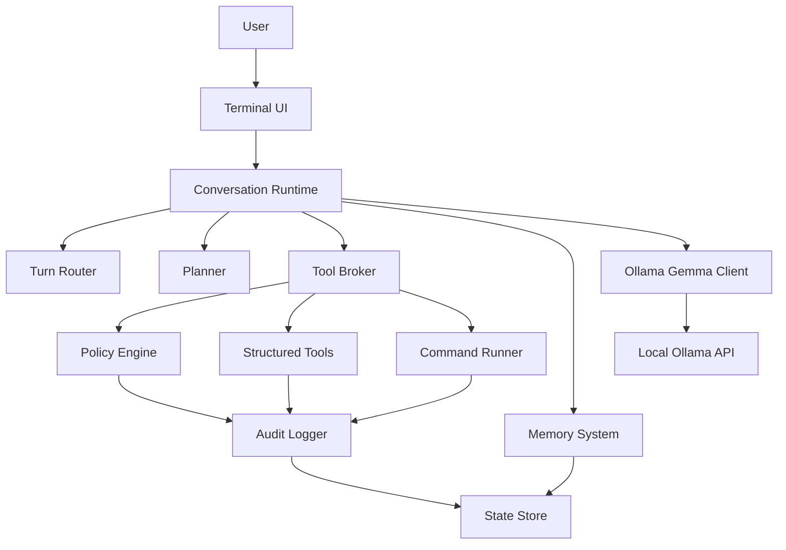

# ShellPilot Design

Status: Current implementation design through v0.10.1, with historical rebuild notes retained
Date: 2026-06-27
Repository: `/Users/lavin/Projects/ShellPilot`

## 1. Purpose

This document defines ShellPilot's design as a modular, local-first Python AI harness. Early sections retain the original rebuild rationale from 2026-06-10; later release-settled sections describe the current implementation through v0.10.1.

The rebuilt project should feel closer to a local coding and shell partner than a menu-driven chatbot. The user should be able to open one CLI conversation, ask questions, ask for project inspection, request command execution, approve plans for complex work, and use a manual shell when they want direct control.

The system is local-first through Ollama: by default every model call is local, and cloud/remote models are an explicit, off-by-default opt-in (section 15.2). Gemma 4 is the default and primary supported model family. The design intentionally avoids broad multi-provider abstractions in the first version because different model families vary widely in tool calling, reasoning behavior, streaming, and instruction following.

## Safety Scope

This project is a local developer productivity harness. Security-related features are limited to defensive command review, local audit logs, local privacy controls, and user-approved diagnostics. The project does not include offensive exploitation, credential theft, malware behavior, evasion, persistence, unauthorized scanning, or remote targeting.

## 2. Original Repo Baseline

This section is historical context from the initial rebuild plan. The repository has since shipped the rebuilt architecture through v0.10.1, but these observations explain why the current boundaries exist.

The pre-rebuild repository already proved several valuable ideas:

- A local Ollama-backed CLI assistant can work without cloud services.
- Tool calling is useful for file inspection, shell execution, memory, environment lookup, and system information.
- Planning before execution is important for complex tasks.
- Project memory is valuable and should be kept.
- Security profiles and command approval are necessary because shell automation can be destructive.
- Local audit logs are useful, but the security model should not add avoidable latency to every action.

The pre-rebuild implementation also had structural problems that the rebuild needed to address:

- `README.md` and code had drifted. The README documented fields and counts that did not match the implementation.
- The app is split into separate Chat and Agent modes even though the desired UX is one conversation that can answer or act.
- Runtime configuration is global mutable state.
- Ollama, Gemma 4, prompt behavior, and model roles are hard-coded across modules.
- Some local tests exist and pass, but `tests/` is ignored by `.gitignore`, so they are not part of the tracked project.
- `.docs/` is ignored, so durable project docs should live in `docs/`.
- The current security pipeline includes LLM classification in places where deterministic command policy would be faster and more predictable.
- Manual Shell audits all commands as low risk even though it runs with `shell=True`.
- Chat mode is described as read-only, but it can write persistent memory through `remember_memory`.

The rebuild should keep the useful ideas and discard accidental coupling.

## 3. Product Direction

The product is a local AI harness for a developer or power user working inside a terminal.

It should support:

- Natural conversation about the current project and local environment.
- Project inspection through structured tools.
- Task execution with planning for complex work.
- Shell command execution with clear approvals based on risk.
- A manual shell mode for direct user control.
- Persistent user behavior preferences and project memory.
- Local logs and local state only.
- Clean installation from a cloned repository.
- Modular internals that can be extended without turning the core into a monolith.

The initial rebuild should not try to become:

- A cloud-hosted assistant.
- A general multi-provider AI SDK.
- A full security product.
- A workflow automation SaaS.
- A plugin marketplace.
- A replacement for a real shell.

## 4. Naming Brainstorm

Settled 2026-06-10: the project name is **ShellPilot**. The brainstorm below is kept for historical context.

Simple name candidates:

| Name | Feel | Notes |
|---|---|---|
| Harness | Direct, accurate | Best description of the product: a local model harness around tools. |
| Claw | Short, memorable | Similar energy to OpenClaw; may be too close depending on desired distinction. |
| LocalClaw | Clear, local-first | Strong signal, but a little more derivative. |
| Anvil | Durable, tool-focused | Good for a developer tool, implies building. |
| Forge | Build-focused | Common but intuitive. |
| Tether | Local control | Suggests the model is anchored to the machine and policy. |
| Mason | Builder/helper | Friendly and simple, less technical. |
| Pilot | Assistant-like | Clear UX metaphor, but common. |
| Loom | Threads/context | Good if memory and context become major identity. |
| Pike | Small, sharp CLI | Distinct but less self-explanatory. |
| LocalPilot | Clear and practical | Good if the product should feel like a guided local assistant. |
| Shellmate | Friendly terminal partner | Memorable, but less serious. |

Recommendation (superseded by the settled name):

- Package `shellpilot`, executable `shellpilot`, project state dir `.shellpilot/`, env prefix `SHELLPILOT_`.

## 5. Design Goals

### 5.1 Local First

By default, all model calls happen through local Ollama. No telemetry, cloud sync, or automatic upload is part of the product. Cloud/remote models are an explicit opt-in, off by default behind the `[model] allow_cloud` switch (changeable only by a deliberate act — a `config.toml` edit or a confirm-gated `/config set`, never an env var) plus per-session consent (section 15.2) — local-first stays the default and the only full-privacy posture. The only other network egress is the optional, off-by-default web grounding tools: they contact only the search provider and pages the user approves per request, with no API keys.

### 5.2 Gemma 4 First

Gemma 4 is the default and primary supported family. The system can be designed cleanly enough that another Ollama model could be added later, but v1 optimizes prompts, tool schemas, and reasoning assumptions for Gemma 4.

### 5.3 One Conversation Loop

Chat and Agent modes should be combined. The user should not have to decide which mode they are in before asking.

The runtime should infer whether the turn is:

- A direct question.
- A project inspection request.
- A task that needs a plan.
- A simple command/action request.
- A preference or memory update.
- A manual shell request.

### 5.4 Modular By Construction

Major concerns must have explicit boundaries:

- CLI interface.
- Conversation runtime.
- Planner.
- Tool broker.
- Tool implementations.
- Command runner.
- Policy engine.
- Memory system.
- LLM client.
- Prompt library.
- Persistence.
- Logging and audit.
- Configuration.

Each module should be testable without launching the whole CLI.

### 5.5 Performance Conscious

Avoid extra model calls when deterministic logic is enough.

Examples:

- Command risk classification should be deterministic first.
- Tool selection should be handled in the main model turn where possible.
- Summarization and memory optimization should run only when needed.
- Log classification should not block command execution unless a profile explicitly requires it.

### 5.6 Privacy Preserving

The assistant must assume local files can contain secrets. It should avoid reading broad sensitive files unless asked and should redact obvious secrets from memory, logs, and prompts.

### 5.7 User Control

The user is allowed to execute dangerous commands. The assistant's job is not to forbid all risk. Its job is to identify risk, explain the likely goal and effect of a dangerous command, require explicit confirmation when policy requires it, and record what happened.

## 6. Non-Goals For v1

These should be deferred:

- Packet capture diagnostics as a core feature.
- Skill Builder as currently designed.
- Cloud provider support.
- Remote execution.
- Multi-user collaboration.
- Long-running background daemon.
- GUI.
- Plugin marketplace.
- Full sandbox/container runtime.
- Complex policy language.

Packet capture diagnostics and custom skills can return later as capability packs once the core extension model exists.

## 7. Proposed Dependency Strategy

The project should remain Python-centered but should not force "stdlib only" when a small dependency improves correctness or maintainability.

Target Python version:

- Python 3.11+ for vNext.
- Reason: `tomllib`, stronger typing ergonomics, modern packaging baseline, better performance than older Python versions.

Recommended runtime dependencies:

| Dependency | Purpose | Rationale |
|---|---|---|
| `rich` | Terminal rendering, status, tables, panels, colors | Obvious choice for a polished CLI without hand-rolled ANSI complexity. |
| `httpx` | Ollama HTTP client | Cleaner timeouts, streaming, errors, and testability than raw `urllib`. |
| `platformdirs` | Config/data/cache/log paths | Avoid hard-coded `~/.local/state` logic and handle OS differences correctly. |

Recommended dev dependencies:

| Dependency | Purpose |
|---|---|
| `pytest` | Tests |
| `pytest-cov` | Coverage |
| `ruff` | Formatting and linting |
| `mypy` or `pyright` | Type checking, optional at first |

Dependencies intentionally not recommended for v1:

| Dependency | Reason |
|---|---|
| `typer` | Nice, but `argparse` is enough if the primary UX is interactive. Avoid extra CLI framework complexity until needed. |
| `prompt_toolkit` | Powerful, but heavier. Start with `rich` plus standard input unless multiline editing/history becomes a priority. |
| `pydantic` | Useful for validation, but start with dataclasses and explicit validation unless schema complexity becomes painful. |
| `langchain` | Too broad and heavy for this project. The harness should own its execution model. |
| `llama-index` | Not needed for the initial local project-memory design. |

## 8. Install And Run Strategy

The primary install path should be clone-first:

```bash
git clone <repo-url>
cd <repo>
python3.11 -m venv .venv
source .venv/bin/activate
python -m pip install -e ".[dev]"
shellpilot
```

Also support direct module execution during development:

```bash
python -m shellpilot
```

The important point is that the project should have:

- `pyproject.toml`.
- A console script entrypoint.
- A tracked test suite.
- A standard dev install path.
- A standard command list in README.

Recommended initial commands:

```bash
shellpilot
shellpilot --cwd /path/to/project
shellpilot config show
shellpilot config edit
shellpilot doctor
```

`shellpilot doctor` should validate local prerequisites:

- Python version.
- Ollama availability.
- Ollama API reachability.
- Installed local models (with tested/untested family tags).
- State/config directories.
- Write access to project workspace.

## 9. High-Level Architecture

The architecture should be layered.



### 9.1 Package Layout

Proposed package layout:

```text
shellpilot/
  __init__.py
  __main__.py
  app.py
  cli/
    __init__.py
    commands.py
    terminal.py
    doctor.py
  config/
    __init__.py
    model.py
    loader.py
    defaults.py
  llm/
    __init__.py
    ollama.py
    gemma.py
    messages.py
    streaming.py
  runtime/
    __init__.py
    conversation.py
    router.py
    planner.py
    executor.py
    events.py
  tools/
    __init__.py
    base.py
    registry.py
    filesystem.py
    search.py
    command.py
    environment.py
  policy/
    __init__.py
    profiles.py
    command_policy.py
    approvals.py
    risk.py
  memory/
    __init__.py
    agents_md.py
    redaction.py
  persistence/
    __init__.py
    paths.py
    json_store.py
    toml_store.py
    audit_store.py
  prompts/
    __init__.py
    system.py
    planning.py
    execution.py
    memory.py
  capabilities/
    __init__.py
tests/
docs/
pyproject.toml
README.md
```

### 9.2 Module Responsibilities

| Module | Responsibility |
|---|---|
| `cli` | Terminal rendering, command-line flags, slash commands, doctor command. |
| `config` | Layered settings, schema validation, defaults, user/project overrides. |
| `llm` | Ollama HTTP calls, Gemma-specific prompt/tool formatting, streaming events. |
| `runtime` | Conversation loop, turn routing, planning, task execution, event dispatch. |
| `tools` | Structured tool definitions and implementations. |
| `policy` | Risk classification, security profiles, approval decisions. |
| `memory` | v1: `AGENTS.md` instruction loading and secret redaction helpers. v2: behavior/project/session memory and optimization. |
| `persistence` | Filesystem paths, atomic JSON/TOML writes, audit logs. |
| `prompts` | System prompts and prompt templates. |
| `capabilities` | Extension packs. Skills v2 is implemented through deterministic trigger-selected markdown guidance and read-only resources (v0.7.0, section 23); heavier packs (tools/handlers/permissions) remain a v3 candidate. |

## 10. Unified Conversation Runtime

The current Chat and Agent split should be replaced with one runtime.

### 10.1 Turn Lifecycle

Each user turn should pass through this pipeline:

1. Read user input.
2. Check slash commands and direct CLI commands.
3. Load relevant context:
   - Behavior instructions from `AGENTS.md` (global and project).
   - Recent session summary.
   - Current workspace facts.
   - (v2) Behavior and project memory once the memory system exists.
4. Ask Gemma 4 for a response with tool access.
5. If the model answers directly, print the answer.
6. If the model requests tools, pass them through the tool broker.
7. If the task needs 3 or more distinct steps, propose a plan (section 11.1).
8. If approval is needed, ask the user.
9. Execute approved tools/commands.
10. Feed results back to the model.
11. Summarize the turn.
12. (v2) Propose memory updates when appropriate.
13. Write audit events.

Plain text is the default output mode. If the user is just talking, asking for an opinion, asking a conceptual question, or asking something that can be answered from already-loaded context, the assistant should respond normally in plain text and should not call tools.

Tools are for grounded inspection and actions:

- Bash or argv command execution.
- File reads, writes, and anchored edits.
- Search across project files.
- Git inspection.
- Environment/system lookup.
- (v2) Memory lookup or proposed memory updates.

The model should not use tools just to look busy. Tool use should have a clear purpose: gather missing local evidence, perform a requested action, verify a result, or update approved memory.

### 10.2 Turn Types

The runtime should support these turn types:

| Turn Type | Description | Example |
|---|---|---|
| `answer` | Direct response, no tools needed | "What does this project do?" after enough context is loaded. |
| `inspect` | Read-only tool use | "Find where config is loaded." |
| `plan` | Complex task needs explicit plan | "Refactor the command runner." |
| `execute` | Simple action can be performed with approval policy | "Run the tests." |
| `edit` | File modifications via structured patch/edit tools | "Fix the failing test." |
| `memory_update` (v2) | User preference or discovered fact should be stored | "Always answer concisely unless I ask for detail." In v1, point the user at `AGENTS.md`. |
| `manual_shell` | User wants raw shell mode | "Open manual shell." |
| `clarify` | Required input is missing | "Deploy it" with no target. |

### 10.3 Routing Strategy

Avoid a separate classifier model call for every turn.

The system prompt should tell Gemma 4 how to behave:

- Answer directly when the user is asking a question and no inspection is needed.
- Use normal plain text for conversation; do not wrap ordinary answers in structured tool/action output.
- Use read-only tools when inspection would materially improve accuracy.
- Propose a plan for multi-step work (3 or more distinct steps, section 11.1); act directly otherwise.
- Ask a short clarification question only when a required target is missing.
- Use structured tools for file changes and commands.
- Stop after completing the current user request.

The runtime can add deterministic routing hints before the model call:

- Slash command detected.
- Message starts with `!` or explicit manual shell command.
- User asks to remember a preference (v1: suggest editing `AGENTS.md`).
- User asks for a multi-step code change.
- User asks to run, install, delete, modify, or commit.

Do not overbuild a standalone intent classifier in v1.

### 10.4 Reliability Design

Gemma 4 e4b handles tool calls correctly most of the time. "Most of the time" is the central design constraint, because failures compound multiplicatively across a task: at a 90% per-step success rate, a 10-step chain completes cleanly only about 35% of the time. Retry and recovery are therefore the main loop of the runtime, not edge-case handling.

Design rules that follow:

- Keep the tool count small and every input schema flat. No nested objects, no unions, no optional-heavy schemas. Small models degrade as tool count and schema complexity grow.
- Every model-driven step must be independently recoverable. The plan artifact (section 11.3) exists so a failed step can be retried or replanned without losing the task.
- Recovery loops are designed behavior, not error handling:

| Failure | Recovery |
|---|---|
| Malformed tool call | Return a compact schema reminder and allow exactly one retry. |
| Precheck failure (unrunnable command, missing executable, empty argv, packed shell line) | Tool returns a normal failed result pre-approval; the model may correct the arguments and retry. |
| Sensitive-path read (`read_file`/`search_text` whose path component names a secret) | Classifier raises risk to HIGH; `privacy.allow_sensitive_reads` gates it — `"ask"` prompts (standard `[y/n]`, reason shown), `"never"` blocks, `"always"` auto-runs. `search_text` skips matching files during traversal and notes the count (section 15). |
| Edit anchor not found or ambiguous | Re-read the target region and allow one corrected retry. |
| Same failure twice | Stop and enter the roadblock protocol (section 11.6). |
| Tool-call loop | Enforce turn/tool budgets (section 24.6) and replan or stop. |
| Approved plan stalls on narration | Inject a bounded continuation nudge (below) and keep the turn going. |
| Empty reply after a tool result | Nudge the model to continue or answer in plain text; bounded to two attempts, then print an honest `(empty response)` line and end the turn. |
| End-of-plan summary repeated | After explicit completion via `update_plan`, if the completing reply already contains a substantive summary, end the turn instead of re-prompting for one (below). |

Small models often reply to an approved plan with prose — "I will now execute Step 1." — and no tool call, which would otherwise end the turn and force the user to type "continue" once per step. When a no-tool-call reply arrives while the active plan still has a pending or in-progress step, the tool loop injects a tool-role nudge (`PLAN_CONTINUE_NUDGE`) naming that step, then loops again instead of returning. The nudge is **positive routing, not a muzzle**: it tells the model to record the step with `update_plan(step={index}, status="completed")` and continue if the step is done, do the step now with the appropriate tool then record completion if it is not, record a blocker if something is blocking it, and ask the user only when it needs information the user alone can provide. It does not forbid narration (a prose-only step has no tool to call) and carries no "do not repeat" wording. The nudge is bounded to **two per turn**: a model that genuinely needs the user (an honest question, an unrecoverable blocker) keeps the third no-tool-call reply, which ends the turn normally. The nudge never fires for a merely *proposed* plan awaiting approval, nor once the per-turn tool budget has emptied the tool set (in that state the model has already been told to answer in plain text). This is the deterministic runtime backstop behind the prompt and tool-result hardening that nudges the model toward single-turn plan execution.

**Single end-of-plan summary (v0.8.2).** A plan advances only when the model calls `update_plan(step=N, status="completed")`. When the *last* step completes, the `update_plan` tool result returns a single end-of-plan summary prompt (kept) that asks the model to give its final summary with length matched to the task — brief for simple work, fuller when there are substantive findings. The duplication problem: small models often write a full end-of-plan summary as prose in the **same** reply that calls `update_plan(completed)`; the tool loop would then re-invoke the model on that "summarize" tool result, producing a second (and sometimes third) copy. The runtime suppresses that redundant re-invocation deterministically: after a tool batch, if the active plan's status transitioned to `completed` **in this batch** (captured by comparing the status before the batch — completion is therefore always **explicit**, driven by the model's own `update_plan` through the normal `_update` handler, with `on_step_change`/UI re-render and all bookkeeping already done — never inferred from prose) **and** the completing reply's content is already a substantive summary (`len(reply.content.strip()) >= MIN_SUMMARY_CHARS`, ~80 chars), the loop writes a `plan_summary_suppressed` audit event and returns that reply, ending the turn. The already-streamed prose is the single summary. When the completing reply has no or short content, suppression does **not** fire, so the "summarize" prompt still reaches the model and elicits the one summary turn (the normal path). Only the extra model round-trip is skipped; the completion, the artifact write, and the programmed summary prompt are all untouched.

A reasoning-capable model can also end a turn with a genuinely *empty* reply — no text, no tool call. This was observed live: a 4.2k-token thinking block followed by zero content and zero tool calls, rendering nothing to the user. Without a guard the loop accepts that empty reply as the answer and the turn vanishes silently behind the stats line. So, after the plan nudge has had its chance, any empty (or whitespace-only) reply triggers the empty-reply nudge — a tool-role message inserted by the runtime. Two separate nudge messages are used: `EMPTY_FIRST_NUDGE` fires when no tool has run yet in this turn (the model is expected to answer in plain text or call a tool); `EMPTY_CONTINUE_NUDGE` fires when at least one tool result has already been appended (the model stalled mid-execution). Both are treated as unacceptable: silence is never a valid answer, whether or not the model has done any work yet. The nudge budget is **two per turn** (`MAX_EMPTY_NUDGES = 2`); on exhaustion the runtime prints an honest `(empty response)` line and returns the empty answer rather than looping forever. When the captured `thinking` is non-empty the audit events record its length, so a "thinking-only" turn is diagnosable after the fact.

The roadblock protocol (section 11.6) and the model edge cases (section 24.6) are instances of this principle, not exceptional paths. Phase 0.5 (section 27.2) measures the actual failure rates of the target model before the edit strategy is locked in.

**Deterministic contract validation (v0.5.2).** `validate_args` enforces three additional constraints before any handler runs, routing failures through the same malformed-call path (schema reminder + one retry) as unknown arguments or wrong types:

- **Enum membership** — when a parameter schema declares `"enum": [...]`, any value not in that list is rejected with a message naming the parameter and listing the allowed values. Affected tools: `patch_file.operation` (one of `replace_exact`, `insert_before`, `insert_after`, `delete_exact`), `write_file.mode` (one of `create`, `overwrite`, `append`), `update_plan.status` (one of `pending`, `active`, `completed`, `skipped`). The enum values are single-sourced from the existing constants (`OPERATIONS`, `WRITE_MODES`, `STEP_STATUSES`) — not duplicated.
- **Array item types** — when a parameter declares `"items": {"type": "..."}` on an array, every element is checked against the JSON-schema type mapping; a non-conforming element is rejected with the element index and actual type. Affected tool: `propose_plan.steps` (items must be strings).
- **Integer bounds** — when a parameter declares `"minimum"` or `"maximum"`, out-of-range integers are rejected with the bound named. Affected tool: `run_command.timeout_seconds` (minimum 1). The existing handler-level floor clamp (`max(1, ...)`) coexists as defense in depth; the schema minimum rejects 0 and negative values before the handler is reached.

Handler-level checks for the same conditions (e.g. the `if mode not in WRITE_MODES` guard in `_write_file`, the `if status not in STEP_STATUSES` guard in `_update`) remain in place as defense in depth; in normal flow they are unreachable for those parameters.

**`max_plan_steps` enforcement (v0.5.2).** `RuntimeSettings.max_plan_steps` (default 10) is now enforced at proposal time. A `propose_plan` call whose `steps` list exceeds the limit returns a corrective failure (`plan has N steps; max is M — consolidate related steps and propose again`) via the normal `ToolResult(success=False, ...)` path — not the malformed-call path — because the step count is a policy decision, not a schema error. The setting is threaded from `Settings.runtime.max_plan_steps` through `ConversationRuntime` to `make_plan_tools(max_plan_steps=...)` at construction time.

### 10.5 Context And Output Budgeting

The current code uses broad character limits like `MAX_INPUT_LENGTH` and `MAX_OUTPUT_CHARS`. The rebuild should move to model-aware token budgets.

The runtime should query Ollama for the selected model's metadata when possible, using the local model information exposed by Ollama. The context budget should come from the selected Gemma 4 model's configured context length, not from one global constant.

Ollama has a context trap the design must handle explicitly: model metadata reports the model's maximum context length, but the actual runtime context is whatever `num_ctx` the client requests, and Ollama's default `num_ctx` is small regardless of what the model supports. The Ollama client must set `num_ctx` explicitly on every request from the resolved context budget. Detecting a large maximum while silently running at the default would make all of the budgeting below meaningless.

Token counting mechanism: v1 does not ship a local tokenizer. All token estimates use a `chars / 4` heuristic with a safety margin, and compaction triggers before the hard limit to absorb estimation error. The budget terms below are estimates, not exact counts.

Budget terms:

| Budget | Meaning |
|---|---|
| `model_context_tokens` | Total usable context window for the selected model. |
| `reserved_response_tokens` | Tokens reserved for the model's next answer. |
| `reserved_system_tokens` | Budget for system prompt, tools, policy, and behavior instructions. |
| `working_prompt_tokens` | Remaining budget for conversation, task state, file snippets, and tool results. |
| `compact_at_tokens` | Threshold where automatic compaction should start. |
| `hard_limit_tokens` | Threshold where new context must be rejected or compacted before another model call. |

Recommended formula:

```text
model_context_tokens = detected from Ollama, else fallback to 8192
reserved_response_tokens = clamp(1024, 4096, floor(model_context_tokens * 0.20))
reserved_system_tokens = clamp(1024, 4096, floor(model_context_tokens * 0.15))
working_prompt_tokens = model_context_tokens - reserved_response_tokens - reserved_system_tokens
compact_at_tokens = floor(model_context_tokens * 0.70)
hard_limit_tokens = floor(model_context_tokens * 0.90)
```

`clamp(min, max, value)` means use `value` but never lower than `min` or higher than `max`.

When automatic compaction is off, a turn is refused if it would cross `hard_limit_tokens`. That pre-turn gate counts the estimated prompt (system prompt + history, including history images) plus this turn's incoming text **and** its incoming images (`IMAGE_TOKEN_ESTIMATE` per image), so an image-heavy turn cannot slip past a limit that text-only turns respect. The term is zero for text-only turns, leaving them unchanged.

Note the floor case: at the 8192-token fallback, after the system prompt, tool schemas, and behavior instructions, the working prompt budget is roughly 3-4k tokens. Small-context operation is a first-class mode, not a degraded one: shorter tool results, more aggressive truncation, and no long conversational tails.

If the selected model exposes a much larger context window, the runtime can scale up conversation and tool context, but it should still cap noisy data. Larger context should improve continuity, not encourage dumping full command logs into every prompt.

Recommended tool-output prompt budgets:

| Item | Prompt Budget |
|---|---|
| Single read-only tool result | `min(2000 tokens, 10% of model_context_tokens)` |
| Total tool results in one turn | `min(8000 tokens, 30% of model_context_tokens)` |
| Behavior instructions (`AGENTS.md`) | `min(1500 tokens, 10% of model_context_tokens)` |
| (v2) Project memory | `min(2500 tokens, 15% of model_context_tokens)` |
| Recent conversation | Whatever remains after system, memory, active task, and tool budgets. |

Raw command output needs separate limits because the user may need to see more output than the model should receive:

| Setting | Recommended Default | Purpose |
|---|---|---|
| `max_command_capture_chars` | `200000` | Maximum command output captured locally for logs/UI. |
| `max_command_prompt_tokens` | model-aware, default around `2000` tokens | Bounded command output sent back to the model. |
| `max_tool_prompt_tokens` | model-aware, default around `2000` tokens per tool | Bounded tool result sent to the model. |
| `max_user_message_tokens` | `min(4096, 25% of model_context_tokens)` | Prevent giant pasted prompts from crowding out system and task context. |

When a user pastes content that exceeds `max_user_message_tokens`, the CLI should suggest saving it to a file or importing it as an explicit context artifact instead of silently truncating it.

Output generation should also be explicit:

- Normal conversational response: usually under `1024` tokens.
- Plan or final task summary: usually under `2048` tokens.
- Large generated file: use file-writing/edit tools, not one giant chat response.
- Dangerous command purpose explanation: a fixed deterministic template (one or two sentences), built from the classifier reasons rather than generated by the model.

The runtime should expose `/compact status` so the user can see current context usage, selected model context length, compaction threshold, and whether automatic compaction is enabled.

#### ContextAssembler

The system prompt is assembled from a fixed, ordered set of blocks — base prompt, behavior instructions, memory, the conditional skills group (a `skills index` block plus per-skill bodies and triggered references, section 23), and (when a plan is live) a compact plan-state block. A pure `ContextAssembler` (no file or model I/O) captures that assembly as a structured `ContextSnapshot` of `ContextBlock`s, each carrying a block name, source, token estimate, an `injected` flag, and an optional skip reason. The snapshot is the single source of truth: the same structure produces both the live model prompt (joining injected blocks with `\n\n`) and the `/context` breakdown, so the figures shown to the user cannot drift from what the model receives. Block order is load-bearing; the base prompt is always present, while behavior, memory, skills, and plan state are injected only when their trigger or non-empty condition holds.

Skill activation uses an explicit `TriggerContext(plan_status, web_enabled, enabled)` rendered by the runtime. `plan_status` is the live plan status when a plan sidecar exists, `web_enabled` is true only when both `web_search` and `web_fetch` are registered in the `ToolRegistry`, and `enabled` is the `[skills] enabled` tuple. This keeps boot-only settings drift from accidentally activating web guidance.

Each discovered skill also receives a `SkillDecision` in the snapshot, including valid, invalid, disabled, and budget-skipped skills. Decisions record the matched triggers, injection result, reason, resource summary, and script summary; slash commands render active state and row details from these decisions instead of re-deriving visibility.

For active skills, the assembler selects only references whose own trigger fires. The skill body and all selected references are one budget group: if the group would exceed the skill budget, neither body nor references are injected, and later skills are skipped with the same budget reason. Templates and scripts are discovered metadata only; they are never injected in v0.7.0.

## 11. Planning Model

Complex tasks require a plan. The plan should be visible and editable before execution.

### 11.1 When To Plan

Planning is required when the task needs 3 or more distinct steps. All related setup
must be folded into one plan; a second follow-up plan for work already known at proposal
time is not allowed. (Settled 2026-06-11)

Planning is NOT required (do the action directly) when:

- The task is a direct answer or single read-only inspection.
- The task is a single command or a single file edit.
- The task is a simple low-risk command like `pwd` or `git status`.

### 11.2 Plan Shape

Plans should be structured data internally:

```python
class TaskPlan:
    goal: str
    risk: str
    steps: list[PlanStep]
    assumptions: list[str]
    verification: list[str]

class PlanStep:
    id: str
    title: str
    intent: str
    kind: str
    status: str
    expected_tools: list[str]
```

### 11.3 Plan Artifacts

Complex plans should be written to a project-local plan file. The plan file becomes the reference of record for the task, instead of relying only on transient chat history.

Recommended location:

```text
<workspace>/.shellpilot/tasks/<task-id>/PLAN.md
```

Example:

```text
.shellpilot/tasks/20260610-153012-command-runner-refactor/PLAN.md
```

Why this location:

- It is local to the project the work applies to.
- It does not pollute source directories like `src/` or `docs/`.
- It can hold task-local artifacts later, such as diffs, snapshots, and verification logs.
- It can be gitignored by default.
- It can be exported to `docs/plans/` only when the user wants to keep a plan as tracked project documentation.

The initial rebuild should create `.shellpilot/` as a local project state directory and recommend adding it to `.gitignore`.

Plan file contents:

```markdown
# Task Plan: Refactor command execution into a modular runner

Status: active
Task ID: 20260610-153012-command-runner-refactor
Workspace: /Users/lavin/Projects/ShellPilot
Profile: balanced
Created: 2026-06-10T15:30:12Z
Updated: 2026-06-10T15:35:44Z

## Goal

Refactor command execution into a modular runner while preserving local-only behavior.

## User Intent

The user wants a cleaner execution layer with `shell=False` by default and explicit raw-shell handling.

## Assumptions

- Keep Ollama/Gemma 4 as the only v1 provider.
- Preserve manual shell as a separate mode.
- Preserve command approval for risky commands.

## Plan

- [ ] Inspect current command execution and policy code.
- [ ] Define the command runner interface.
- [ ] Move command execution behind the interface.
- [ ] Add tests for risky commands and safe commands.
- [ ] Run tests.

## Files Expected To Change

- `shellpilot/tools/command.py`
- `shellpilot/policy/command_policy.py`
- `tests/test_command_runner.py`

## Verification

- `pytest tests/test_command_runner.py`
- `pytest`

## Decisions

- Pending.

## Open Questions

- Pending.

## Blockers

- None.

## Revisions

- None.

## Progress Log

- Created initial plan.
```

The plan artifact should be updated as work progresses:

- Mark steps as active/completed/skipped.
- Record important user decisions.
- Record files changed.
- Record verification commands and results.
- Record blockers and replans.

The runtime should load the active `PLAN.md` before each planned step and include a compact plan state in the model context. This gives the model a stable reference even after `/compact` compresses conversation history.

The plan file should not become a verbose transcript. It should remain a concise operational reference.

#### Plan persistence and session-resume (v0.6.0)

Plans survive session boundaries through two cooperating mechanisms.

**`state.json` sidecar.** Every `_write` call atomically writes a machine-readable sidecar alongside `PLAN.md`:

```text
<workspace>/.shellpilot/tasks/<task-id>/state.json
```

The sidecar carries `state_version: 1` and the full `TaskPlan` fields in JSON.  It is written *before* the session pointer record (crash-tolerant ordering: a pointer without a readable sidecar is a no-op on restore; a sidecar without a pointer is unreferenced state). The self-healing loader (`load_plan`) returns `None` on any error — missing file, corrupt JSON, wrong version, or field error — and never raises.

**Active-plan pointer in the session transcript.** The session JSONL file carries `active_plan` records that track the live pointer:

```json
{"type": "active_plan", "task_id": "<task-id or null>"}
```

The pointer is `task_id` while the plan status is `proposed`, `active`, or `blocked`; it is `null` for terminal statuses (`completed`, `cancelled`).  A `clear` record resets the pointer to `null`. Duplicate writes are suppressed: a new record is only appended when the pointer value changes.  The last `active_plan` record in a transcript wins on load.

**On `--resume`.** The boot sequence reads the pointer from the transcript, loads the sidecar with `load_plan`, and calls `PlanManager.restore` only when the sidecar status is still live (`proposed`/`active`/`blocked`). The restore path primes the dedupe cache so no new session record is written. If the plan pointer references a different workspace (e.g. the session was moved), `load_plan` returns `None` because the task directory does not exist under the new workspace — no restore, no crash.

Plans are project-local: the sidecar lives inside the workspace `.shellpilot/tasks/` directory, so carrying a session file to a different workspace is safe.

Rendered plan example:

```text
Goal: Refactor command execution into a modular runner

Assumptions:
- Keep local-only Ollama behavior.
- Preserve existing command approval UX.

Plan:
1. Inspect current command execution and policy code.
2. Define the new command runner interface.
3. Move execution logic behind the interface.
4. Update tests around command policy and execution.
5. Run unit tests.

Verification:
- Unit tests pass.
- Existing low-risk command flow still works.
- Dangerous command approval still prompts.
```

### 11.4 Planning Workflow

Recommended workflow:

1. User describes a non-trivial task.
2. Runtime gathers minimal context needed to plan.
3. Model drafts a structured plan.
4. Runtime writes `PLAN.md` under `.shellpilot/tasks/<task-id>/`.
5. UI shows the rendered plan and plan file path.
6. User approves, rejects, or suggests revisions.
7. When the user requests revisions, the harness marks the existing task as
   pending-revision and returns the feedback to the model. The model's next
   ``propose_plan`` call rewrites the existing task's PLAN.md and progress log
   **in place** — same task ID, same directory. A revision never creates a
   second task directory. ``/clear`` (or any ``cancel()`` call) also clears the
   pending-revision marker so the next ``propose_plan`` starts a fresh task.
   - **Idempotent duplicate propose (v0.8.2).** Small models sometimes emit
     ``propose_plan`` twice in one reply batch; run sequentially, the first
     creates and approves the plan while the second — identical — would otherwise
     cancel the just-approved plan and re-prompt the user for the same approval.
     So when there is **no pending revision**, the active plan is already
     ``proposed`` or ``active``, and the incoming proposal is **identical** to it
     (the stripped ``goal`` equals the stored goal **and** the normalized
     ``steps`` list equals the stored ``PlanStep.title`` list — a byte-identical
     re-emit), ``propose_plan`` is a no-op: it does not re-approve, cancel,
     recreate, or re-prompt, and instead returns a success result telling the
     model the plan is already active and to keep executing the current step.
     Accepted tradeoff: a deliberate identical "restart" re-propose is also
     swallowed, which is far rarer than the duplicate-emit this prevents. The
     guard sits after the pending-revision branch, so a genuine revision still
     revises in place and any changed goal or step list still recreates.
8. On approval, the `propose_plan` tool result instructs the model to continue in the same
   turn: it must call the tool for step 1 immediately, then record progress with
   `update_plan`, and keep executing steps without asking the user again. The user
   approval has already been captured; the model must not re-ask in prose. This
   execution discipline also arrives in the system prompt via the conditional builtin
   `planning` skill and its plan-mode references, selected only while a plan is live
   (`proposed`/`active`/`blocked`; section 23.1).
9. Each `update_plan` call for a non-final step instructs the model to continue with the
   next step in the same turn. The final completion result instructs the model to summarize
   the outcome instead.

A plan finalizes to `completed` once every step is `completed` or `skipped`. This is
re-checked after **any** step status change, so a skipped final step finishes the plan just
as a completed one does; only a *completion* advances the next pending step to active.

Completing a step is deterministically guarded: if the step's last side-effecting action
failed or was denied and nothing has succeeded since, `update_plan(completed)` returns a
corrective failure telling the model to apply the change successfully or record a blocker
with `update_plan(blocker="<evidence>")`. Pure-analysis steps and failure-then-successful-alternative
paths complete freely.

10. Runtime updates the plan file after each meaningful step.
11. Runtime writes a final outcome summary into the plan file when the task finishes.

The user should not have to manually edit source files. The normal edit interaction is:

1. User suggests the desired change in plain language.
2. Model inspects the relevant files.
3. Model proposes or applies the actual file edit through the anchored edit tools.
4. Runtime shows diffs and asks for approval according to the active profile.
5. Runtime updates the plan artifact with what changed.

The user may manually edit the plan file if they want, but the default interaction should be conversational: the user suggests plan or source changes, and the model performs the actual plan/source edits through the runtime.

### 11.5 Replanning

The runtime should stop and replan when:

- A command fails in a way that invalidates the current plan.
- A required file or API does not exist.
- The model attempts a blocked action twice.
- Test failures reveal a wrong assumption.
- The user changes direction.

Replanning should preserve completed steps and explain what changed. It should update the existing plan artifact rather than create a disconnected second plan, unless the user explicitly starts a new task. The blocker-recording mechanics (`update_plan(blocker=…)`, then propose a revised plan or ask one short question) are carried by the conditional builtin `planning` skill while a plan is active/blocked (section 23.1), not the always-on base prompt.

### 11.6 Roadblock Protocol

When the model hits a roadblock, it should not keep pushing through the same failing path. The runtime should move the task into a controlled `blocked` or `replanning` state.

A roadblock includes:

- A command or tool fails in a way that invalidates the current step.
- The model discovers its assumptions are stale or wrong.
- A file, API, dependency, model, command, or config item does not exist.
- Tests fail for reasons not covered by the current plan.
- The model needs information outside the current workspace or permissions.
- A policy blocks the required action.
- The same safe recovery attempt fails twice.

Roadblock behavior:

1. Stop the current step.
2. Capture evidence:
   - Failed command or tool.
   - Exit code or error.
   - Relevant output lines.
   - Current plan step.
   - Assumption that appears invalid.
3. Record the blocker in the active `PLAN.md`.
4. Refresh context with the narrowest safe reads or checks needed.
5. Decide whether the issue can be recovered inside the original goal.
6. Draft a revised remaining plan.
7. Show what changed from the old plan to the revised plan.
8. Ask for user approval when the revised plan changes scope, increases risk, needs new permissions, or depends on user intent.
9. Continue only after the revised path is clear.

The model may try bounded self-recovery before asking the user. Good self-recovery examples:

- Re-read a file that changed.
- Run a narrower diagnostic command.
- Search for a renamed symbol or config key.
- Check installed tool versions.
- Use a structured tool instead of raw shell.
- Run a focused test to isolate a failure.

Bad self-recovery examples:

- Repeating the same failed command without a new reason.
- Expanding into broad unrelated searches.
- Installing dependencies without approval.
- Changing unrelated files to make a failure disappear.
- Ignoring a failed verification step.
- Continuing execution after the plan's core assumption is false.

If the model's understanding is outdated, it should explicitly mark the stale assumption:

```text
Stale assumption: The command runner lives in `ai_core/tools/handlers.py`.
New evidence: Command execution has moved to `shellpilot/tools/command.py`.
Plan change: Replace steps 2-4 with steps that update the new runner interface.
```

The plan artifact should record this under `## Revisions`:

```markdown
## Revisions

- 2026-06-10T16:20:00Z: Replanned after discovering command execution had moved from `ai_core/tools/handlers.py` to `shellpilot/tools/command.py`.
```

It should record active blockers under `## Blockers`:

```markdown
## Blockers

- Blocked at step 3: `pytest tests/test_command_runner.py` fails because `CommandPolicy` is not importable.
  Evidence: `ModuleNotFoundError: No module named 'shellpilot.policy.command_policy'`.
  Next action: create the missing module or revise the package layout.
```

The assistant should ask the user a question only when it cannot choose safely from local evidence. The question should be short and specific:

```text
The implementation can either add the missing `command_policy.py` module or change the imports to use the existing policy module. Which direction do you want?
```

If the task is genuinely blocked and cannot proceed without the user, the runtime should:

- Mark the current step as blocked.
- Preserve the plan artifact.
- Preserve relevant file snapshots.
- Print the blocker and the exact decision needed.
- Avoid claiming the task is complete.

## 12. Tool System

Tools should be modular, typed, and registered through a central registry.

### 12.1 Tool Interface

Each tool should define:

- Name.
- Description.
- Input schema.
- Output schema.
- Side effect level.
- Default risk.
- Allowed profiles.
- Handler function.

Example:

```python
class ToolSpec:
    name: str
    description: str
    input_schema: type
    output_schema: type
    side_effect: SideEffect
    default_risk: RiskLevel
    allowed_profiles: set[str]
```

### 12.2 Core Tools For v1

Core tools:

| Tool | Purpose | Side Effect |
|---|---|---|
| `read_file` | Read bounded file content | None |
| `list_dir` | List directory entries | None |
| `search_text` | Search files | None |
| `write_file` | Create/overwrite/append file | Workspace write |
| `patch_file` | Apply structured patch | Workspace write |
| `run_command` | Run argv command with `shell=False` | Variable |
| `env_info` | Read cwd, OS, selected env info | None |

The v1 core surface is deliberately small: seven tools with flat input schemas. Fewer tools measurably improve small-model tool-call reliability (section 10.4).

Git inspection does not get dedicated tools in v1. `git status`, `git diff`, and similar read-only git commands run through `run_command` and are classified low risk by the deterministic command policy allowlist. Dedicated `git_status`/`git_diff` tools can return later if structured git output proves valuable.

Memory tools (`memory_read`, `memory_propose_update`, `memory_commit_update`) shipped in v0.3.0 as part of the memory system (section 16); plan tools (`propose_plan`, `update_plan`) ship with the planner. v0.5.0 adds `view_image` (multimodal, section 34) and two opt-in web tools (`web_search`, `web_fetch`, section 33) that are only registered when `[tools] web = true`.

Raw shell should be deferred as an agent tool. Agent execution should use `run_command` with `shell=False` in v1. Raw shell remains available through Manual Shell, where the user directly controls the command string.

### 12.3 Tool Output Contract

Every tool result should include:

- `success`.
- `summary`.
- `content`.
- `truncated`.
- `risk`.
- `side_effect`.
- `metadata`.

The model should receive bounded output. The user can see fuller output when appropriate.

### 12.4 File Editing

File edits must be read-before-write.

Before the model can edit an existing file, the runtime must have read that file and recorded a file snapshot for the current task. Write tools should reject edits that do not reference a prior read snapshot.

The snapshot should include:

- Resolved path.
- Content hash.

This prevents blind edits where the model guesses file contents, overwrites concurrent changes, or writes a file it has not inspected.

File edits should prefer `patch_file` or anchored replacement over full-file rewrites.

The editing flow should be:

1. Read target file.
2. Record a file snapshot and content hash.
3. Generate an anchored edit against that snapshot.
4. Validate the file has not changed since the snapshot.
5. Apply the edit atomically.
6. Re-read or validate changed regions.
7. Run focused tests or checks.

This avoids accidental file truncation, prevents stale writes, and makes diffs easier to review.

### 12.5 Anchored Edit Strategy

Models are unreliable at line-specific replacement when asked to surgically rewrite arbitrary line numbers. They are also wasteful when asked to regenerate an entire file where only a few regions changed.

The runtime should therefore support anchored edits: the model generates only changed spans, and the runtime copies unchanged text from the previously read snapshot.

Conceptually:

```text
snapshot_before = full file text read by runtime
model_output = changed spans with stable before/after anchors
runtime_output = unchanged prefix + model change + unchanged suffix
```

The model should not need to regenerate the whole file. It should provide enough context to locate the edit deterministically.

Recommended edit operations:

| Operation | Purpose |
|---|---|
| `replace_between` | Replace text between two exact anchors. |
| `replace_exact` | Replace one exact old text block with one new text block. |
| `insert_before` | Insert text as new line(s) before the line containing the exact anchor. |
| `insert_after` | Insert text as new line(s) after the line containing the exact anchor. |
| `delete_exact` | Delete one exact old text block. |
| `rewrite_file_from_snapshot` | Last resort for generated files or broad rewrites. Requires prior full read. |

Example edit request:

```json
{
  "path": "shellpilot/runtime/executor.py",
  "snapshot_hash": "sha256:...",
  "operation": "replace_exact",
  "old": "def execute_step(...):\n    ...\n",
  "new": "def execute_step(...):\n    ...updated logic...\n"
}
```

Runtime validation:

- The path must match the read snapshot.
- The current file hash must match the snapshot hash.
- The `old` block or anchors must match exactly once unless the operation explicitly allows multiple matches.
- The result must preserve file encoding and newline style.
- The runtime should show a diff before approval when the active profile requires it.

For large files, the runtime can read and expose bounded windows around relevant anchors, but it should still compute a whole-file hash before writing. If the model needs to rewrite a region outside the current window, it must request another read first.

Whole-file rewrites are acceptable when:

- The file is small.
- The file is generated.
- The change touches most of the file.
- The target format is easier to safely regenerate than patch.

Even then, the runtime should treat the model output as a replacement against a known snapshot, not a blind write.

v1 implementation note (2026-06-10): the Phase 0.5 benchmark measured 100% byte-exact span reproduction for `gemma4:e4b`, so the anchored strategy ships as designed. The v1 operation set is `replace_exact`, `insert_before`, `insert_after`, and `delete_exact`; whole-file rewrites go through `write_file` with `mode=overwrite` against a validated snapshot (covering `rewrite_file_from_snapshot`). `replace_between` is deferred: it needs a two-anchor schema, and `replace_exact` covers its use cases at the measured reliability. v0.5.1: `insert_before`/`insert_after` operate on line boundaries -- a live session glued a docstring onto the `def` line when the anchor lacked a trailing newline, so mid-line splices for the insert operations were replaced with whole-line insertion; intra-line edits belong to `replace_exact`.

## 13. Command Execution Design

Command execution is one of the most important design areas.

### 13.1 Default Command Runner

The agent should use `shell=False` by default.

Input:

```python
class CommandRequest:
    argv: list[str]
    cwd: str
    env: dict[str, str] | None
    timeout_seconds: int
    stdin: str | None
```

Execution:

- Use `subprocess.Popen(argv, shell=False)`.
- Stream stdout/stderr.
- Bound captured output; each read is hard-capped at 65 536 chars so a newline-less stream cannot materialise an unbounded string before the total capture cap is consulted, and the final captured chunk is sliced to the remaining budget so total capture never exceeds the cap (and `truncated` is set).
- Enforce timeout.
- Kill process group on timeout.
- Return exit code and captured output.
- Run with a sanitized copy of the parent environment (`DYLD_*`/`LD_*`/`Malloc*` stripped; pagers, editors, and credential prompts forced non-interactive) and stdin closed (`DEVNULL`) — command output must not depend on debug environment variables, and a command that reads stdin gets immediate EOF instead of hanging to its timeout. ShellPilot also scrubs the same prefixes from its own environment at boot: macOS libmalloc can emit a diagnostic line from the fork window of every spawned command (before exec, while the child still runs the parent's image), and that noise would land inside captured command output. A residual single-line allocator diagnostic can still appear on hosts whose terminal ancestry primed libmalloc stack-logging; eliminating it would require posix_spawn, which is incompatible with process-group kills and Ctrl-C isolation (investigated and declined, v0.5.1).

### 13.2 Raw Shell

Raw shell is still useful for user-controlled workflows and shell-native syntax.

V1 raw shell use case:

- Manual Shell mode only.

Raw shell must be visible:

- The UI should label it as raw shell.
- The policy engine should treat shell metacharacters as higher risk.
- Approval prompts should show the exact command string.

Do not expose `raw_shell` as a normal agent tool in v1. If the model wants a pipeline, redirection, shell expansion, or another shell-native expression, it should first translate the request into structured tools or `run_command` with `shell=False`. If that is not reasonable, the assistant should ask the user to use Manual Shell or approve a future raw-shell capability after v1.

### 13.3 Pipes And Redirection

When the AI wants a pipeline like:

```bash
grep -R "foo" . | head
```

Preferred order:

1. Translate to structured tools like `search_text`.
2. Use Python-side post-processing where simple.
3. Ask the user to switch to Manual Shell when shell-native behavior is truly needed.

**Pre-flight rule:** A command that cannot start is rejected deterministically BEFORE the approval prompt. This covers:

- Empty `argv`.
- A packed shell line (shell syntax in `argv[0]` or a single-token command string with spaces).
- An `argv[0]` that resolves to a missing or non-executable path (path-separator form).
- An `argv[0]` that is not found on `PATH` (bare-name form).
- A standalone shell-operator token (e.g. `|`, `>`, `&&`) appearing anywhere in `argv`. Note: `;` is deliberately exempt — `find -exec ... ;` passes a literal `;` argument to `find`, and a stray `;` elsewhere fails naturally without harm.

When a PATH miss is detected, the runtime produces deterministic suggestions: it probes `<name>3` first (covers `python→python3`, `pip→pip3`) and then scans PATH for close matches via `difflib`. Example message: `executable 'python' not found on PATH — did you mean: python3?`

When a packed single-token command contains no shell syntax markers, the runtime computes `shlex.split` on the token and appends a deterministic `Did you mean argv=[...]?` suggestion to the rejection message, e.g. `Did you mean argv=["python", "-m", "unittest", "test_calculator.py"]?`. Packed tokens that contain shell syntax (pipes, redirects) receive no suggestion since the shell operators cannot be expressed in `argv`.

Approvals are never spent on commands that cannot start. The model receives a normal failed tool result and may correct the arguments and retry.

### 13.4 Dangerous Commands

The user is allowed to run dangerous commands, but the assistant must not hide the risk.

When a dangerous command is detected:

1. Deterministic policy marks it dangerous and records *why* (the classifier reasons).
2. The harness produces a short purpose explanation deterministically from those reasons — a pure function maps each reason to a fuller, one-line consequence sentence. No model call is involved, so the approval prompt appears instantly.
3. The UI displays risk, command, cwd, and purpose explanation.
4. The user explicitly approves or rejects.
5. The audit log records the command, risk, purpose explanation, and decision.

The explanation is short and specific, keyed to the classifier reason:

```text
Recursively and permanently deletes the target and everything inside it; this cannot be undone.
```

Because it is built from the deterministic classifier reasons, the explanation can never downgrade the risk classification — it only restates the detected danger in plainer language.

The assistant should not generate a prose summary for every command. Routine low-risk commands should show normal command output or compact status only. Purpose explanations are required for risky commands because they help the user decide whether the risk is justified.

## 14. Security And Policy

Security should be practical, deterministic first, and profile-driven.

### 14.1 Profiles

| Profile | Intended User | Behavior |
|---|---|---|
| `supervised` | New users, small models, high caution | Ask before every tool with side effects and every command. |
| `balanced` | Default | Auto-run read-only tools and low-risk inspect commands. Ask for writes, installs, deletes, network, and raw shell. |
| `trusted-local` (v2) | Power user in trusted repo | Auto-run low-risk workspace writes and safe allowlisted commands. Ask for dangerous commands and raw shell. Deferred to v2. |

### 14.2 Risk Levels

| Risk | Meaning |
|---|---|
| `low` | Read-only or harmless local operation. |
| `medium` | Workspace write, package command, network read, or command with meaningful side effects. |
| `high` | Delete, credential access, privilege changes, destructive git operations, raw shell with dangerous syntax. |
| `blocked` | Disallowed by current profile without manual override. |

### 14.2a Side-Effect Decision Matrix

`blocked` risk always returns `block` regardless of side effect or profile.

| Side Effect | Risk | `supervised` | `balanced` |
|---|---|---|---|
| `none` | any | auto | auto |
| `variable` | low | ask | auto |
| `variable` | medium / high | ask | ask |
| `workspace_write` | low | ask | auto |
| `workspace_write` | medium / high | ask | ask |
| `network` | low / medium / high | ask | ask |

`network` always requires per-request consent in every profile. Network egress is irreversible and privacy-sensitive; the user must confirm every outbound request.

### 14.3 Deterministic Policy First

Policy should inspect:

- Base executable.
- Arguments.
- Shell metacharacters.
- File targets.
- Workspace boundary.
- Known destructive flags.
- Network activity.
- Application/URL launchers (`open`, `xdg-open`).
- Package manager operations.
- Git operations.
- Secret-like paths.
- Privilege escalation.

Examples:

| Pattern | Risk |
|---|---|
| `ls`, `pwd`, `git status` | Low |
| `python -m pytest` | Medium (runs arbitrary project Python) |
| `pip install` | Medium |
| `git commit` | Medium |
| `git push` | Medium or high depending on config |
| `rm file.txt` | Medium |
| `open file`, `open https://…` | Medium (launches an app/URL) |
| `rm -rf path` | High |
| `sudo ...` | High |
| `curl ... | sh` | High |
| Write outside workspace | High or blocked |

### 14.4 LLM Classification

Do not make LLM classification part of the hot path for every command.

Allowed uses:

- Classify audit log summaries asynchronously or on demand.
- Help explain unfamiliar commands after deterministic policy returns `unknown`.
- Provide a second opinion in `supervised` profile if configured.

Dangerous-command explanations (section 13.4) are generated deterministically from the classifier reasons, not by the model; the last blocking per-command model call on the approval path has been removed.

Disallowed uses:

- Letting the LLM mark a deterministic high-risk command as low risk.
- Blocking every command on an extra model call by default.
- Feeding large raw command outputs into a classifier unnecessarily.

### 14.5 Workspace Boundary

The default workspace is the cwd where the harness is started or the explicit `--cwd` path.

File writes should be limited to the workspace unless:

- The user explicitly approves a path outside the workspace.
- The active profile permits it.
- The path is not sensitive.

The boundary must be clear in the UI. Relative paths are resolved against the workspace before the boundary test, and `rm` targets are boundary-checked in the same way as other write commands (v0.5.2).

**Display-integrity invariant (v0.10.0).** Every user-facing path display — the tool-call line, the approval-panel head, and the write/patch diff-panel title — is derived from the *same* `resolve_in_workspace` result the tool acts on, never from the raw model argument. A spoofing path (`..` segments, `./x/../y`, symlink, trailing junk) is shown as its resolved, workspace-relative target, so the file the user approves is always the file actually touched; a path that escapes the boundary renders an honest `<outside workspace>` marker rather than a fabricated-looking in-workspace path. The single helper `workspace_display(workspace, raw_path)` (`tools/base.py`) is the one display formatter, layered over the canonical resolver — there is no second, divergent resolution. This is a display-only change: the boundary checks and the resolution the action uses are unchanged.

**Live workspace (v0.10.1).** `AppUI` and `TerminalUI` resolve the tool-call path against the *live* workspace via a `workspace_fn: Callable[[], Path]` injected at construction (`lambda: runtime.status().workspace`), so a mid-session `/cwd set` is immediately honoured in the tool-call summary line. The approval-panel path display (`executor._display_value`) was already live; this closes the one remaining surface that used a stale build-time capture.

### 14.6 Approval Outcomes And Reject-And-Steer

An approval prompt has three outcomes, not two — `[y]es / [e]dit / [n]o` (`ApprovalReply`, `policy/approvals.py`):

- **`[y]es`** — approve and run the action.
- **`[n]o`** (or Enter) — plain decline; the action does not run and the model is told not to retry it.
- **`[e]dit` — reject-and-steer.** The proposed action is **rejected and never runs**; the user types one line of free-text guidance ("Tell the model what to do instead:") which is fed back to the model as the declined tool call's result ("the user declined this action and asks you to do this instead: `<guidance>`. Propose a corrected action."). The model then proposes a **corrected** action, which re-enters the normal `classify → decide → gate` flow like any other tool call.

This is *reject-and-steer*, not inline-edit-and-run: the user never edits a command that then executes under the badge it was approved under. **Safety is automatic** because the un-approved action is dropped and the correction is a fresh tool call that is independently classified and re-gated — steering can never smuggle a higher-risk action past the prompt. The outcome is uniform across every approval-gated tool (commands and file writes alike); no per-tool editing logic exists because nothing is edited in place.

**The HIGH-risk typed-`run` confirm is unchanged.** A HIGH-risk command still requires typing the literal `run` to execute; `[e]` is an additional option at that same prompt that steers without running, and Enter still cancels. Empty guidance after `[e]` is treated as a plain decline (nothing runs). A steered approval is audited as `decision="steered"` on the `approval` event (alongside `approved`/`rejected`).

## 15. Privacy

The product must stay local by default.

Privacy requirements:

- No cloud model calls by default. No telemetry. No remote logging. No automatic upload of files. Cloud/remote models are opt-in and off by default; enabling one is gated by `[model] allow_cloud` plus per-session consent, with an active-cloud indicator and an egress audit as the boundary (section 15.2).
- Web grounding is off by default; when enabled, every request is individually approved
  and audit-logged (query/URL, redacted).
- No reading sensitive paths unless relevant and approved.
- Redact secrets from logs and memory.
- Keep state in OS-appropriate local app directories.

Sensitive data patterns:

- `.env`
- `.ssh`
- `.aws`
- `.gnupg`
- `.netrc`
- Credentials files.
- Private keys.
- Tokens and API keys.

Reads of these are gated deterministically, never by model judgement. The `read_file` and `search_text` tools carry a classifier that resolves the path argument and matches its **components** against the secret markers above (exact match, plus the `.env.*` extension form); a match raises the tool's risk from LOW to HIGH while its side effect stays `none`. A HIGH-risk, no-side-effect tool can only be a sensitive read, so the approval policy consults the `privacy.allow_sensitive_reads` setting (section 17):

- `"ask"` (default) — the read is surfaced for approval with the classifier reason shown (e.g. `reads a sensitive path (.env)`). It uses the standard `[y/n]` prompt, not the typed-`run` command gate, and carries no purpose explanation: the deterministic purpose template (section 13.4) is reserved for HIGH-risk *side-effecting* actions, so a HIGH-risk no-side-effect sensitive read shows the classifier reason alone.
- `"never"` — the read is blocked before execution, with no prompt.
- `"always"` — the read runs automatically.

`search_text` applies the same gate to directory traversal: files whose path components name a secret are skipped (their contents are never read) unless `allow_sensitive_reads = "always"`, and the tool result appends a deterministic note naming up to three skipped files and pointing at `read_file` or the `"always"` setting. An explicit sensitive path passed as the search root is gated by the classifier exactly like `read_file`; once that gate authorizes it (auto under `"always"`, on approval under `"ask"`, never under `"never"`), the approved sensitive root is searched in full — the traversal skip applies only to sensitive files encountered incidentally under a non-sensitive root. Listing directory names (`list_dir`) is not a content read and is never gated.

The write tools (`write_file`, `patch_file`, section 12.5) build their preview by reading the existing target, so an in-workspace sensitive file (e.g. a workspace `.env`) on overwrite, append, or patch would otherwise render its existing secret contents in the approval diff — and return them to the model on approval. When the resolved, in-workspace target's path components name a secret and `allow_sensitive_reads != "always"`, the diff is replaced with a `[sensitive file contents hidden]` placeholder at every preview and result site, so the existing on-disk secret never appears pre-approval. Out-of-workspace targets are already rejected by the workspace boundary (section 24.1) and cannot be previewed or written. This hides the contents only; write tools keep their existing risk and always-ask side-effect gate — the HIGH read-classifier is deliberately *not* bolted onto them, since write risk and read secrecy are separate concerns.

### 15.1 Egress Chokepoint (v0.10.0)

When the model endpoint is **remote**, the entire prompt (system prompt, AGENTS.md, memory, file contents, command output) leaves the device — the prompt itself is an exfiltration channel that no per-action approval gate intercepts. The runtime owns a single locality signal (`_is_egressing()`, which delegates to the shared `is_egressing(model, base_url)` predicate in `config/model.py` — true when the model `base_url` is not loopback **or** the model is a cloud model — `is_cloud_model(name)`, the Ollama cloud tag (`:cloud`, or a sized `<size>-cloud` such as `:31b-cloud`, matched on the tag after the final `:`), which egresses to the provider even through a localhost Ollama proxy) and applies two controls at the one chokepoint where every **conversational** model request passes (`conversation.py` tool loop):

- **Outbound redaction (best-effort defence-in-depth, not a guarantee).** On an egressing turn, when `privacy.redact_secrets` is on, a **redacted copy** of the outbound messages is sent (`redact_secrets` on content, `redact_structure` on tool-call arguments) — the in-memory history is never mutated. A **loopback turn is sent byte-identical** (no copy, zero behaviour change). The value patterns mask common credential shapes (AWS/GitHub/Slack tokens, JWTs, bearer headers, PEM blocks, `key=value` assignments); in addition `redact_structure` masks **string and numeric (int/float, excluding `bool`) scalar values** under a **sensitive dict key** (`password`/`passwd`/`secret`/`token`/`api_key`/`apikey`/`access_key`/`accesskey`/`client_secret`/`private_key`/`access_token`/`refresh_token`/`auth_token`/`session_token`/`aws_secret_access_key`/`bearer_token`, compared case-insensitively with `-`→`_`, matching either the exact key **or** a conventional prefixed form where the token is the final `_`-delimited segment — so `OPENAI_API_KEY`, `DB_PASSWORD`, and the `X-Api-Key` header all match), and the value-pattern's separator now tolerates a quote so **quoted-JSON-key forms** (`"api_key": "…"`) match. Container values (list/dict) under a sensitive key are still walked, not masked wholesale; `bool`/`None` scalars are deliberately left intact (`bool` is a Python subclass of `int`). This is a deliberate **over-mask**: a benign field literally *named* `token`/`secret` will read `[REDACTED]` in the persisted/egress copy — over-masking is preferred to leaking, and the in-memory history is never mutated. This remains regex-based and best-effort: **novel secret formats are still missed**, and **image/base64 data is not redactable here and egresses unredacted**. It reduces accidental credential leakage to a provider; it is not a confidentiality guarantee. Local-first remains the only full privacy posture.
- **Egress visibility (audit).** Every egressing model request emits a `model_request` audit event (host/model/counts only — never message bodies; section 22), and every `SideEffect.NETWORK` tool call that actually runs emits a `web_egress` event. Together these record *what left the device* without recording its contents.

**Accepted residual — `/memory compact`.** One model call bypasses this chokepoint: the `/memory compact` preference optimization (`SlashDispatcher._memory_compact`, `slash.py`) calls the Ollama client directly, outside the `conversation.py` tool loop, so on an egressing session it carries no `model_request` audit event and no outbound-redaction pass. This is an **accepted residual**, not a consent failure: per-session consent (§15.2) is granted before any model call, so this call is already covered by the boundary; and what it sends is stored preferences only (short behaviour strings — not history, file contents, or command output), which §16.4 already requires must not contain secrets. The open gap is audit-completeness (a silent egress the trail does not count) and the missing best-effort redaction pass. Routing `_memory_compact` through the chokepoint to close the audit-undercount gap is a planned hardening follow-up. (Context compaction — `/compact`, §20.2 — is unaffected: it makes no model call, only in-memory message dropping.)

### 15.2 Cloud Models — Opt-in Egress Consent (v0.10.0)

Cloud/remote models are **opt-in and off by default**: the local-first posture is the product's core promise, so enabling a model that egresses is a deliberate, security-gated act. A default localhost session is byte-identical to the pre-v0.10.0 program — no new prompt, no `allow_cloud` needed, the system prompt unchanged.

A session **egresses** when the model is a cloud model (`is_cloud_model(name)` — the Ollama cloud tag, `:cloud` or a sized `<size>-cloud`, matched on the segment after the final `:` so both forms are caught; the prompt leaves the device even though the daemon proxies it through localhost) **or** the endpoint `base_url` is non-loopback (`is_loopback_url` in `llm/ollama.py`). This combined predicate is `is_egressing(model, base_url)` in `config/model.py` — one source of truth shared by the boot consent gate, the runtime egress chokepoint, the active-cloud UI indicator, and `/status`, so every trigger agrees on what counts as off-box. The cloud-models case is the primary feature: `base_url` stays `localhost`; only the model name signals egress.

Three layered controls form the consent boundary:

- **`[model] allow_cloud` — the master egress switch (default `false`).** It is **high-stakes and boot-only** (in both `HIGH_STAKES_KEYS` and `BOOT_ONLY_KEYS`, absent from `ENV_MAP`): it is settable via a `config.toml` edit or a confirm-gated `/config set` (which persists through the program-managed `overrides.json`; boot-only, so the effect is next launch) — but **never via an env var**, and never via overrides written by anything but an explicit user `/config set`. The same invariant applies to `tools.web` and `model.base_url`. Whatever the setter, the per-session consent gate below is the real boundary. With `allow_cloud` off, a cloud/remote model is refused at boot with a message pointing at the switch; no model is loaded.
- **Per-session consent (re-asked every launch, never persisted).** With `allow_cloud` on, an egressing session shows an honest disclosure — the model runs off the device; the entire prompt (file contents, command output, memory the model reads) is sent to the provider and may be **unredacted**; under the `balanced` profile low-risk actions auto-run and can send data without a per-action prompt; the provider's retention/training/jurisdiction are outside ShellPilot's control — followed by a simple **y/N prompt that defaults to No** (Enter, EOF, or anything but an explicit yes declines). The session keeps the `balanced` profile (no profile change); the disclosure discloses that risk rather than silently downgrading capability.
- **Fail-closed ordering.** The consent gate (`_resolve_cloud_consent`, a testable module-level helper mirroring the AGENTS.md trust gate) runs at boot **strictly before** the first prompt-bearing call (`_preload` → `model_context_length` → `chat`). A decline (or a non-interactive/non-TTY session, which fails closed because consent cannot be obtained) returns before any model load — **no prompt data egresses**. The local availability gate (`chosen not in installed`) is skipped for cloud names, since cloud models are absent from the local `/api/tags`; the typo-catch survives for local names. `/model use <name>` mid-session mirrors the same gate: a cloud/remote target requires `allow_cloud` and fresh consent before `set_model`/`_preload`; on reject it neither switches nor preloads.

**System-prompt honesty.** The base prompt's claim that ShellPilot runs "entirely on this machine" with "no independent network access" is **false when egressing**, so it is conditional: a non-egressing (local) session keeps the byte-identical line (zero regression on the gemma4 baseline); an egressing session replaces it with an honest line stating the session's content leaves the device (`build_system_prompt(is_egressing=...)`, threaded from `_is_egressing()`; `PROMPT_VERSION` 5).

**Active-cloud indicator (unspoofable).** Three UI surfaces show the locality, all derived from `is_egressing` on the *live* model — never from model output, so the model cannot fake or hide it:

- **Boot banner** (§31.10) styles the model name amber when the boot session egresses.
- **Persistent status bar** (§31.11). The always-on bar above the prompt carries the locality segment: `☁ CLOUD` (amber, bold) with an amber emphasis across the whole bar when egressing, `● local` (green) otherwise. Each REPL iteration recomputes `is_egressing(runtime.model, base_url)` on the live model and feeds it as the bar's `is_cloud`, so a mid-session `/model use <cloud>` turns it on and switching back to a local model turns it off. The bar's `dir`/`model`/`profile`/`ctx%` come from `runtime.status()`, never from model output, and the user-controlled workspace path is sanitized (§36.2) before render. The chevron also turns amber when egressing. (This replaced an earlier separate bold-amber header line; the indicator now lives in one place — the bar.)
- **`/status` locality line.** After Model/Profile, `/status` shows `Locality: REMOTE — <host>` in amber when egressing (the non-loopback host, or `cloud` for a cloud-tagged model on a loopback endpoint) or `Locality: local` in dim otherwise.

The status bar is rendered as the input's `bottom_toolbar` with explicit per-fragment colors (prompt_toolkit's default reverse-video toolbar styling is cleared), so the locality segment renders in color in the live terminal. The non-TTY `PlainInput` path has no bar — it cannot egress (consent fails closed off a TTY), so there is nothing to indicate there.

**Audit.** When the AuditLogger is constructed (after the gate, by which point consent has already been granted), an egressing session records a single `cloud_consent_granted` event (`model`, endpoint `host`) — the consent record alongside the per-turn `model_request` egress-visibility events.

**Boundary, not guarantee.** Consent is *the* boundary: once granted, the prompt egresses. The best-effort outbound redaction from §15.1 is defence-in-depth layered behind it, not a confidentiality guarantee (regex-based, misses novel secret formats, leaves image/base64 unredacted). The disclosure says so plainly; **local-first remains the only full privacy posture.**

**Accepted residual — metadata probe before consent.** At boot, `client.health()` and `list_models()` issue `GET /api/tags` against `base_url` *before* the consent gate. For the primary cloud-model case `base_url` is loopback, so this is a purely local call and nothing egresses (Ollama proxies only the actual model load, which is gated). For a **non-loopback `base_url`** these are a **metadata-only probe** (no prompt content) to the endpoint the user *deliberately configured in `config.toml`*, made before consent. This is documented and accepted: it carries no prompt/file/memory data, and the user already chose that endpoint by a deliberate act (a `config.toml` edit or a confirm-gated `/config set` of `base_url`). All **prompt-data** egress remains consent-gated from `_preload` onward.

## 16. Memory System (v2)

Implemented in v0.3.0 (settled 2026-06-11) following this section's design, with these implementation notes:

- Stores: global `memory.json` in the user config dir, project `.shellpilot/memory.json` with `project_id`. Versioned schema, explicit validation (unknown versions rejected), atomic writes, secrets redacted before disk.
- Facts carry an `id` (e.g. `fact_001`) — an addition to the 16.5 example schema — so `/memory forget` can address them.
- Tools: `memory_read` (read-only, auto) and `memory_propose_update` (the model's only write path; MEDIUM risk, approval required in every profile, with a diff-style preview). The runtime injects a budget-capped Memory block into the system prompt each turn.
- `/memory compact` optimization (16.4) covers preferences; facts are structured and excluded for now. A deterministic guard rejects any optimization that drops or invents ids, or drops a `source: user` entry — regardless of what the model returns.
- AGENTS.md remains read-only and is loaded alongside memory; `trusted-local` auto-save (16.3) remains moot until that profile exists.

V1 behavior instructions were static AGENTS.md only; that path still works unchanged.

Memory should become a first-class feature, not just a project file index.

### 16.1 Memory Types

| Type | Purpose | Persistence |
|---|---|---|
| Behavior memory | How the user wants the AI to act and output | Global and project-level |
| Project memory | Durable facts about the current repo | Project-level |
| Session memory | Current conversation/task context | Session-level |
| Tool memory | Summaries of important command/tool outcomes | Session or project-level |

### 16.2 Behavior Memory

Behavior memory captures preferences like:

- "Be concise by default."
- "Ask before installing dependencies."
- "Prefer simple Python over heavy frameworks."
- "When presenting command output, summarize first."
- "Use detailed plans for architectural work."

It should be represented in two forms:

1. Human-editable instructions.
2. Structured optimized memory.

Human-editable files:

```text
~/.config/<app>/AGENTS.md
<project>/AGENTS.md
```

#### 16.2.1 Project AGENTS.md trust-on-first-use

The project `<workspace>/AGENTS.md` is injected as standing "Project instructions" with the same authority as ShellPilot's own system prompt. Cloning or running inside an untrusted repository would otherwise silently load attacker-authored standing instructions (and, under opt-in cloud, egress them). The project file is therefore trust-on-first-use (TOFU):

- The **global** `<config-dir>/AGENTS.md` is always trusted and loaded — it is the user's own file.
- The **project** `<workspace>/AGENTS.md` is loaded only after the user accepts it. Acceptance is recorded in `.shellpilot/state.json` as the `trusted_agents_md` SHA-256 digest of the file's raw bytes.
- On boot, the current digest is compared to the recorded one. If they match, the file loads without prompting. If it is new or its content has changed since it was last trusted (any byte change flips the digest), the user is re-prompted (default No) and the file is loaded only on acceptance.
- A **non-TTY** session fails closed: the project file is not loaded (no way to obtain consent).

Storing the digest never clobbers the recorded last-selected model; both keys coexist in `state.json` via read-merge-write.

Structured memory:

```json
{
  "version": 1,
  "preferences": [
    {
      "id": "pref_001",
      "scope": "global",
      "text": "Prefer concise answers unless detail is requested.",
      "source": "user",
      "updated_at": "2026-06-10T00:00:00Z"
    }
  ]
}
```

### 16.3 Memory Updates

The agent should not silently rewrite user preferences.

Memory update flow:

1. Model proposes a memory update.
2. Runtime validates the schema.
3. UI shows the proposed update.
4. User approves, rejects, or edits.
5. Runtime writes memory.
6. Audit event records the update.

In `trusted-local`, low-risk project facts can be auto-saved, but behavior preferences should still be visible.

### 16.4 Memory Optimization

The model can optimize memory into a compact format, but the process should be controlled.

Optimization should:

- Merge duplicate preferences.
- Remove stale session-specific details.
- Preserve explicit user instructions.
- Prefer short, actionable statements.
- Keep source metadata.

Optimization should not:

- Invent preferences.
- Remove recent explicit instructions without approval.
- Store secrets.

### 16.5 Project Memory

Project memory should store:

- Important paths.
- Build/test commands.
- Architecture notes.
- Known constraints.
- User decisions.
- Module ownership.
- Setup quirks.

Example:

```json
{
  "version": 1,
  "project_id": "ShellPilot:<hash>",
  "facts": [
    {
      "kind": "command",
      "value": "python -m pytest",
      "label": "Run unit tests",
      "confidence": "observed",
      "source": "tool_result"
    }
  ]
}
```

The project store is path-scoped to `workspace/.shellpilot/memory.json` and stamped with `project_id_for(workspace)`. Because the file follows the workspace, a `/cwd set <path>` (section 14.1) rebuilds the project `MemoryStore` for the new workspace inside the single `set_workspace` chokepoint — so the previous workspace's facts stop injecting into the prompt (and, under cloud, stop egressing). The shared global store is preserved across the change.

## 17. Configuration

Configuration should be layered and explicit.

### 17.1 Precedence

Highest precedence wins:

1. CLI flags.
2. Environment variables.
3. **Runtime overrides** (`overrides.json` — see §17.3).
4. Project config.
5. User config.
6. Defaults.

### 17.2 Config Locations

Use `platformdirs`.

Examples:

```text
User config:   ~/.config/<app>/config.toml
User data:     ~/.local/share/<app>/
User state:    ~/.local/state/<app>/
Cache:         ~/.cache/<app>/
Project config:<repo>/.<app>/config.toml
```

On macOS and Windows, use platform-native equivalents via `platformdirs`.

#### Starter config on first edit

`/config edit` prints the user config path. When no user `config.toml` exists
yet, it first writes a commented **starter template** at that path (creating the
config directory if needed, owner-only `0600`), so the printed path is real and
immediately editable instead of pointing at a missing file. Every key in the
template is commented out, so it is valid TOML that `load_config` accepts and
that resolves to the built-in defaults — an effectively empty config. The
template's comments are honest about the egress/safety model: which keys are
config-file-only (`model.options`, `skills.enabled`) versus high-stakes
(`tools.web`, `model.base_url`, `model.allow_cloud`, `runtime.security_profile`,
settable here or via a confirm-gated `/config set`, never via an env var).

When a `config.toml` already exists, `/config edit` only prints the path and
**never** rewrites or overwrites it — config.toml stays user-owned (only the
program-managed `overrides.json` is ever written by the program). Writing a
starter happens solely on the explicit `/config edit` action and only when the
file is absent (using `O_EXCL`, so a concurrently-created file is never
clobbered).

#### Workspace harness state

`.shellpilot/state.json` stores harness-internal state for a workspace — it is
not user-editable config.  The current schema (version 1) holds a single key:

```json
{"version": 1, "last_model": "gemma4:e4b"}
```

`last_model` is written by the boot model picker (Task A8) when the user selects
a model, and read on the next launch so the picker can pre-select the same model.
The file is written atomically; a missing or unreadable file is silently ignored
by the harness.

Per-task plan state is stored in a separate sidecar at
`.shellpilot/tasks/<task-id>/state.json` (STATE_VERSION 1), written atomically
alongside `PLAN.md` on every plan mutation.  See section 11.3 for the schema and
restore behaviour.

### 17.3 Overrides Layer

The overrides layer sits between env/CLI (explicit per-launch intent, always
on top) and the project config file.  It lets users persist runtime changes —
made inside the program via `/config set` — across sessions without editing
TOML by hand.

**File location**

```text
<user config dir>/overrides.json   # same directory as config.toml
```

Example (`~/.config/shellpilot/overrides.json`):

```json
{
  "model.default": "gemma4:e2b",
  "runtime.max_tool_turns": 20
}
```

The file contains a flat JSON object mapping dotted keys to values.  It is
written and read exclusively by the harness; users should not edit it by hand
(use `/config set` / `/config unset` / `/config reset` instead).

**Precedence position**

```
CLI flags  >  env vars  >  overrides.json  >  project config  >  user config  >  defaults
```

A `/config set` always visibly wins over the project file, which means a team
project config can be overridden for local experimentation without touching
the shared file.

**Self-heal contract**

Errors in `overrides.json` **never raise** — the program always boots:

- Missing file → treated as empty (no warnings).
- Unreadable file, corrupt JSON, or a top-level value that is not an object →
  entire file ignored with one warning collected into `LoadedConfig.warnings`;
  the bad file is left on disk.
- Individual invalid entries (unknown key, wrong type, out-of-range value) →
  entry skipped with a per-entry warning; remaining valid entries still apply.

**Context ratio range contract**

`context.compact_at_ratio` and `context.hard_limit_ratio` must each be
strictly between 0 and 1 (exclusive), and `compact_at_ratio` must be strictly
less than `hard_limit_ratio`.  These constraints are enforced in `_coerce` via
`RANGE_VALUES` and a post-merge cross-field check in `load_config`:

- Values outside `(0, 1)` or an inverted pair that originates from a
  hand-edited `config.toml` (source `user` or `project`) → fatal
  `ConfigError`, consistent with the general config.toml contract.
- An out-of-range value or inversion introduced by the overrides layer
  (source `set`) → entry dropped with a per-entry warning; the key reverts
  to its pre-override value so the program always boots.

Warnings are surfaced to the user by the CLI on start-up (Task 2).

This is the opposite of `config.toml` handling: hand-edited TOML is
user-owned and fails loudly with `ConfigError` exactly as today.  The
harness never writes TOML (`tomllib` is read-only by design).

**Two-tier setter invariant (egress / security)**

Two named sets in `config/loader.py` constrain how a key may be set:

*Config-file-only keys (`CONFIG_FILE_ONLY_KEYS`)* — structural tables/lists
with no scalar CLI representation, settable only by editing `config.toml`
(the user or project layer); never via an env var, the program-managed
`overrides.json`, or `/config set`:

- `model.options` — a sampling-options table; a sampling change must be an
  explicit config act.
- `skills.enabled` — the active-skill list must be an explicit config act.

An entry for either in `overrides.json` is silently skipped with a warning;
`/config set` rejects it with a `ConfigError`; neither has an env-var mapping.

*High-stakes keys (`HIGH_STAKES_KEYS`)* — egress/safety keys whose runtime
change materially affects whether data leaves the device or the local approval
posture. They are settable via `config.toml` **or** a confirm-gated
`/config set` (which persists through the overrides layer), but are
**deliberately absent from `ENV_MAP`** — an ambient env var is not a
deliberate act, so it can never enable egress or downgrade the security
posture. This env-absence claim is load-bearing.

- `tools.web` — enables network egress (web search/fetch).
- `model.base_url` — redirects the Ollama endpoint to a different host.
- `model.allow_cloud` — the master cloud-egress switch (default `false`).
  Enabling cloud/remote models is also boot-only. See §15.2.
- `runtime.security_profile` — downgrading the security posture (e.g.
  `supervised` → `balanced`). Unlike the egress keys this is **live**: the
  profile is read per turn, so a confirm-gated `/config set` lowers it this
  session (same effect as `/profile use`, the unsaved session-only switch).

The relaxation rationale: the model can neither type slash commands nor write
`overrides.json` (it lives in the config dir, outside the workspace), and the
per-session cloud-consent gate (§15.2) still fires regardless of how
`allow_cloud` was set — so a confirm-gated `/config set` opens no model/
injection vector while the amber confirm preserves deliberateness. Because a
high-stakes override persists and outranks `config.toml`, a boot notice lists
any active high-stakes override on every launch (§36.3).

**Slash commands**

Three slash commands manage the overrides file at runtime:

- `/config set <key> <value>` — validate and persist a single key/value.
  Values are coerced exactly like env-var strings (`"40"` → 40, `"true"` →
  `True`, `"auto"` → `None` for `int | None` fields, `"0.8"` → float).
  **Validate before persist**: if `validate_override` raises `ConfigError`,
  the error is printed in red and the file is never touched.  This invariant
  means a corrupt entry can never reach `overrides.json` via the CLI.
  The new value takes effect immediately for live keys (via `update_settings`).
  A subset of keys are *boot-only* (theme, model client, tool registration,
  keep_alive preload, etc.); for those a dim note is appended: "takes effect
  next session".  For `model.default` specifically the note adds "use
  `/model use <name>` to switch now".
  Setting a **high-stakes key** (`HIGH_STAKES_KEYS` — `tools.web`,
  `model.base_url`, `runtime.security_profile`, `model.allow_cloud`) first
  prints an amber warning naming the specific risk (cloud egress / changes the
  model endpoint / lowers the safety profile / enables web egress), when it
  takes effect (the three egress keys are boot-only → "next session";
  `runtime.security_profile` is read per turn → "this session (next turn)", so a
  live safety downgrade is never falsely deferred), and that it persists in
  `overrides.json` until `/config unset <key>`; it then requires an explicit
  confirm. A decline saves nothing and prints a dim "unchanged."  For
  `runtime.security_profile` the warning also points at `/profile use <profile>`
  for an unsaved, session-only change. The structural config-file-only keys
  (`model.options`, `skills.enabled`) are still rejected outright by
  `validate_override`.

- `/config unset <key>` — remove the override for `<key>`.  If no override
  exists the command is a silent no-op with a message.  After removal the
  value reverts to the next layer down (project, user, or default), and the
  source is shown.

- `/config reset` (no key) — clear **all** overrides after y/N confirmation
  (default No).  Reports `cleared N override(s).`  All values revert to the
  underlying config stack.

Every set/unset/reset operation reloads the full config stack (same path as
`/config reload`) and calls `update_settings` so live settings are always
coherent.  Self-heal warnings produced during reload are printed immediately
after the operation.

Warnings are also displayed at boot: immediately after the initial
`load_config` succeeds, the CLI prints each warning so the user sees
self-heal notices even on the first launch.

**Session-only vs persistent changes**

`/profile use <name>` and `/compact auto on|off` are session-only quick
toggles — they mutate the in-memory settings but do not write to disk.
`/config set` is the persistent path: it writes `overrides.json` and the
change survives across sessions until explicitly removed with
`/config unset` or `/config reset`.

### 17.4 Example Config

```toml
[model]
provider = "ollama"
family = "gemma4"  # deprecated since v0.4.0; ignored by the runtime; kept so old configs parse
default = "gemma4:e4b"
reasoning = true
base_url = "http://localhost:11434"
keep_alive = "5m"   # how long Ollama keeps the model loaded between requests

# Verbatim Ollama request `options`, passed through untouched. ShellPilot does
# NOT validate the individual keys — Ollama validates and errors at request
# time. num_ctx is reserved to the context budget and overrides any value set
# here. The supported lever for diagnosing model-side decoding issues.
# [model.options]
# repeat_penalty = 1.3
# repeat_last_n = 256
# temperature = 0.2
# seed = 7

[runtime]
security_profile = "balanced"
max_plan_steps = 10          # must be >= 1
max_tool_turns = 40          # must be >= 1
command_timeout_seconds = 600  # must be >= 1
auto_compact = true  # selective token-budget compaction (v0.3.0, section 20.2)

[context]
model_context_tokens = "auto"
reserved_response_tokens = "auto"
reserved_system_tokens = "auto"
compact_at_ratio = 0.70
hard_limit_ratio = 0.90
max_user_message_tokens = "auto"
max_tool_prompt_tokens = "auto"
max_total_tool_prompt_tokens = "auto"
max_command_prompt_tokens = "auto"
max_command_capture_chars = 200000

[workspace]
boundary = "start_cwd"
allow_outside_workspace = false

[instructions]
# v1: static behavior instructions read from AGENTS.md files.
load_agents_md = true

# [memory] arrives in v2 with the full memory system (see section 16).

[privacy]
telemetry = false
redact_secrets = true
allow_sensitive_reads = "ask"

[ui]
theme = "default"
show_reasoning_summary = true
show_full_tool_output = false
# v2 visual design (section 31), settled 2026-06-11:
glyphs = "auto"   # auto | unicode | ascii
spinner = true    # aviation status spinner while the model works

[tools]
# Off by default: enabling this causes network egress (DuckDuckGo search +
# pages you approve). Every request requires per-turn user approval.
# There is deliberately no SHELLPILOT_TOOLS_WEB env var — enabling network
# egress must be an explicit config-file act, not an ambient env var.
web = false

[skills]
# List of user skill folder names (and non-planning builtin skills) that are
# active in the session.  Config-file only: no env-var mapping, no /config set,
# no overrides.json — enabling a skill is an explicit config-file act.
# The builtin "planning" skill is always considered enabled (harness machinery);
# it does not need to appear here.
# enabled = ["my-skill"]
```

| Key | Type | Default | Notes |
|---|---|---|---|
| `model.options` | table | empty | Passed verbatim as the Ollama request `options`. Keys are **not** validated by ShellPilot — Ollama validates and errors at request time. `num_ctx` is reserved to the context budget (section 10.5) and overrides any value set here. Config-file only: no env-var mapping (same rationale as `tools.web` — a sampling change must be an explicit config act). |

`[model.options]` is the supported lever for diagnosing model-side decoding issues. When the v0.5.0 repeated-generation incident was investigated the harness was ruled out (n=1) and model-side sampling was the remaining suspect; `repeat_penalty`, `repeat_last_n`, `temperature`, and `seed` are exactly the knobs that table exposes, passed straight through to Ollama without ShellPilot interpreting them. The whole table is replaced wholesale by the higher-precedence layer (project over user), never merged key by key.

### 17.5 Environment Variables and CLI Overrides

Recommended environment variables:

```text
SHELLPILOT_MODEL
SHELLPILOT_CONFIG
SHELLPILOT_NO_COLOR
SHELLPILOT_UI_GLYPHS
```

Do not require environment variables for normal use.

There is deliberately **no** environment variable for the egress / security
keys (`model.base_url`, `runtime.security_profile`, `tools.web`,
`model.allow_cloud`).  An ambient env var (e.g. an inherited `.envrc`) must not
be able to redirect the Ollama endpoint, downgrade the security profile, or
enable network/cloud egress — those require a deliberate act (a `config.toml`
edit or a confirm-gated `/config set`; see the high-stakes keys above).

#### `--model` flag

`shellpilot --model NAME` selects the model for a single session without
changing the user or project config.  It is injected as a CLI-layer override
(`source = "cli"`, highest precedence) and skips the interactive boot model
picker (Task A8).  Example:

```sh
shellpilot --model gemma4:e2b
```

## 18. Ollama And Model Integration

The LLM layer is local and Ollama-backed. Any model installed in the local Ollama
instance is selectable. Two families are currently qualified: `gemma4` and `qwen3.5`
(see `TESTED_FAMILIES` in `shellpilot/config/model.py`). Other models can be used
but are tagged `untested` in the picker and `/model list` output.

### 18.1 Ollama Client

Responsibilities:

- List local models.
- Check Ollama health.
- Send chat requests.
- Set `num_ctx` explicitly on every request from the resolved context budget (section 10.5).
- Stream responses.
- Handle tool calls.
- Normalize Ollama errors.
- Enforce request timeout.
- Support cancellation.

### 18.2 Model Families

`TESTED_FAMILIES = ("gemma4", "qwen3.5")` in `shellpilot/config/model.py` is the
authoritative list of families ShellPilot is qualified against. `is_tested_model(name)`
returns True when the name starts with any tested family prefix. The boot picker and
`/model list` show a dim `untested` tag for any installed model outside these families.
`/model use <name>` accepts any installed model; for untested models it prints a dim
note directing to `scripts/benchmark_model.py` as the qualification path.

`ModelSettings.family` (config key `[model] family`) is **deprecated since v0.4.0**
and ignored by the runtime. It is retained in the dataclass so existing config files
parse without error.

### 18.3 Model Roles

Simple roles, all served by the single session model:

| Role | Purpose | Default |
|---|---|---|
| `main` | Conversation, planning, execution | `gemma4:e4b` |
| `summarizer` | Context and memory compression | same as main |
| `explainer` | Dangerous command explanation | same as main |

Do not require separate models. Allow overrides later.

## 19. Prompt Strategy

Prompts should be versioned and kept in one package area.

Prompt principles:

- Gemma 4 first.
- Be explicit about when to answer vs act.
- Plain text is the default for normal conversation.
- Tool contracts should be short and concrete.
- Tool calls should be reserved for local evidence, shell commands, search, file operations, memory operations, and verification.
- The model should not work ahead of the current step.
- The model should not ask for approval directly. The runtime owns approvals.
- Plans must go through the propose_plan tool. The model must never write a plan as chat text or ask for approval in prose. (Settled 2026-06-11)
- After a plan is approved, the model continues in the same turn until the plan is complete or genuinely blocked. It must not stop to announce a step or request permission it already has. (Settled 2026-06-11)
- (v2) The model should propose memory updates through a schema.
- The model should summarize evidence and uncertainty.

**Proposal-vs-execution split (Settled 2026-06-12; refined for Skills v2 on 2026-06-13).** Planning guidance is partitioned by when it applies, so the model only carries the rules relevant to the current turn:

- **Proposal-time rules live in the base prompt** (`shellpilot/prompts/system.py`, `_BASE`): call `propose_plan` once for real multi-step work (3+ distinct steps), include all known setup/work, do not plan trivial one-step command/edit/inspection tasks, and never write plans as prose. The base prompt keeps a single bridge sentence ("After a plan is approved, keep working in this same turn…") and carries no `update_plan` mechanics. The base prompt is always present.
- **Plan-mode discipline is the builtin `planning` skill** (`shellpilot/skills/builtin/planning/`): `SKILL.md` is only a tiny harness-managed-plan preamble, and mode-specific guidance lives in `references/proposed.md`, `references/active.md`, and `references/blocked.md`. The loader assigns those three references to `PLAN_PROPOSED`, `PLAN_ACTIVE`, and `PLAN_BLOCKED` by filename convention; templates are discovered metadata only.
- **Rationale.** The 8K-context target model pays for every system-prompt token on every turn, and system blocks are never compacted (section 20.2). `update_plan` mechanics are dead weight before an active/blocked plan, while expanded proposal guidance is dead weight outside proposal mode. Selecting planning references by exact plan status keeps plan-free turns lean while guaranteeing the relevant discipline is present exactly when it can be acted on. The split is enforced by tests: the base prompt must contain compact proposal rules and no `update_plan`; planning references must carry the mode mechanics. `PROMPT_VERSION` is bumped to 4 for the Skills v2 builtin-resource layout.

### 19.1 Unified System Prompt Themes

The main system prompt should communicate:

- No independent network access; internet contact only via registered, per-call-approved tools.
- You can answer questions directly.
- Use tools when inspection is needed.
- Use tools for bash commands, project search, file operations, memory operations, and verification.
- Do not call tools for ordinary conversation when plain text is enough.
- For multi-step work call propose_plan; never write a plan as chat text or ask for approval in prose. (Settled 2026-06-11)
- After plan approval, keep working in the same turn until done or blocked. (Settled 2026-06-11) The detailed execution mechanics (`update_plan` step/blocker recording) arrive via triggered builtin `planning` references, injected only in the matching plan mode (section 23.1).
- Do not hide shell commands.
- Respect the active security profile.
- Do not store secrets in memory.
- Keep responses aligned with user behavior instructions.

### 19.2 Structured Outputs

Where possible, the model should return structured actions:

```json
{
  "kind": "plan",
  "goal": "...",
  "steps": [...]
}
```

But the runtime should not rely on perfect JSON from the model for critical safety. Policy and approvals remain deterministic.

## 20. UI Design

The CLI should be direct and information-dense.

Core UI states:

- Idle prompt.
- Thinking/status.
- Tool call display.
- Approval prompt.
- Plan display.
- Command output stream.
- Final task summary.
- (v2) Memory proposal.

Example prompt (v2 two-line prompt, settled 2026-06-11 — visual details in section 31):

```text
~/Projects/test_project · gemma4:e4b · balanced
❯
```

Example plan approval (v2 panel gate — see section 31; borders are drawn by rich, never hand-assembled):

```text
╭─ Plan · refactor-command-policy ─────────────╮
│ Goal: Refactor command policy                │
│                                              │
│ ☐ 1  Inspect current policy and runner       │
│ ☐ 2  Define the new policy interface         │
│ ☐ 3  Move classification into policy module  │
│ ☐ 4  Add tests for risky commands            │
│ ☐ 5  Run tests                               │
╰──────────────────────────────────────────────╯
Approve plan? [y]es / [e]dit / [n]o
```

Example dangerous command prompt (v2 badge style — see section 31):

```text
⏺ run_command(rm -rf build/)
   HIGH  recursive delete · "This removes the stale build output before regenerating artifacts."
  CWD: /Users/lavin/project
  Type "run" to execute, or press Enter to cancel:
```

The ` HIGH ` chip renders as an inverse white-on-red badge; purpose text is the deterministic explanation required by section 13.4.

Command display should avoid noisy per-command narration. The UI should show:

- Command and streamed output for executed commands.
- Purpose explanation only when a command is risky, unusual, or requires approval.
- A final task summary after a planned task completes.

For planned tasks, the final summary should describe the task outcome, important files changed, verification performed, and any unresolved risk. It should not restate every command that ran unless a command result is materially important.

### 20.1 Slash Commands

Slash commands are user controls for the harness itself. They should not be the main way to ask the AI to work; normal language remains the primary interface.

Commands should be predictable, composable, and safe. Destructive app-state commands should ask for confirmation.

Commands:

| Command | Purpose |
|---|---|
| `/help` | Show available slash commands and short examples. |
| `/exit` | Exit the harness. |
| `/clear` | Clear conversation history after confirmation; also cancels the active plan and resets snapshots, diffs, and failure state. |
| `/status` | Show current model, profile, cwd, context usage, active plan, and pending approvals. |
| `/doctor` | Check Python version, Ollama reachability, model availability, config paths, and workspace access. |
| `/model` | Show the active model and context metadata. |
| `/model list` | List all installed local models with tested/untested tags. |
| `/model use <name>` | Switch the active local model (any installed model; untested models print a qualification note). |
| `/profile` | Show active security profile. |
| `/profile use <supervised|balanced>` | Switch security profile for this session only (reverts on restart; set `[runtime] security_profile` in config.toml to make it permanent). `trusted-local` arrives in v2. |
| `/config show` | Print resolved config with source layers. |
| `/config edit` | Print the user config path for editing; if no `config.toml` exists yet, first write a commented starter template (resolving to defaults) at that path. Never overwrites an existing file (§17.2). |
| `/config reload` | Reload config from disk. |
| `/config set <key> <value>` | Validate and persist a single override to `overrides.json`; high-stakes keys require an amber-gated confirmation (§17.3). |
| `/config unset <key>` | Remove the override for `<key>` (§17.3). |
| `/config reset` | Clear all overrides after `y/N` confirmation (§17.3). |
| `/cwd` | Show current workspace boundary and process cwd. |
| `/cwd set <path>` | Change workspace cwd/boundary after confirmation. |
| `/tools` | List available tools and whether each is enabled by the active profile. |
| `/plan` | Show the current or most recent plan. |
| `/plan path` | Show the active plan artifact path. |
| `/plan cancel` | Cancel the active plan. |
| `/plan revise <instruction>` | Ask the assistant to revise the active plan before continuing. |
| `/diff` | Show pending or recent file diffs from agent edits. |
| `/compact` | Compact older conversation context now (selective, section 20.2). |
| `/compact status` | Show estimated context usage, model context length, and compaction thresholds. |
| `/compact auto on` | Enable automatic token-budget compaction. |
| `/compact auto off` | Disable automatic token-budget compaction. |
| `/context` | Show the per-block context breakdown (block name, source, token estimate, injected flag, and skip reason) plus tool schemas, history, and a total against the model context and compact-at thresholds. Reads the same `ContextSnapshot` the live prompt is built from (section 10.5). |
| `/logs` | Show recent local audit/session events. |
| `/export <path>` | Export this session's transcript to markdown (default `.shellpilot/exports/<session-id>.md`). |
| `/memory show` | Show project and behavior memory with entry ids; preferences are annotated with their (scope, source) and the store file paths are printed. |
| `/memory add <text>` | Add a global behavior preference after confirmation. |
| `/memory forget <id>` | Remove a memory entry after confirmation. |
| `/memory compact` | Model-assisted preference optimization, approved before saving (section 16.4). |
| `/shell` | Enter Manual Shell mode. |
| `/exit-shell` | Return from Manual Shell mode to the assistant. |
| `/attach <path>` | Stage an image file to send with the next user message (vision-capable models only). Path is validated eagerly; bytes are re-read at send time. *(v0.5.0)* |
| `/attach` | List currently staged images, or report "No attachments staged." *(v0.5.0)* |
| `/skills` | List all discovered skills with root, trigger declarations, enabled/builtin/disabled/invalid status, decision-derived active state, resource/script summaries, skip reasons, and advisory warnings. *(v0.7.0)* |

All commands scheduled for v0.3.0 (memory, prefs, compact auto, export) shipped. `/prefs` was retired in v0.10.0 — it had converged with `/memory show`, which now lists preferences with their (scope, source) and prints the store paths.

`/context show` (a redacted dump of the assembled prompt) is deliberately deferred. The `/context` status table does not fully solve prompt inspection — it shows per-block sizes, not the prompt's actual text — but a verbatim dump must not leak secrets. When `show` lands it must reuse the v0.5.2 redaction helpers before printing any block content.

Deferred to v3 candidates:

| Command | Purpose |
|---|---|
| `/capabilities` | List installed capability packs (reserved for the heavier packs that include tools/handlers/permissions — distinct from `/skills`). |
| `/capabilities enable <name>` | Enable a deferred capability pack. |
| `/undo` | Revert selected harness-managed changes when a safe undo record exists. |

### 20.2 Compaction Behavior

`/compact` must be reliable because the harness depends on long-running local context.

V1 compaction was deliberately simple: oldest-first truncation. Selective token-budget compaction shipped in v0.3.0 (settled 2026-06-11) as three deterministic passes, cheapest loss first:

1. Digest old tool results in place (head/tail excerpt with an omission marker). Allowed everywhere except the in-flight exchange; snapshot staleness checks still force a fresh read before any write.
2. Drop the oldest non-user messages outside the recent window. An assistant tool call takes its tool-result messages with it so no orphans confuse the model.
3. Last resort: drop the oldest user messages, always keeping the newest one.

No model call is involved — compaction is deterministic by design, matching the policy-first philosophy. Model-written summaries of dropped turns were considered and deliberately omitted. `/compact auto on|off` toggles automatic compaction (`[runtime] auto_compact`, default on); with it off, a turn that would exceed the hard limit is refused with guidance instead.

Even simple truncation must preserve:

- Explicit user instructions.
- Behavior preferences.
- Active plan and step statuses.
- Pending approvals.
- File snapshot metadata needed for read-before-write safety.
- Important paths.
- Files changed.
- Commands that materially affected task outcome.
- Errors, failed assumptions, and unresolved risks.
- Verification results.

Truncation should drop or compress first:

- Redundant conversation filler.
- Full raw command output after important lines are summarized.
- Large read-only tool outputs that are no longer active.
- Repeated status messages.
- Old reasoning text that does not affect future actions.

`/compact` should not silently discard active edit context. If compaction would remove file content needed for a pending edit, the runtime should keep the file snapshot metadata and require a fresh read before writing if exact content is no longer available in active context.

`/compact status` should show something like:

```text
Model: gemma4:e4b
Detected context: 8192 tokens
Current prompt estimate: 5120 tokens
Compact at: 5734 tokens
Hard limit: 7372 tokens
Active plan: yes
Pending file snapshots: 2
```

## 21. Manual Shell

Manual Shell should stay, but it should be clearly separate from agent execution.

Manual Shell properties:

- User types commands directly.
- Uses `shell=True`.
- Does not pretend to be low risk.
- Logs command and exit status.
- Does not route commands through the model.
- Can be entered and exited from the unified CLI.

Manual Shell should display a banner:

```text
Manual Shell
Commands run exactly as typed with shell=True.
The AI is not controlling this mode.
Type /exit-shell to return.
```

A `!` prefix is a one-shot escape into the same audited manual-shell path: `!<cmd>` runs a single command (raw shell, identical to `/shell`) without entering the shell loop, while a bare `!` opens the loop. It is a human-only escape — the prefix is recognized only at the interactive prompt reader, so model output can never reach it.

Inside the shell loop, Ctrl+C during a running command aborts that command and returns to the `manual$` prompt rather than leaving the shell; Ctrl+C at an empty prompt (or EOF) exits back to the agent CLI. The unified CLI applies the same discipline to interactive turns: a `KeyboardInterrupt` or a model-call error raised while handling a slash command or a `!` escape is caught and returns to the prompt instead of tearing down the session (a clean `/exit` is the only path that ends it).

## 22. Logging And Audit

Audit logs should be local and structured.

Events:

- Session start/end.
- User turn.
- Tool call requested.
- Tool call approved/skipped/executed.
- Command risk decision.
- Dangerous command explanation.
- Command result.
- File edit.
- (v2) Memory update.
- Config change.
- Error.
- **`model_request`** (v0.10.0) — emitted only on an **egressing** turn (a non-loopback model endpoint *or* a cloud model; §15.2). Records *that* a prompt left the device and to where, with **counts only, never message bodies**: `host`, `model`, `locality` ("remote"), `message_count`, `approx_bytes`, `image_count`. A purely local turn emits nothing. This is the egress-visibility record (F10/F12) for what leaves the box.
- **`web_egress`** (v0.10.0) — emitted by the executor when a `SideEffect.NETWORK` tool (`web_search`/`web_fetch`) actually runs (after every gate passes, immediately before the call leaves the box). Records `tool` and the redacted `args` (the AuditLogger redacts a secret in a query/URL). A blocked or user-declined call never ran and emits nothing.
- **`cloud_consent_granted`** (v0.10.0) — emitted once per egressing session, after the user has granted per-session cloud consent at boot (or via `/model use`; §15.2). Records `model` and the endpoint `host` only — the consent record for a session that may egress prompt data.

Log entry shape:

```json
{
  "version": 1,
  "timestamp": "2026-06-10T00:00:00Z",
  "session_id": "...",
  "workspace": "...",
  "event": "command_approval",
  "risk": "high",
  "profile": "balanced",
  "command": "rm -rf build/",
  "explanation": "This recursively deletes the build directory.",
  "decision": "approved"
}
```

Audit signing can be included, but the key strategy must be coherent:

- If signatures are only per-session, they prove tamper evidence only while the key exists.
- If long-term verification matters, store or derive a persistent local key.
- If privacy and simplicity matter more, structured logs without signatures may be acceptable in v1.

Recommendation for v1:

- Use structured JSONL logs.
- Redact secrets.
- Include deterministic risk metadata.
- Defer forensic signing until the threat model is clearer.

## 23. Capability Packs

### 23.1 Skills v1 — Instruction-Only Slice (v0.6.0)

The first shipped slice of capability packs is **instruction-only skills**: folders containing a hand-parsed `SKILL.md` instruction file. No scripts, no model-facing tools, no permissions model.

**SKILL.md format**

```
---
name: planning
description: Execution discipline for an approved multi-step plan.
---
<body — injected verbatim into the system prompt when the skill is active>
```

The frontmatter is hand-parsed (no YAML library). Rules:
- File must start with a `---` line.
- Lines until the closing `---` are `key: value` pairs.
- Only `name:` and `description:` are recognized — any other key → invalid skill.
- A malformed pair line (no `:`) → invalid skill.
- Missing opening or closing `---` → invalid skill.
- **The folder name is the authoritative skill name.** If frontmatter `name:` is present and mismatches, the skill still loads as valid with an advisory in `warnings` (e.g. `frontmatter name 'x' ignored — folder name is authoritative`).
- Body = everything after the closing `---`, stripped, bounded by `truncate_to_tokens` (per-skill cap: `min(800, ctx // 12)` where `ctx` is the detected model context).
- Empty body is valid.
- Invalid skills are listed in `/skills` but never injected.

**Discovery roots**

Two roots only — project/workspace roots are deliberately excluded (prompt-injection vector, §24.5):

- **Builtin root**: `shellpilot/skills/builtin/` inside the installed package, resolved via `importlib.resources.files("shellpilot.skills.builtin")`. v0.7.0 ships four markdown-only builtin directories: `planning/`, `context-management/`, `web-grounding/`, and `skill-authoring/`. These non-`.py` data files must travel in wheels, so the wheel build explicitly includes `artifacts = ["shellpilot/skills/builtin/**/*.md"]`; resolution must work zip-safe from an installed wheel, not just the source tree. Builtins deliberately ship no `scripts/` manifests in v0.7.0.
- **User root**: `<config_dir>/skills/` (e.g. `~/.config/shellpilot/skills/`). Absent directory → no user skills, no error.

**Reserved builtin names**

Builtin names are harness machinery. A user skill folder whose name matches any builtin skill name (including the upcoming `planning`) becomes `valid=False, error="reserved builtin name"` and is never injected. This rule survives even if the builtin skill itself is invalid.

**Enablement**

`[skills] enabled = ["my-skill"]` in `config.toml` lists the names of user skills and enabled-trigger builtins (for v0.7.0, `skill-authoring`) that are active. Config-file only: no env-var, no `/config set`, no overrides.

The builtin `planning` skill is always considered enabled as harness machinery; `context-management` uses `ALWAYS_ON`; `web-grounding` uses `WEB_ENABLED`. None of those need to appear in the enabled list.

**Discovery order and data contract**

`discover_skills(...)` returns ALL found skills (valid + invalid) in deterministic order: builtin alphabetical, then user alphabetical. The list is inert data — activation is checked later by evaluating each skill's triggers against the runtime `TriggerContext`.

**Triggers**

Each skill carries `triggers: tuple[SkillTrigger, ...]`; a skill is active when any trigger fires:
- `ALWAYS_ON` — injected every turn.
- `ENABLED` — injected when the skill name appears in `[skills] enabled`.
- `PLAN_PROPOSED`, `PLAN_ACTIVE`, `PLAN_BLOCKED` — injected only when the live `TaskPlan.status` exactly matches `proposed`, `active`, or `blocked`.
- `WEB_ENABLED` — injected only when both `web_search` and `web_fetch` are registered in the runtime `ToolRegistry`.

Builtin trigger assignment is by folder name: `context-management` → `ALWAYS_ON`; `planning` → `PLAN_PROPOSED`, `PLAN_ACTIVE`, and `PLAN_BLOCKED`; `web-grounding` → `WEB_ENABLED`; `skill-authoring` → `ENABLED`. User skills default to `ENABLED`.

**Injection contract**

The `ContextAssembler` (section 10.5) folds discovered skills into the system prompt as conditional blocks. The contract is deterministic:

- **Valid skills only.** Invalid skills are `/skills`-only via `SkillDecision`; they never produce a context block. Each valid skill gets a block named `skill:{name}`, source = the skill's root (`builtin`/`user`), body text `## Skill: {name}\n{body}`.
- **Order.** `planning` first (when present), then the rest alphabetical by name. The skills group sits **after memory, before plan state**.
- **Trigger predicate** (single source of truth, shared by the live prompt and the `/skills` Active column): `ContextAssembler` receives an explicit `TriggerContext(plan_status, web_enabled, enabled)` from the runtime. A non-injected valid skill still appears as a block with `injected=False` and a `reason` (`"plan not active"`, `"plan state mismatch"`, `"web disabled"`, `"disabled"`, or `"skipped: skill budget"`) so `/context` explains itself.
- **Triggered references.** Active skills inject their `SKILL.md` body plus references whose own trigger fires. References with `trigger=None` and all templates/scripts are metadata only.
- **Cumulative budget guard.** Injectable skills are walked in order, summing each active skill's body plus selected triggered references against a budget of `ctx // 6` (computed in `conversation.py` from the model context). Once a whole group would push the running total over budget, that skill and every later one are marked `injected=False, reason="skipped: skill budget"`. System blocks are never compacted (section 20.2), so this hard cap bounds the worst case.
- **Skills index block.** A block named `skills index` (source `skills`, text `Loaded skills: {comma-separated injected names}.`) is placed before the first skill block and injected **only when at least one skill body is injected this turn**. With no model-facing skill tools in v1, advertising unloaded skills would give the model nothing actionable, so the index lists exactly what is present.

The builtin `planning` skill is the canonical first builtin: it is always enabled and carries `PLAN_PROPOSED`, `PLAN_ACTIVE`, and `PLAN_BLOCKED` triggers so mode-specific planning guidance can be selected by exact plan status (section 19). Its `SKILL.md` body is a tiny harness-managed-plan preamble; `references/proposed.md`, `references/active.md`, and `references/blocked.md` carry the longer mode guidance and are assigned matching triggers by filename convention. `templates/plan.md`, `templates/revised-plan.md`, and `templates/blocker.md` are discovered metadata only. Planning references give action-only, concrete-step guidance (updated v0.8.2): every step must be one concrete action naming the exact command, file, or check; verification is its own step ordered after change steps; no summarize step — the harness auto-requests the final summary on completion; the active reference reinforces doing the work and recording it in the same turn without stopping to announce steps.

The other v0.7.0 builtins are:
- `context-management/` (`ALWAYS_ON`): tiny context hygiene guidance plus discovered-only `references/file-triage.md` and `references/context-budgeting.md`.
- `web-grounding/` (`WEB_ENABLED`): standing grounding guidance, expanded in v0.8.0, hardened in v0.8.1 — web tools being available does not mean use web; treat search snippets as leads, not evidence, and fetch the official source with web_fetch before asserting factual/current/numeric claims; don't assume the version or name in the question is current — confirm the current generation from the source; decompose multi-entity or comparison questions into separate searches; shape discover-first queries and prefer a specific page over a homepage; fetch only URLs from the search results rather than inventing one; if a fetch is blocked or fails (403/404), search again for another authoritative source rather than guessing; cite sources; network calls require approval.
- `skill-authoring/` (`ENABLED`): opt-in guidance for creating skills. Its references (`skill-anatomy.md`, `trigger-writing.md`, `resource-routing.md`) are fleshed-out, trigger-less authoring docs — on-demand-readable via `skill_read`, not injected — and templates (`SKILL.md`, `skill-eval.md`). The `SKILL.md` body is the canonical progressive-disclosure example: a lean body that routes to each reference by name with when-to-read guidance rather than inlining the depth.

**`/skills` command**

Lists all discovered skills in a table with columns: Skill, Root, Triggers, Status, Active, Resources, Reason.
- Status: `invalid: <error>` for invalid skills; `builtin` for planning-style builtins; `enabled` or `disabled` for others.
- Triggers, Active, Resources, and Reason are read from the live `ContextSnapshot.decisions` (declared triggers, injection result, non-active reason, resource summary, script summary, and dim advisory warnings), so there is one source of truth with the assembled prompt.
- Empty discovery → "No skills discovered."

`/capabilities` remains reserved for the heavier future capability packs (tools, handlers, permissions).

### 23.2 Skills v2 — Bounded Resources And Script Manifests (v0.7.0)

Skills v2 keeps `SKILL.md` as the only injected instruction body, but the loader now records adjacent resources and script metadata as inert data on the discovered `Skill`. Discovery is deterministic and advisory failures are recorded in `Skill.warnings`; invalid scripts are represented as `SkillScript(valid=False, error=...)`. Resource and script discovery must not execute code.

**Folder layout**

Only these direct child folders under a skill root are recognized:

- `references/` — direct `*.md` children become `SkillResource(kind="reference", name=<file stem>, rel_path="references/<file>.md", text=<bounded text>, est_tokens=<estimate>, trigger=None)`.
- `templates/` — direct `*.md` children become `SkillResource(kind="template", name=<file stem>, rel_path="templates/<file>.md", text=<bounded text>, est_tokens=<estimate>, trigger=None)`.
- `scripts/` — optional script files plus `scripts/manifest.json`.

All other top-level folders and files are ignored. Resource discovery is direct-child only: nested subdirectories and non-`.md` files under `references/` or `templates/` are ignored. Resources are sorted by file stem for stable ordering.

**Resource caps**

Each resource file is read as at most `MAX_RESOURCE_BYTES = 64 * 1024` bytes before UTF-8 decode, then bounded again with `truncate_to_tokens(max_tokens)`. Each skill loads at most `MAX_RESOURCES_PER_KIND = 16` references and 16 templates. Excess resources are dropped after sorting and an advisory warning records the count, for example `references: found 18 markdown resources; loaded first 16 sorted by name`.

**Path safety**

For filesystem user roots, all discovered resource and script entry paths are resolved with `Path.resolve()` and must remain inside the resolved skill root. Symlinks or aliases that escape the skill root are rejected without raising. Unsafe resources/templates are skipped with a warning; unsafe script entries become invalid `SkillScript` records. For builtin roots resolved through `importlib.resources.Traversable`, discovery is restricted to direct children of the allowed folders and only regular file entries are considered, preserving zip-safe package loading.

**Scripts**

`scripts/manifest.json` is parsed with stdlib `json` only. The loader never executes scripts. Manifest entries create `SkillScript` values and must include `name`, `entry`, `description`, `mode`, and `timeout_seconds`. `mode` must be `"read"` or `"write"`, `timeout_seconds` must be a positive integer, and `entry` must be a bare relative filename that exists directly under `scripts/`. Malformed JSON creates one invalid placeholder script for the manifest; malformed entries create invalid scripts with precise errors. Direct script files without a manifest are ignored with a warning. Runtime execution, permission prompts, and script result handling are deferred to a later release with its own safety design.

### 23.3 Heavier Capability Packs (v3 candidate)

The original heavier design remains the future direction. A capability pack can include:

- Prompt guidance.
- Tool definitions.
- Tool handlers.
- Config schema.
- Tests.
- Permissions.
- Documentation.

Example future packs:

- `packet_capture_diagnostics`
- `network_diagnostics`
- `docker`
- `python_project`
- `node_project`
- `git_workflow`

Skills v2 is implemented in v0.7.0 (sections 23.1-23.2): deterministic trigger selection, builtin planning modes, read-only references/templates, and script manifest discovery without execution. Runtime script execution is explicitly deferred to a later release with its own safety design. Capability loading for heavier packs — tools, handlers, and permissions — is designed but not yet implemented (v3 candidate, 2026-06-11).

### 23.4 Skills v3 — Progressive Disclosure (v0.9.0)

Progressive disclosure lets the model read a skill's deeper docs on demand rather than force-injecting them into every prompt. A resource is **on-demand** when its `trigger` field is `None`; triggered resources remain injected as before. No data-model or loader change is required — `SkillResource.trigger` was already nullable.

**Predicate.** `is_on_demand(resource: SkillResource) -> bool` returns `True` when `resource.trigger is None`. The explicit `disclosure` dial for per-model profiles will replace this predicate when that consumer ships (planned for v0.10.x).

**`skill_read` tool.** A `make_skill_read_tool(skills)` factory builds a `ToolSpec` named `skill_read` closed over the discovered skills; the handler resolves only **valid** ones (see Registration). The model calls it with two required string args: `skill` (skill name) and `resource` (document name). Resolution is pure exact-string matching against in-memory `Skill` objects — no filesystem access, no path interpretation. A `resource` value that looks like a path (e.g. `"../secret"` or `"references/foo.md"`) simply matches nothing and returns a clean failure. The handler searches `skill.references + skill.templates` in that order. On failure it lists the available names so the model can correct itself. `resource.text` is already byte/token-bounded at load, so no additional truncation is applied.

**Policy.** `SideEffect.NONE`, `RiskLevel.LOW` — the tool reads only in-memory text copied from the already-loaded skill objects, so no approval gate fires.

**Registration.** `skill_read` is registered in the runtime only when `settings.skills.enabled` is non-empty. A default session (empty `enabled`) gets no `skill_read` tool, leaving the baseline unchanged. `discover_skills` returns valid *and* invalid skills, so the runtime filters to valid skills before building the tool **and** the handler independently skips any non-valid skill (omitting it from the available-names listing). Invalid and reserved skills are therefore unreadable through `skill_read` — closing the only path that could otherwise expose them, since the injection/assembler path is valid-skills-only. The tool reads **any valid skill by name**, not only the `enabled`-named ones, so the model can consult any active skill's docs; this scope is intentional — all such resources are local, non-secret skill content.

**`Readable:` menu.** After the skills-index block, the assembler injects a one-line `"skills readable"` block advertising the on-demand docs of every injected skill: `Readable docs (open with skill_read): <skill>: <name>, <name>; <skill>: <name>`. Only skills with ≥1 on-demand resource appear; names are references before templates, deduped per skill. The block is injected only when `trigger_ctx.enabled` is non-empty (mirroring the `skill_read` registration gate exactly — see Registration above), so a default session with no opted-in skills sees no menu and the baseline system text is unchanged. The block is not budget-counted; it is a bounded single line, not skill body content.

**Workflow skills (opt-in showcase, v0.10.0).** Four `ENABLED`-gated builtins exercise progressive disclosure: `debugging` (reproduce → hypothesize → isolate/bisect → fix the cause → verify; refs `method`, `common-traps`), `verification` (run the real check before claiming done; ref `checklist`), `code-review` (correctness/security/clarity/tests/scope; ref `dimensions`), and `git-workflow` (inspect-before-commit, atomic commits, safe undo; refs `commits`, `recovery`). Each ships a lean injected body (~175–185 est tokens) that routes by name to on-demand `references/*.md` the model reads via `skill_read` when relevant — depth without standing context cost. They are opt-in (enable via `[skills] enabled`), so a default session is byte-identical to before. The `git-workflow` guidance is accurate to the policy classifier: `git reset`/`git clean`, branch deletion, and force-push are `RiskLevel.HIGH` (section 14), a plain `git push` is medium.

## 24. Operational Edge Cases

These edge cases should be accounted for in design and tests. They do not all need elaborate v1 implementations, but the runtime should fail clearly and avoid unsafe behavior.

### 24.1 File And Edit Edge Cases

| Edge Case | Expected Behavior |
|---|---|
| Binary file | Refuse text edit unless the tool explicitly supports binary-safe operations. |
| Huge file | Read bounded windows; require targeted anchors before writing. |
| Non-UTF-8 text | Preserve bytes where possible; otherwise report encoding limitation. |
| BOM or unusual newline style | Preserve original encoding marker and newline style on write. |
| Generated or minified file | Prefer whole-file rewrite only if user approves or file is known generated. |
| Executable bit or permissions | Preserve file mode after edits. |
| Symlinked file | Resolve real path and enforce workspace boundary before read/write. |
| Hardlink or path alias | Use real path and content hash to avoid bypassing snapshot checks. |
| External file changed after read | Reject write and require a fresh read. |
| Anchor appears multiple times | Reject ambiguous edit unless operation explicitly handles multiple matches. |
| Anchor missing | Reject edit and re-read/search before retrying. |
| Multi-file edit partially fails | Stop, report partial state, update plan blocker, and avoid pretending task completed. |
| Dirty git state before edit | Show or record dirty state before agent writes so user changes are not mistaken for agent changes. |

### 24.2 Planning Edge Cases

| Edge Case | Expected Behavior |
|---|---|
| Multiple active plans | Require selecting or cancelling an active plan before starting another planned task. |
| Plan file deleted | Reconstruct from session state if possible, otherwise replan and record loss of plan artifact. |
| Plan file edited by user | Re-read and treat user edits as authoritative unless unsafe or contradictory. |
| Workspace moved or renamed | Recompute workspace metadata and warn before continuing. |
| Repeated replans | Stop after a small bounded count and ask the user for direction. |
| Plan conflicts with chat instruction | Ask a concise clarification and update `PLAN.md` after user choice. |
| Crash mid-task | Resume from `PLAN.md`, logs, and file snapshots when safe; otherwise require fresh inspection. |

### 24.3 Command Edge Cases

| Edge Case | Expected Behavior |
|---|---|
| Interactive command waits for input | Detect likely interactive programs and ask before running. |
| Command requires TTY/password | Refuse in agent mode; suggest Manual Shell. |
| Long-running server/process | Ask for explicit approval and show how it will be stopped. |
| Huge output | Stream to user, capture locally up to limit, send compact result to model. |
| Child process survives timeout | Kill process group where supported and report survivors if detected. |
| Expected non-zero exit code | Let tool metadata or command policy mark known cases, such as `grep` no matches. |
| Command not found | Diagnose missing tool and ask before install. |
| Platform-specific command | Prefer portable structured tools; otherwise explain platform assumption. |
| Network command | Treat as at least medium risk even though model is local-only. |
| Shell metacharacters requested | Translate to structured tools or ask user to use Manual Shell in v1. |

### 24.4 Context And Compaction Edge Cases

| Edge Case | Expected Behavior |
|---|---|
| Ollama metadata unavailable | Fall back to conservative token budget. |
| Token estimate is wrong | Leave safety margin and compact before hard limit. |
| Compaction would remove active edit context | Preserve snapshot metadata and require fresh read before write. |
| Compacted summary conflicts with plan | Treat `PLAN.md` as reference of record for planned task state. |
| Tool output too large | Keep local artifact/log; send only relevant excerpt or summary to model. |

### 24.5 Memory Edge Cases

Most rows here concern the v2 memory system. The prompt-injection and secret rows also apply to v1 `AGENTS.md` loading and logs.

| Edge Case | Expected Behavior |
|---|---|
| Conflicting preferences | Prefer project over global, newer explicit user instruction over older memory, and ask when still ambiguous. |
| Stale project fact | Update only after evidence; preserve source metadata. |
| Prompt injection in repo docs | Do not store instructions from project files as behavior memory without user approval. |
| Secret-like content | Redact from memory proposals and logs. |
| Too many memory proposals | Batch and ask once, or defer low-value suggestions. |
| Workspace change (`/cwd set`) | Rebuild the project memory store for the new path; the prior workspace's facts are never injected (or egressed) after the switch. |

### 24.6 Ollama And Model Edge Cases

| Edge Case | Expected Behavior |
|---|---|
| Ollama not running | `doctor` reports it and normal runtime gives a clear local setup message. |
| Model missing | Show installed supported models and suggest `ollama pull`. |
| Model emits malformed tool call | Reject tool call, show compact error, and allow one retry. |
| Model loops tool calls | Enforce turn/tool budgets and replan or stop. |
| Reasoning mode unavailable | Per-model fallback: add the model to `_no_think`; retry once without `think`; other models keep sending `think`. `_reasoning` (the config-level flag) is never mutated. |
| Reasoning-only turn (think text, empty content) | The streamed `thinking` field is accumulated and captured on the reply message. It is never echoed back to the API; it may be surfaced live to the UI when a consumer is wired via `on_thinking` (the default `TerminalUI` is a no-op). A turn that reasons then emits nothing is observable in the audit log; the runtime nudges such a reply once the model has already run a tool (section 10.4). |
| Stream ends without `done` sentinel | Rejected as incomplete: `_stream_chat` raises `OllamaResponseError` after the `with` block closes without seeing a chunk whose `done` field is truthy. Legitimate early stops (`done_reason = "length"` or `"load"`) still carry the sentinel and are accepted normally. |

### 24.7 Privacy And Log Edge Cases

| Edge Case | Expected Behavior |
|---|---|
| Command output contains secret | Redact before memory/log summaries when detected. |
| Plan file would contain sensitive data | Store path/reference instead of full secret content. |
| User asks to inspect sensitive file | Ask for explicit approval and avoid saving content to memory. |
| User asks to delete logs/state | Confirm and perform local deletion through app-state controls. |

## 25. Lean MVP Boundary

The rebuild should stay light. The goal is a reliable local harness, not a framework.

### 25.1 Build In MVP

| Area | Include |
|---|---|
| Runtime | One conversation loop with plain text by default and tools only when useful. |
| Model | Ollama + multi-model local integration (gemma4 default; TESTED_FAMILIES registry). |
| UI | `rich` terminal output, simple input, slash commands. |
| Config | Basic layered config with TOML and environment overrides. |
| Planning | `.shellpilot/tasks/<task-id>/PLAN.md` artifacts. |
| Tools | `read_file`, `list_dir`, `search_text`, `write_file`, `patch_file`, `run_command`, `env_info`. Read-only git goes through the `run_command` allowlist. |
| Command execution | `shell=False` agent command runner with streaming, timeout, and deterministic policy. |
| Memory | Read `AGENTS.md` behavior instructions (global and project). Full memory system is v2. |
| Security | `supervised` and `balanced`; deterministic risk first. `trusted-local` is v2. |
| Tests | Unit tests, fake model tests, focused command/edit tests, CI running `ruff`, `mypy --strict`, and `pytest`. |

### 25.2 Defer From MVP

| Area | Defer |
|---|---|
| Memory system | Behavior/project memory, proposals, and optimization move to v2. V1 only reads `AGENTS.md`. Scheduled for v0.3.0 (settled 2026-06-11). |
| Token-budget compaction | V1 uses oldest-first truncation; selective compaction is v2. Scheduled for v0.3.0 (settled 2026-06-11). |
| `trusted-local` profile | Deferred from v1, and deferred again at the 2026-06-11 v2 scoping. Revisit for v3. |
| Session resume | Shipped in v0.3.0 (settled 2026-06-11): append-only JSONL transcripts at `.shellpilot/sessions/<session-id>.jsonl`, written incrementally with secrets redacted; compaction trims memory, never the transcript. `shellpilot --resume [id]` restores the latest (or named) session's history; snapshots are never restored, so read-before-write forces fresh reads. `/export` renders the transcript to markdown. Tool-call arguments are redacted recursively (matching the audit log's `_redact_value` logic, now unified in `redact_structure` in `shellpilot/memory/redaction.py`) before they reach the JSONL transcript; `/export` inherits redaction by re-reading the transcript from disk. Fixed in v0.5.2. `session_markdown` re-applies redaction at export time so transcripts written before v0.5.2 (which may contain raw secrets on disk) cannot leak through `/export`; on-disk history is deliberately left untouched. Fixed in v0.5.2 review wave. Plan state now also restores on `--resume` (v0.6.0): an `active_plan` pointer in the transcript is read at boot; if the referenced plan sidecar is live (`proposed`/`active`/`blocked`), `PlanManager.restore` reinstates it (section 11.3). **Read-side traversal guard (v0.10.1):** `SessionStore.find` now rejects any session id whose resolved parent differs from the sessions directory, closing the `--resume ../../../../etc/x` path-traversal vector; the write path was already safe via `path.stem`. |
| Agent raw shell | Do not expose `raw_shell` as an agent tool in v1. Keep Manual Shell for direct user-controlled `shell=True`. |
| Capability packs (Skills v2) | v0.6.0 shipped instruction-only SKILL.md discovery; v0.7.0 extends it with deterministic trigger selection, four markdown-only builtins, read-only references/templates, script manifest discovery without execution, and enriched `/skills` + `/context` visibility (section 23). |
| Capability packs (heavier: tools/handlers/permissions) | Design later after core tools are stable. v3 candidate (2026-06-11). |
| Packet capture diagnostics | Revisit as a heavier capability pack. |
| Skill Builder | Superseded by Skills v2 (section 23) and the v3 heavier packs design. |
| Plugin marketplace | Out of scope. |
| Advanced audit signing | Defer until threat model requires it. |
| Undo system | Defer until edits and snapshots are stable. v3 candidate (2026-06-11). |
| Export command | Defer unless session sharing becomes important. Scheduled for v0.3.0 with session persistence (settled 2026-06-11). |
| Prompt toolkit UI | Adopted in v2 (settled 2026-06-11): the section 31 redesign adds input history and slash autocomplete, which is exactly the "standard input becomes painful" bar this row set. |
| Heavy type system | Start with dataclasses and validation; add `pydantic` only where it clearly reduces bugs. |
| Sandboxed `run_command` (Seatbelt) | Declined (section 35). |

### 25.3 Bloat Control Rules

- Do not add a dependency unless it removes meaningful code or risk.
- Do not add a module until there is a real boundary or file size pressure.
- Skills v2 (section 23) is the current lightweight extension boundary. Script execution is deferred to a later release, and heavier pack machinery (tools, handlers, permissions) must wait until a concrete heavier capability is being implemented.
- Do not make every nice command a slash command; prefer natural language and keep slash commands for harness controls.
- Do not add a second model/provider abstraction in v1.
- Do not make security slower than necessary; deterministic policy comes first.
- Do not store everything in memory; store only durable preferences and useful project facts.

### 25.4 Portfolio Quality Bar

This project is also a public portfolio piece. That changes the definition of done:

- Finished beats featureful. A feature ships only when tested and documented; unfinished features are cut, not merged half-done.
- CI is required from Phase 0: GitHub Actions running `ruff check`, `ruff format --check`, `mypy --strict`, and `pytest`. CI uses the fake model only; no Ollama in CI.
- The fake-model test suite (section 26.3) is a headline architectural feature: it proves the runtime is testable without a GPU or a live model.
- The README must include a short demo recording (asciinema or GIF) showing: question, plan, approval, edit, verification passing.
- Docs and implementation must not drift; doc updates ship in the same change as behavior changes.

## 26. Testing Strategy

Testing must be tracked and standard.

### 26.1 Test Types

| Test Type | Purpose |
|---|---|
| Unit tests | Policy, config, memory, parsers, tool handlers. |
| Golden prompt tests | Ensure prompt changes are intentional. |
| Fake Ollama tests | Runtime behavior without real model dependency. |
| Tool integration tests | Commands, file edits, search, git in temp dirs. |
| PTY tests | Interactive CLI flows where needed. |
| Security tests | Dangerous command detection and approval behavior. |
| Snapshot tests | UI rendering for plans and approvals. |

### 26.2 Required CI Checks

At minimum:

```bash
ruff check .
ruff format --check .
mypy shellpilot --strict
pytest
```

Optional:

```bash
pytest --cov=shellpilot
```

### 26.3 Fake Model

The fake model is a headline architectural feature, not a testing convenience: it is what makes the runtime testable in CI without a GPU or a live Ollama install.

The runtime should be testable with a fake model that emits:

- Direct answers.
- Tool calls.
- Plans.
- Malformed tool calls.
- Stuck loops.
- Memory proposals.

This prevents every integration test from needing a real Ollama model.

## 27. Migration Strategy

The rebuild should not blindly refactor the current code. It should use the current repo as a reference implementation and harvest working ideas.

### 27.1 Keep Or Adapt

Keep/adapt:

- Tool ideas.
- Project memory concept.
- Plan-first execution concept.
- Command allowlist patterns.
- Output bounding.
- Ollama local-first approach.
- Slash command idea.
- Audit event idea.

Rewrite:

- Global config.
- Main app loop.
- Chat/Agent split.
- Tool registry.
- Command execution.
- Memory update flow.
- Prompt organization.
- Install/test scaffolding.
- Documentation.

Defer:

- Packet capture diagnostics.
- Skill Builder.
- Advanced local diagnostic reports.
- Plugin marketplace.

### 27.2 Build Phases

#### Phase 0: Foundation

- Add `pyproject.toml`.
- Create new package skeleton.
- Add tracked tests.
- Add `docs/DESIGN.md`.
- Add `.shellpilot/` to the recommended project `.gitignore` template.
- Add `shellpilot doctor`.

#### Phase 0.5: Model Capability Validation

Before any phase commits to the edit strategy, run a standalone benchmark script against the real local model (default `gemma4:e4b`) and record the results in `docs/`:

- Tool-call format reliability: repeated trials per v1 tool; rate of well-formed calls.
- Exact-span reproduction: can the model echo a target text block byte-exact. This predicts anchored-edit viability.
- Multi-turn chaining: does call quality hold by step 5+ of a tool chain.
- Stopping behavior: does the model stop after task completion instead of looping.

The results gate design decisions: if exact-span reproduction fails more than roughly 20% of the time, prefer line-window edits or small-file whole-rewrites over `replace_exact`-style anchored edits, and update section 12.5 before Phase 4.

#### Phase 1: Local Ollama Chat

- Implement Ollama health check.
- Implement Gemma 4 model discovery.
- Implement unified conversation loop.
- Support direct answers.
- Add session summary.

#### Phase 2: Read-Only Tools

- Add `read_file`, `list_dir`, `search_text`, `env_info`.
- Add tool broker.
- Add fake model tests.
- Add bounded output.

#### Phase 3: Planning And Execution

- Add plan generation.
- Add `.shellpilot/tasks/<task-id>/PLAN.md` plan artifacts.
- Add plan approval.
- Add `run_command` with `shell=False`.
- Add deterministic risk classification for commands from the start; full profiles arrive in Phase 5.
- Allowlist read-only git commands (`status`, `diff`, `log`) as low risk.
- Add command streaming and timeout.
- Add focused verification prompts.

#### Phase 4: Writes And Patches

- Add `write_file` and `patch_file`.
- Add workspace boundary checks.
- Add diff preview.
- Add edit verification.

#### Phase 5: Security Profiles

- Add `supervised` and `balanced`.
- Complete the deterministic command policy.
- Add dangerous command explanations.
- Add audit logs.

V1 ends here. The phases below are v2.

#### Phase 6 (v2): Memory

- Add behavior memory.
- Add project memory.
- Add memory proposals and approvals.
- Add memory optimization.
- Add `trusted-local`.

#### Phase 7 (v2): Capability Packs

- Define pack manifest.
- Move deferred features behind packs.
- Revisit packet capture diagnostic support.

## 28. Acceptance Criteria For v1

The rebuild is usable when:

- A fresh clone can be installed locally with documented commands.
- `shellpilot doctor` validates Ollama reachability and installed model availability.
- The user can start one conversation loop.
- The assistant can answer simple questions without tools.
- The assistant can inspect project files with read-only tools.
- The assistant can plan complex tasks and ask for approval.
- Complex task plans are written to `.shellpilot/tasks/<task-id>/PLAN.md`.
- The assistant can run safe commands with `shell=False`.
- Dangerous commands require an explanation and explicit approval.
- Manual Shell exists and is clearly marked as raw shell.
- `AGENTS.md` behavior instructions are loaded and honored.
- Config is layered and inspectable.
- Tests are tracked and pass.
- CI passes `ruff check`, `ruff format --check`, `mypy --strict`, and `pytest` using the fake model.
- README includes a demo recording of a plan, approval, edit, and verification loop.
- Docs match the implementation.

## 29. Open Decisions

Settled during design review (2026-06-10):

- Project motivation: public portfolio piece. Finished and polished beats broad and rough (section 25.4).
- Memory system, token-budget compaction, `trusted-local`, and capability packs: deferred to v2.
- Session persistence/resume: deferred to v2. V1 sessions are ephemeral; the audit log is the durable record.
- `pydantic`: not in v1. Dataclasses plus explicit validation.
- Type checking: `mypy --strict` required in CI from Phase 0.
- Audit log signing: deferred until the threat model is clearer (section 22).
- `trusted-local` auto-write question: moot for v1.
- Final name (settled 2026-06-10): **ShellPilot**. Package, executable, and PyPI name `shellpilot`; state dir `.shellpilot/`; env prefix `SHELLPILOT_`. PyPI `shellpilot` was unregistered as of 2026-06-10; the hyphenated `shell-pilot` is an unrelated subprocess library and a distinct name under PEP 503.

- Project `AGENTS.md` (settled 2026-06-10): read-only when present. The assistant never creates or writes `AGENTS.md`; the user authors it.

- v2 scope and releases (settled 2026-06-11): v2 ships in two releases. **v0.2.0** is the terminal visual redesign specified in section 31. **v0.3.0** adds the memory system (section 16), session persistence/resume with `/export`, and selective token-budget compaction. `trusted-local` stays deferred; capability packs and `/undo` are v3 candidates.

- `prompt_toolkit` (settled 2026-06-11): adopted in v2. The section 31 input design (history, slash autocomplete, two-line prompt) crossed the adoption bar. This resolves the previously open question.

Still open (do not block implementation):

- None as of 2026-06-11.

## 30. Recommended Defaults

Use these unless a later decision overrides them:

- Name: `ShellPilot`.
- Executable: `shellpilot`. A short alias can be added later if wanted.
- Python: 3.11+.
- Runtime deps: `rich`, `httpx`, `platformdirs`; add `pydantic` only if schema/config validation becomes too costly to maintain manually.
- Dev deps: `pytest`, `pytest-cov`, `ruff`, `mypy` (strict mode required in CI).
- Provider: Ollama only.
- Model family: Gemma 4.
- Default model: `gemma4:e4b`.
- Default profile: `balanced`. Profiles in v1: `supervised` and `balanced`; `trusted-local` is v2.
- Default workspace boundary: start cwd or explicit `--cwd`.
- Default command mode: `shell=False`.
- Raw shell: Manual Shell only in v1; defer agent `raw_shell` tool.
- Packet capture diagnostics: deferred capability pack.
- Skill Builder: deferred and redesigned as capability packs.
- Memory: v1 reads `AGENTS.md` only; full memory system deferred to v2.
- Compaction: oldest-first truncation in v1; token-budget compaction deferred to v2.
- Session resume: deferred to v2; v1 sessions are ephemeral.
- Token counting: `chars / 4` heuristic with safety margin; no local tokenizer in v1.
- UI: "Instrument minimal" visual design per section 31 (settled 2026-06-11); `ui.glyphs = "auto"`; spinner on.

## 31. Terminal Visual Design (v2)

Settled 2026-06-11 in a design session with side-by-side mockups; every choice below was user-approved. This section specifies the v0.2.0 visual redesign that replaces the v1 plain-text output. It is the authority for how things look; earlier sections remain the authority for what is shown and when.

### 31.1 Theme: "Instrument minimal"

Monochrome hierarchy on the user's terminal background — the app never sets its own background fill. Color appears only where it carries meaning. Brightness does the structural work.

| Style | Value | Used for |
|---|---|---|
| Emphasis | bold, bright white | Banner title, tool names, current plan step |
| Body | terminal default foreground | Conversation text, approval questions |
| Dim | `#6b6b6b` | Machinery: tool args, results, context line, reasons |
| Faint | `#444444` | Panel borders, turn stats, ellipsis markers |
| Accent green | `#98c379` | Prompt chevron, success ✓, plan checks, diff additions |
| Red | `#e06c75` | High risk, diff removals, errors ✗ |
| Amber | `#e5c07b` | BLOCKED badge, context-usage warning |

Colors are truecolor values; rich downgrades automatically on 256/16-color terminals. All named styles live in one `rich.theme.Theme` in `cli/theme.py` — no inline hex anywhere else.

### 31.2 Prompt

A bold accent-green `❯` over a persistent status bar (§31.11):

```text
~/Projects · gemma4:e4b · balanced · ● local      12% ctx
❯
```

Input is provided by `prompt_toolkit`: persistent up-arrow history (state dir `history` file), tab-completion for slash commands, and the always-on status bar rendered as the session's `bottom_toolbar`. The chevron is accent-green for a local session and turns **amber** when egressing (a second at-a-glance cloud cue alongside the bar's locality segment). The non-TTY `PlainInput` fallback (pipes, tests) prints the dim `context_line` (`~/Projects · model · profile`) above a plain `input()` — the bar is a TTY feature, and a non-TTY session cannot egress (cloud consent fails closed off a TTY, §15.2).

### 31.3 Activity lines

Tool calls render as `⏺` + bold tool name + dim `(args) · summary`. Results and continuations indent under a dim `⎿`, with a green `✓` or red `✗`. Command output streams dim-indented under `⎿`; when display truncation applies, a faint `… +N lines` marker is shown (capture and audit limits are unchanged from section 13).

### 31.4 Diffs

Diffs render in a rich `Panel` titled with the filename: line-number gutter, full-line subtle red/green backgrounds for removals/additions, and brighter word-level highlight spans on the changed words. A changed line is always laid out the conventional unified-diff way — the old text on its own red removal row, then the new text on the next green addition row (removals before additions within a hunk), each carrying its own line-number gutter; the two are never paired onto one visual line. Every removal/addition fills its colored background to a uniform width so each renders as a distinct full-width bar rather than a short colored fragment: `render_diff(..., width=W)` standardizes the panel to a fixed width `W` and fills bars to its inner width (the app passes the pane width so every diff window is the same size); without a width (the legacy UI and `/diff`) bars fill to the widest changed-line content. Word-level highlighting applies only when a removed/added line pair is similar (`difflib.SequenceMatcher` ratio >= 0.5); pure additions/removals get the full-line background only. A line wider than the panel folds onto continuation rows (the colored background follows the text, blank gutter on the continuation) instead of running off the side. Tabs are expanded and control characters sanitized before rendering.

When a file write/edit is proposed, the approval diff appears with a brief scrolling reveal before the prompt: `DiffReveal` (cli/streaming.py) opens a transient `Live` (`vertical_overflow="crop"`) on the main thread and progressively shows the diff rows, scaling the chunk size so the whole reveal finishes within a fixed `TOTAL_DURATION` (~0.6 s) regardless of length — a huge diff adds no real latency. It clears the region before stopping (same clear-before-stop as `ResponseStream.finish`) so a tall reveal never leaks into scrollback. The reveal rides the same motion toggle as the spinner (`[ui] spinner`): it is a no-op when motion is off, on a non-terminal, or for a short diff (at or below `ANIMATE_THRESHOLD = 20` rendered rows), and it never starts until the spinner's own `Live` has fully stopped — two concurrent `Live` on one Console would corrupt the display. After the reveal, the settled panel prints. A long diff settles into a bounded window of `WINDOW_ROWS = 24` rows with a single `… (+N more)` footer (`render_diff(..., max_rows=...)`, `sp.faint`, mirroring `output_truncation`); a short diff prints in full unchanged. The approval semantics are unchanged: the diff is shown, then the y/n (or typed-`run`) prompt, then the write applies only on approval. The source diff is already capped upstream at `MAX_PREVIEW_LINES = 60` (tools/patch.py), so the window/footer is a second display layer on an already-bounded preview.

### 31.5 Approvals

Badge blocks: an inverse chip anchors the request, followed by the dim reason or deterministic purpose, then the question.

- ` MEDIUM ` — white on gray `#3a3a3a`.
- ` HIGH ` — white on red `#c14949`; keeps the typed-`run` flow, with `"run"` in red.
- ` BLOCKED ` — black on amber; used by the roadblock protocol (section 11.6).

The approval question is `Approve? [y]es / [e]dit / [n]o` — uniform lowercase. It accepts `y`/`yes`/`n`/`no` case-insensitively and **Enter means no**; default-deny semantics are unchanged. `[e]dit` rejects-and-steers: it does not run the action but prompts `Tell the model what to do instead:` for one line of guidance fed back to the model (section 14.6); empty guidance is a plain decline. A HIGH-risk command keeps its typed-`run` gate, with `[e]dit` offered alongside (`Type "run" to execute, [e]dit to steer, or press Enter to cancel`). When color is unavailable, chips degrade to plain `[MEDIUM]` text.

### 31.6 Plans

The proposal gate is a `Panel` titled `Plan · <slug>` containing the goal and `☐ n` steps, with `Approve plan? [y]es / [e]dit / [n]o` below (example in section 20). During execution the checklist lives inline: green `✓ n` for done, bold `▶ n` for the current step, dim `☐ n` for pending — printed as steps change, never via full-screen redraws.

### 31.7 Responses

Model responses render as rich Markdown, updated live while tokens stream (`rich.live.Live` with overflow cropping). On completion the live region is replaced by exactly one final clean render, so scrollback always holds one perfect copy — including when the response is taller than the terminal and live repaints span multiple screens; the implementation ensures no repaint can leak lines into scrollback above the final print. Non-TTY output falls back to plain text streaming.

### 31.8 Status and stats

- While the model works: an accent-colored aviation spinner — a compact-glide plane (`✈···` / `·✈··` / `··✈·` / `···✈` / `····`) gliding across a 4-cell track in `sp.accent` green, followed by a dim flight-phase phrase and elapsed seconds. It erases itself before the first token prints and is Ctrl-C safe (never leaves a stray line). Disable with `ui.spinner = false`; auto-disabled when not a TTY.

  **Flight-phase phrases:** 37 lowercase phrases across four ordered phases, rotated randomly every 10 s (random pick within the current phase, never repeating the immediately preceding phrase). The progression never regresses — the phase advances as elapsed time grows. No approach/landing phrases are included because completion time is unknowable.

  | Phase | Window | Pool size | Sample phrases |
  |---|---|---|---|
  | ground | 0–10 s | 10 | taxiing, spooling up, cleared for takeoff |
  | climb | 10–20 s | 9 | wheels up, rotating, climbing through clouds |
  | cruise | 20–60 s | 10 | on autopilot, riding the jetstream, trimmed for level flight |
  | long-haul | 60 s+ | 8 | holding pattern, crossing time zones, awaiting vectors |

  Rationale: random pick within an ordered, never-regressing phase progression — coherent story within a turn, variety across turns; no approach/landing phrases because completion time is unknowable.

- Context utilization is no longer printed after each turn. It lives in the always-on status bar (§31.11), color-coded as it fills, so the reading is visible at the prompt at all times rather than only on the turn it was emitted. `turn_finished` stays on the `RuntimeUI` protocol (the runtime still computes `TurnStats`) but the terminal UI no longer prints a per-response line.

**Labeled spinner states (A10, settled 2026-06-11):** `AviationSpinner.start(label=...)` accepts an optional label (plain `str` or rich `Text`). When set, every frame renders a breathing-beacon glyph (`·` / `✧` / `✦` cycling) in `sp.accent` followed by the label with its rich styling preserved (no longer flattened to plain text), then the dim elapsed suffix. Two specific labels are used:

- **Boot preload:** `fueling <model>` (dim "fueling " + emphasis model name) — shown while `client.preload()` warms the model at startup and after `/model use <name>`.
- **Per-tool activity:** `running <tool>` (dim "running " + emphasis tool name) — started by `show_tool_call` and stopped at the top of every subsequent output method (`show_tool_result`, `show_command_output`, `ask_approval`, `ask_plan_approval`, `show_plan_progress`, `show_error`). `stream_token` already stops the spinner; the guard is idempotent.

No-label behaviour (flight-phase phrases) is the default. The `ui.spinner = false` config and non-TTY paths disable the spinner as before — the label parameter has no effect when the spinner is disabled. `ui.glyphs = "ascii"` and `NO_COLOR` degradation are unchanged; no new config keys.

### 31.9 Polish contract

- All borders and panels come from rich primitives, never hand-assembled strings — alignment is guaranteed by construction at any terminal width, including wide Unicode characters.
- `NO_COLOR` and non-TTY output degrade cleanly: no ANSI noise, badges become bracketed text, panels and content remain readable.
- Glyph fallback: `ui.glyphs = "auto" | "unicode" | "ascii"`. The glyph set (`⏺ ⎿ ❯ ✈ ✦ ✧ ☐ ✓ ▶`) maps to ASCII equivalents; `auto` selects ASCII on terminals that cannot encode the Unicode set.
- Snapshot tests (section 26.1) cover plan, approval, and diff rendering.

### 31.10 Boot banner

The boot banner is a bounded-width (`expand=False`) rich `Panel` (`cli/banner.py:render_banner(model, *, is_cloud, profile, skills=(), recent_sessions=())`), printed once after preload and consent resolve. It is laid out as two columns split by a full-height vertical divider. The **left column** centers a welcome line, the block-art fighter-jet logo, the active model name, and a dim sub-line `"<profile> · <local|cloud>"`. The **right column** stacks sectioned cheat-sheets separated by dim horizontal rules: **Commands** (`/help`, `/plan`, `/skills`, `/status`), **Tips** (`/`, `!`, typing `"run"`), **Workflow skills** (the enabled skill names, or — when none are enabled — the available builtins dim plus a `"/skills to enable"` hint), and **Recent sessions** (up to three prior sessions as `label (age)`, the whole section omitted when there are none). The panel title is `ShellPilot v<version>`.

The model name is styled **green** for a local session and **amber** for an egressing (cloud/remote) one — `is_cloud` is the boot-time `egressing_session` value (see §15.2), making the banner the first locality cue of the session, reinforced by the sub-line's `local`/`cloud` word. `profile` and `skills` come from `settings.runtime.security_profile` and `settings.skills.enabled`; `recent_sessions` is built from `SessionStore.recent(sessions_dir)` (newest-first `(label, mtime)` pairs, label = a truncated first-user-message snippet or the session's model name) with mtimes mapped to compact relative ages (`_relative_age`). The recent list is captured *before* the current session's metadata is written so a session never lists itself.

**Jet symmetry:** the jet is rendered as one fixed-width (28-cell) left-aligned `Text` block and centered as a unit via `Align.center(..., width=28)` — never per line with `justify="center"`, which Rich would skew because it strips trailing whitespace, leaving narrow jet rows lopsided in a live terminal. A regression test pins per-row left/right symmetry.

This sectioned layout replaced the earlier two-column command-only banner.

### 31.11 Persistent status bar

A one-line status bar is pinned at the input as `prompt_toolkit`'s `bottom_toolbar`, so it stays static and refreshes on every render. It is the at-a-glance complement to `/status` (§15.2 detailed readout). Layout:

```text
~/Projects · gemma4:e4b · balanced · ● local      12% ctx
```

- **Left:** `<dir> · <model> · <profile> · <locality>`, joined by faint `·` separators. `dir` is the workspace, home-abbreviated. `model` is **green** local / **amber** egressing. `locality` is `● local` (green) or `☁ CLOUD` (amber, bold).
- **Right:** `<pct>% ctx` — context utilization, color-coded **green** (`< 50`) → **amber** (`50–79`) → **red** (`>= 80`).
- **Cloud emphasis:** when egressing, the bar's separators carry a faint amber tint (the prototype's amber "wash" adapted to the terminal) so the whole line reads as cloud at a glance, distinct from a local (faint-grey) bar — alongside the amber model name, the `☁ CLOUD` locality, and the amber chevron.

`status_bar(...)` (`cli/status_bar.py`) is a **pure** builder mirroring `cli/banner.py`: it takes `workspace`/`model`/`profile`/`is_cloud`/`ctx_pct` and returns a `prompt_toolkit` `FormattedText`, with no I/O. Every field is sourced from runtime/session state (`runtime.status()`), never from model output. The `is_cloud` field is the caller's real `is_egressing(runtime.model, base_url)` value (recomputed each REPL iteration on the live model), keeping the active-cloud indicator unspoofable and harness-rendered (§15.2). `ctx_pct` reuses the runtime's own utilization formula via `ctx_percent(used, total)`. The workspace path is user-controlled, so it is run through the shared `_sanitize_line` control/ANSI strip before render (§36.2) — a crafted directory name cannot repaint the bar. The bar consolidates two readouts that previously printed separately each loop: the cloud indicator (was a bold-amber header line) and context utilization (was a per-turn stats line, §31.8). An optional `branch` segment (`⎇ <branch>`, ASCII `git: <branch>`) inserts after `profile` when the host supplies one; it is sanitized like the path, and omitting it leaves the toolbar caller's output byte-identical.

### 31.12 Full-screen app shell (v2, in progress)

The interactive REPL is migrating from a per-turn `prompt_toolkit` `prompt` to a persistent full-screen `Application` on the alternate screen (`cli/app.py`, `build_app(...)`), so the status bar and input dock stay pinned and never scroll away mid-turn. The layout is a scrolling chat pane on top, a custom rounded multi-line **input dock**, and the persistent status bar (§31.11) pinned at the bottom. The dock border is **hand-drawn** (`horizontal_border(width, box, top=...)` — rounded `╭─╮`/`╰─╯`, ASCII `+`/`-` fallback) rather than `prompt_toolkit`'s `Frame`, which only draws square corners and reserves completion-menu height inside the box (filling the terminal height instead of hugging the input); this is the one deliberate exception to the §31.9 "borders from rich primitives" rule, since the dock lives in a `prompt_toolkit` layout. The dock border width, the pane wrap width, and the terminal width are one shared value read at render time, so a resize re-derives the border with nothing cached. Enter submits (a literal newline is Alt+Enter); the dock grows to a 10-row cap then scrolls. The pane **follows the bottom** — auto-scrolling as a response streams in — by exposing its last line as the `FormattedTextControl` cursor (`get_cursor_position`), which prompt_toolkit scrolls to keep visible every render *regardless of focus*; a bare cursorless control would otherwise default to `(0,0)` and snap the pane to the top. PageUp pins an earlier line (so a reader is not yanked down when new output appends), and PageDown moves back toward the bottom — reaching it resumes following. (Mouse-wheel scroll-back is deferred to branch 9: the wheel nudges the window's own `vertical_scroll`, which the cursor-follow re-derives on the next render.) The pane now renders Rich content via `AppUI` (`cli/app_ui.py`), which implements the `RuntimeUI` protocol. `AppUI` holds a `list[RenderableType]` as the transcript source of truth, with an optional in-progress open-response accumulator (accumulated token text rendered as `rich.Markdown`). `AppUI._render_ansi()` renders the renderables to a single ANSI string at the shared terminal width via a `Console(force_terminal=True, width=W)`; the result is cached by width so a resize re-derives it automatically (cache miss) when the pane's `FormattedTextControl(lambda: ANSI(ui._render_ansi()))` renders. `wrap_lines=False` on the pane window lets Rich own all wrapping. Secret redaction (`redact_structure`) and display-integrity path resolution (`workspace_display`) are applied in `show_tool_call` before the summary reaches the pane. Approval methods raise `NotImplementedError` until branch 7 wires the focus-swap; no silent default is acceptable there. `AppUI` never calls `get_app()` or `invalidate()` — those are branch-4 concerns — so it is fully testable without a running app. The non-TTY `PlainInput` path (§31.2) is unchanged.

### 31.13 Worker-thread turn + loop-thread marshaling (v2, in progress)

`ConversationRuntime.run_turn` drives the UI synchronously on the calling thread, calling `self._ui.<method>` for every event. In the full-screen app that thread is the prompt_toolkit event loop, so a long model turn would freeze the whole UI. Branch 4 (`cli/app_turn.py`) runs the one synchronous turn on a **worker thread** and marshals every UI callback back onto the loop thread, so `AppUI` state and the pane repaint are only ever touched on the loop thread.

`ThreadedUI` is a `RuntimeUI` wrapping the real `AppUI` (`inner`) and an injected `schedule: Callable[[Callable[[], None]], None]`. Every fire-and-forget content method (`stream_token`, `stream_thinking`, `begin_response`/`end_response`, `turn_finished`, `show_status`, `show_error`, `show_tool_call`/`show_tool_result`, `show_command_output`, `show_plan_progress`) enqueues the inner call via `schedule(functools.partial(inner.method, *args))` — `functools.partial`, never a closure over a loop variable, so args bind at call time and cannot be rebound before the queued call runs. The blocking approval methods return a value, so they cannot be fire-and-forget: `ask_approval`/`ask_plan_approval` delegate straight to the inner UI and run on the worker thread; the inner `AppUI` still raises `NotImplementedError` (the focus-swap `Future` handshake is branch 7), and the worker's `try/except` surfaces that as a pane error — no approval ever silently defaults.

`TurnRunner` owns the single worker thread for one turn and a `busy` flag. The core safety property: `busy` is SET in `start` (the dock-submit handler, which runs on the loop thread) and CLEARED in `_mark_done` (scheduled back onto the loop thread from the worker's `finally`), so it is only ever read or written on the loop thread — no lock needed. `start` ignores a submit while `busy` (single model, single conversation, single worker; the one-message queue is branch 9). The worker body `_run` touches nothing on the loop thread directly — it only calls `conversation.run_turn` (whose UI is the marshaling `ThreadedUI`, so every UI call is already marshaled) and routes its own error/completion through `schedule`; a `run_turn` exception is rendered as a pane error instead of silently killing the daemon thread, and the `finally` clears `busy` so a crashed turn never wedges the app (Ctrl-C turn cancellation is branch 6). `schedule` is injected so CI drives it synchronously; the real app uses `TurnRunner.schedule`, which reads `app.loop` lazily and schedules (via `loop.call_soon_threadsafe`) a callback that runs `fn()` then `app.invalidate()` (fails closed when the app is not running). prompt_toolkit coalesces the per-call `invalidate()` into one render tick, so per-token marshal+invalidate is correct without throttling.

The runnable entry is `run_app` (`cli/app_main.py`). **The full-screen app is the default for an interactive TTY**; the legacy line-based REPL is opt-out via `--legacy-ui`, the `SHELLPILOT_UI=legacy` env var, or any non-TTY (piped/redirected) session, which the app cannot drive (`app_mode = tty and not (legacy_ui or SHELLPILOT_UI=="legacy")`). The legacy REPL stays byte-identical when selected. The construction cycle — `schedule` needs `app`, `app` needs `runner.start`, `runner` needs the conversation, the conversation needs the `ThreadedUI`/`schedule` — is broken by build order and deferred attribute assignment: `AppUI` is built first (its `width_fn` reads `get_app()` lazily), then `TurnRunner` (its `schedule` reads `runner.app` lazily), then `ThreadedUI` over them; the conversation is constructed **with that `ThreadedUI` as its UI** (so its plan tools capture the marshaling bound methods — not repointed after the fact); then `build_app(on_submit=runner.start, ui=app_ui, …)`; then `runner.app`/`runner.conversation` are set after the app exists and before `app.run()`, by which time they are only read once a turn runs. The UI choice is made in `run_interactive` where the conversation is built (a `ThreadedUI` for app mode, the same `TerminalUI` as before otherwise). The boot banner is built once and used by both UIs: app mode seeds it as `AppUI`'s first transcript renderable (`intro=`) so it shows inside the alt-screen pane (a `console.print` would be lost behind the full-screen app); the legacy REPL `console.print`s the same `Panel`. `session_end` is audited identically in both modes — `run_app` stays UI-only and `run_interactive` writes the event right after the app loop exits, mirroring the legacy loop. One known minor gap remains: a turn still in flight when `/exit` clears `app.loop` drops its final `busy`-clear in the already-dead app (harmless while the process is exiting).

### 31.14 Turn-scoped thinking indicator (v2)

The full-screen pane shows a **live frontier line** while a turn runs, so a long (especially cloud-reasoning) turn is visibly alive instead of a blind spinner. The indicator is **turn-scoped**: it spans the whole tool loop, from the turn's first model call to the end of the turn, and never resets on a per-tool-call boundary.

**Placement (it moves down).** The active line always renders LAST: `AppUI._render_ansi` builds the render list as `[*renderables, <open response>, <active indicator>]`. Completed content (responses, tool calls) is appended to `_renderables`, so it lands ABOVE the live line, which therefore "moves down" the transcript as the turn progresses and ends at the bottom. Because the pane auto-follows the bottom (§31.12), the frontier line stays visible the whole turn, then freezes in place.

**State machine.** `AppUI` holds a `_TurnIndicator | None` (`start`, `reasoning_chars`) and an injected clock `time_fn` (defaults to `time.monotonic`; tests pass a fake). `begin_response` starts the indicator **only if one is not already active** (records `start = time_fn()` once); a later `begin_response` in the same turn — the next tool-loop iteration — is a no-op for the indicator, so the timer, phrase, and reasoning count carry across tool calls (this is the deliberate departure from the v0.10.1 AviationSpinner, which `start`/`stop`ed per model call and reset every tool call). `end_response` does NOT touch the indicator — it only closes the open response, so the indicator keeps running across the tool call into the next model call. `stream_thinking(text)` adds `len(text)` to `reasoning_chars` while active (so the count climbs only while the model thinks, freezing when it stops and resuming if it thinks again). ONLY `turn_finished` freezes the indicator: it appends a permanent `✓ done` line and clears `_indicator`.

**Lines.** Live: `{plane}  {phrase}… {N}s · {fmt(reasoning)} reasoning`, where the plane is `Glyphs.spinner_frames` advanced one cell every `FRAME_SECONDS` (≈0.15s) of elapsed time, the phrase is a DETERMINISTIC pick from the current flight phase's pool (reusing `cli/streaming.py` `phase_for_elapsed`, indexed by 10-second buckets — not random, so it is testable), `N = int(elapsed)` with `elapsed = time_fn() - start`, and `reasoning` is the chars→tokens estimate `ceil(reasoning_chars / CHARS_PER_TOKEN)` (consistent with `budget.estimate_tokens` — an estimate, not exact). Done: `✓ done · {N}s · {fmt(reasoning)} reasoning · {fmt(total)} total`, where `N = int(stats.elapsed_s)` (the runtime's authoritative elapsed, not the UI clock) and `total = stats.output_tokens` (the exact summed `eval_count`). `fmt` is a k/m abbreviation (`999`→`"999"`, `1800`→`"1.8k"`, `2_400_000`→`"2.4m"`).

**Reasoning gate.** The reasoning/total readout is gated on `settings.ui.show_reasoning_summary` (default true; previously a dead flag — this is its consumer), threaded into `AppUI(show_reasoning=…)` at both construction sites (`build_app`, and `terminal.py` app mode passing the setting). When false, the live line is `{plane}  {phrase}… {N}s` and the done line is `✓ done · {N}s` (plane/phrase/timer only). This is display-only; audit capture of thinking is unaffected.

**Animation and caching.** `build_app` sets the `Application`'s `refresh_interval=0.1` so the timer ticks and the plane glides even between thinking chunks. While an indicator is active, `_render_ansi` bypasses the width cache entirely (elapsed changes every render, so it never reads or writes the cache); when idle, the per-tick render is a width-cache hit (a cheap no-op). `AppUI` stays pure state+render — the clock is injected and the repaint is the app's job, so it never calls `get_app()`/`invalidate()`. A turn that errors before `turn_finished` (or a Ctrl-C cancel, §31.15) leaves the indicator active; as a minimal cross-turn guard, `show_user_message` discards any such dangling indicator at the start of the next turn, so an errored turn never poisons the following turn's timer (without it, the next `begin_response` would be a no-op against the stale indicator and count from the old start).

### 31.15 Model-stream cancellation (v2)

Ctrl-C aborts a model turn mid-stream — the motivating case is a long invisible thinking phase (§31.14) the user wants to stop. The cancellation contract is deterministic and history-safe.

**Ctrl-C is a key press, not a SIGINT.** The full-screen app runs in raw mode (ISIG disabled), so `c-c` is an ordinary key binding. `build_app` takes `on_interrupt: Callable[[], bool] | None`; the `c-c` handler is `if on_interrupt is not None and on_interrupt(): return` (a turn was cancelled) `else: show_status(_IDLE_HINT)` (idle). `run_app` wires `on_interrupt=runner.request_cancel`.

**Cancel event, set on the loop thread, observed on the worker.** `TurnRunner.start` creates a fresh `threading.Event` per turn and passes it into `run_turn(text, cancel=…)`. `request_cancel()` (loop thread) returns True and `Event.set()`s it when `_busy` and a cancel exists, else False — the only cross-thread signal (the app only ever *sets* the event; thread-safe). `ConversationRuntime.run_turn` reassigns `self._cancel = cancel` at the top (so a stale event can never leak across turns) and the tool loop passes it to every `self._llm.chat(...)`.

**In-thread stream close + typed exception.** `OllamaClient._stream_chat` checks the event at the top of the `for line in response.iter_lines():` loop and raises `GenerationCancelled` (defined in `llm/client.py`, deliberately NOT an `OllamaError` subclass). Raising INSIDE the `with self._client.stream(...)` block closes the response in-thread via the context manager — the safe close; `response.close()` is never called cross-thread. Because `GenerationCancelled` is neither `httpx.TransportError` nor `OllamaResponseError`, it propagates cleanly out through `chat()` (and through the think-retry, which threads `cancel` into the retried call) to the runtime.

**History integrity (load-bearing).** `run_turn` records the user message *before* the tool loop, then lets `GenerationCancelled` PROPAGATE — it never catches it, records a partial reply, or calls `turn_finished`. The model call raises at the `reply = self._llm.chat(...)` site, so the subsequent `self._record(reply)` is skipped: a cancelled turn leaves the user message in history but NO partial assistant reply. The partial is discarded, not truncated-and-stored.

**Worker: clean abort vs failure.** `TurnRunner._run` catches `GenerationCancelled` SEPARATELY from `Exception`: cancel → `schedule(inner_ui.abort_turn)` (a clean abort, not a "Turn failed" error); any other exception → the `show_error` path. The `finally` schedules `_mark_done` on EVERY path, so a cancelled turn clears `_busy` and the next submit works — the app never wedges.

**`AppUI.abort_turn` (app-side, not a RuntimeUI method).** Clears the dangling live indicator (`self._indicator = None`) then appends a `⏹ aborted` marker (ASCII fallback `Glyphs.cross`, style `sp.warn`). `_add_renderable` closes the open response first, so the partial streamed text stays visible — finalized — with the marker below it. This is display-only; the history discard is the runtime's.

**Subprocess cancellation (branch 6b — killpg).** A cancel requested while a tool *command* is running now kills that child immediately, instead of waiting out its timeout. The per-turn cancel event threads through `ToolContext` (`base.py`) to `run_command_process`, whose wait loop polls it on a `_POLL_SECONDS` (0.1 s) interval and `killpg`s the child's process group the instant the event is set — the worker owns its own `Popen`, so it kills its own child (no cross-thread registry; the `Event` stays the only cross-thread signal). The tool loop then raises `GenerationCancelled` keyed off the cancel `Event` (the general check fires for any tool, immediately after `executor.execute`, before the plan-guard bookkeeping), routing through the same `abort_turn` (`⏹ aborted`) path as the model-stream cancel. Before raising, it rolls this model step out of history (`del self._history[history_before_reply:]`) so no orphaned tool_call — an assistant `tool_call` with no matching result — is re-sent on the next turn; this matches the model-stream cancel, which never records its partial reply. Prior completed steps stay, and partial command output already streamed to the pane stays visible. The `cancel=None` legacy path (the default REPL executor) is behaviorally equivalent to before — same `exit_code`/`output`/`timed_out`/`truncated`; the poll loop merely chunks the wait (a runaway child is still killed at the timeout deadline, within one poll interval).

### 31.16 Approval focus-swap (v2)

Approvals are the exception to the fire-and-forget marshaling of §31.13: `ask_approval` / `ask_plan_approval` RETURN a value, so they cannot be enqueued and forgotten. The full-screen app resolves them with a **focus-swap handshake** (`cli/app_approval.py`, `ApprovalGate`): the worker thread blocks on a `concurrent.futures.Future` while the loop thread renders the prompt into the pane and the dock becomes the approval input.

**Worker blocks, loop thread answers.** `ThreadedUI.ask_approval` delegates to `gate.ask_command(request)` (and `ask_plan_approval` → `gate.ask_plan`). The gate schedules a loop-thread setup thunk (via the same `TurnRunner.schedule` marshaler) and then calls `future.result()`, which blocks the worker. The thunk renders the prompt block — `AppUI.show_approval` (the collapsible diff window, the risk/reason info line, the CWD line) or `AppUI.show_plan_approval` (the plan panel + the sanitized artifact path) — and arms `gate._pending`. Both `Future` operations are thread-safe stdlib primitives, so no lock is needed; `_pending` is touched only on the loop thread (the setup thunk arms it; the dock keybindings read+clear it).

**The diff is a collapsible window.** `show_approval` appends a stateful `_Diff` (not a one-shot panel) to the transcript, so it re-renders at the live pane width on every frame (`_render_diff`): standardized width, long lines folded (§31.4). Collapsed it caps at `DiffReveal.WINDOW_ROWS` (24) rows with a `… (+N more)` footer plus a `click or ctrl-o to expand` hint; expanded shows every row. A diff that already fits the cap gets no hint (nothing to toggle). Toggling is by **click** on the diff (the shared line→element index, §31.19) — which reaches any diff in scrollback — or, as a keyboard fallback for terminals without mouse reporting, **`Ctrl-O`** (with *no active approval*) flips the **latest** diff's `expanded`. `total_rows` is captured once when the diff is appended, so the hint decision never re-parses per frame.

**Three-way outcome, unchanged contract (§14.6).** The dock's submit keybinding routes the typed line to `gate.submit(line)` when `gate.active`, BEFORE the `/exit` check (a mid-approval `/exit` is an approval answer, not a quit). The pure helpers `parse_command_choice` / `parse_plan_choice` carry the contract: a HIGH-risk **command** executes only on the literal `run` (the typed-`run` gate); every other request takes y/e/n; an unrecognized plan token re-prompts. `[e]dit` enters a steer phase — the next line becomes `ApprovalReply.steer_text` (empty = plain decline), which re-enters the deterministic classifier as a re-proposal exactly as in the REPL; the un-approved action never runs. The accepted line is echoed into the pane (sanitized, via `show_status` — never `show_user_message`, which would reset the live turn indicator).

**Ctrl-C / EOF decline THIS action.** During an approval the worker is blocked on the Future, not in a model-stream read, so the §31.15 model-cancel path would not fire. The `c-c` and `c-d` handlers therefore check `gate.active` FIRST and call `gate.cancel()` (resolve as decline — `DECLINE` for a command, `("n", "")` for a plan), mirroring `TerminalUI.ask_approval`'s `except KeyboardInterrupt: return DECLINE`. The turn continues; turn-level cancel is available again once the prompt returns.

**Shutdown ceiling.** A pending approval at app exit leaves the daemon worker blocked on `future.result()`; harmless (process exit reaps the daemon worker). A cleaner shutdown would resolve pending approvals as DECLINE on exit — a future refinement, not a correctness issue since the process is already terminating.

### 31.17 Slash-command routing (v2)

A typed `/...` or `!...` line is a harness control, not a model turn. The dock's submit keybinding (after the §31.16 approval-gate check and the `/exit` quit) routes any such line to the `SlashRouter` (`cli/app_slash.py`) via the `on_slash` callback, instead of sending it to the model. `/exit` stays a direct quit; a normal line still starts a turn. The router splits the work by what would **hang** the loop.

**The invariant is "never hang", not "never run synchronous code".** The event loop must not block on anything that can stall for a *user-perceptible* or *unbounded* time — a model call or a network call (a hung Ollama would otherwise freeze the TUI for the client timeout, with Ctrl-C dead because it is a keypress the blocked loop never reads). It runs fast, bounded, local work inline like any keybinding: rendering, and the small-file reads behind display commands (`/logs`, `/memory show`, `/config reload`, `/export`) — the same synchronous handling the default REPL ships, completing in sub-millisecond-to-low-millisecond time with no hang. So the dividing line for off-loop execution is *network/model*, deliberately not *all I/O*.

**Fast display commands run on the loop thread.** A non-interactive slash command that does only in-memory work or a small local-file read (`/help`, `/status`, `/context`, `/logs`, `/memory show`, `/config reload`, …) runs against a fresh pane-capturing `rich.Console` (force-terminal, truecolor, at the current pane width); the captured ANSI is parsed back with `Text.from_ansi` and appended to the pane by `AppUI.show_slash_output`. No suspension, no terminal hand-off.

**Interactive / slow / own-stdout commands run via `run_in_terminal`.** A command that calls `confirm()`, prompts for cloud consent, prints to its own `Console()` (`/doctor` → `run_doctor`), or does slow preload work (`/model use`) must reach the real terminal. `slash.needs_terminal(line)` classifies these deterministically (`/shell`, `/clear`, `/doctor`, `/plan cancel`, `/cwd set`, `/config set|reset`, `/memory add|forget|compact`, `/model use`); the router schedules them under `run_in_terminal`, which suspends the full-screen app, restores the real terminal, runs the handler synchronously, then redraws. `needs_terminal` enumerates every confirm/consent/own-stdout/preload form — a new one must be added there too.

**Blocking commands run on the worker thread.** Two kinds of slash command block and so cannot run on the loop thread. (1) `/plan revise <text>` calls `runtime.run_turn` — a model turn; running it on the loop thread would freeze the UI and the §31.16 approval-gate `Future` could only be resolved by the now-blocked loop → deadlock, and `run_in_terminal` would suspend the app while the turn marshals UI to it. `slash.needs_worker(line)` selects it (only `/plan revise` with non-empty text; a bare `/plan revise` just prints usage on the loop path); the router echoes the line (it is a turn) and runs it via `TurnRunner.start_action`, so its output reaches the pane through the marshaling UI and its approvals use the focus-swap gate. (2) `/model list` (`GET /api/tags`) and `/attach <path>` (`POST /api/show`) make a blocking Ollama call but need no real terminal; `slash.needs_background(line)` selects them. Both kinds run on the same worker (`start_action`); the background commands are NOT echoed and their captured output is marshaled into the pane (`schedule` → `show_slash_output`). The criterion is "blocks the loop", not just confirm/consent — a hung Ollama must never freeze the TUI for the client timeout. A new command that drives `run_turn` goes in `needs_worker`; one that makes a blocking network/IO call goes in `needs_background`.

**One dispatcher, two consoles, a confirm safety net.** Both the loop and terminal paths drive the app's single `SlashDispatcher`. The injected `dispatch(line, console)` closure swaps the dispatcher's console per call: the loop path passes the capturing console; the terminal path passes the real console. It also swaps the confirm — the loop path uses `_decline` (always declines, never `input()`), so a slash form misclassified as fast can never block the event loop; the terminal path uses the real blocking `_default_confirm`. Both are restored in `finally`.

**`!` / `/shell` and the busy guard.** A one-shot `!<cmd>` runs **captured on the worker** (`start_action` → `run_manual_command_captured`) and its combined output (stderr interleaved into stdout) is rendered into the pane line-by-line through the sanitizing `show_command_output` sink, with a dim `exit code N` note on failure — no app suspend, no terminal flash. Bare `!` and `/shell` are the **interactive** manual-shell loop, which reads live stdin, so they still run on the real terminal (`run_in_terminal` → `manual_shell_loop`). Both use the live workspace so a prior `/cwd set` is honoured; the `manual_shell_command` audit event is unchanged (one shared `_audit_manual_command`). A slash submitted from the dock while a turn is in flight is now QUEUED (the §31.18 one-message queue), not rejected: it is staged and fired through the router at turn end. The `SlashRouter`'s own `is_busy` guard (`route()` shows a "Busy" status when a turn is in flight) is therefore defense-in-depth — the dock stages before `route()` is reached, so a queued slash always runs `route()` from idle — but the guard stays as a fail-safe for any non-dock caller. The default (non-app) REPL is untouched: it routes slash/`!`/manual-shell exactly as before.

### 31.18 Input-dock polish (v2)

The dock gains four refinements; each is additive and a default (non-app) session is byte-identical, since the new `build_app` parameters all default to absent.

**One-message queue.** A normal-line submit while a turn is in flight is staged, not dropped — `build_app` holds a single loop-thread slot (`pending`). The submit keybinding keeps its order: approval-gate check, then `/exit` quit, then the empty check, then — when `is_busy()` is true — it stages the line (a second submit replaces the first; one slot) and returns; otherwise it dispatches immediately. A faint `ConditionalContainer` **chip** (`⏳ queued: …` in unicode; the `queued:` label alone, no glyph, in ASCII) renders just above the dock border while a line is staged; the preview is `_sanitize_line`-stripped and single-lined (user-controlled text). The slot **fires at turn end**: `TurnRunner.on_idle` (set after construction, like `.app`/`.conversation`) is invoked inside `_mark_done` after `_busy` clears, and `build_app` registers `_fire_pending` through `register_idle`; `_fire_pending` clears the slot *before* dispatching, so the fired turn's own end finds an empty slot — no loop. Firing reuses the same dispatch routing as a live submit (slash/`!` → `on_slash`, normal → echo + `on_submit`). A Ctrl-C that **cancels** the turn also DRAINS the slot (the `c-c` handler clears `pending` on the loop thread before the worker's `_mark_done` schedules `on_idle`), so "stop everything" never leaves a staged follow-up to fire after the abort.

**Up-arrow recall.** Pressing Up in an *empty* dock with a line staged pulls it back into the box (cursor at end) and clears the slot, so the user can edit, clear, or re-send it; the chip disappears. The keybinding is filtered on `empty dock AND something staged`, so a non-empty box or an empty slot leaves the default Up (cursor/history) untouched.

**Mouse-wheel scroll.** The chat pane is cursorless-with-an-exposed-cursor-line (§31, `pane_scroll["line"]`, `None` = follow the bottom); the Window's own `vertical_scroll` is re-derived from that cursor each render, so a wheel nudge to `vertical_scroll` is lost. A `FormattedTextControl` subclass intercepts `SCROLL_UP`/`SCROLL_DOWN` at the control and folds them into the **same** cursor-line model as PageUp/PageDown (three lines per notch via `_scroll_up`/`_scroll_down`), so wheel and keyboard share one scroll/auto-follow behaviour; any other mouse event delegates to the base handler.

**Live status values.** The status bar reads its dir/model/profile/locality/ctx through an optional `status_fn` callable evaluated per render, so `/model use` (the cloud indicator!), `/profile use`, `/cwd set`, and context growth reflect immediately. The cloud bit stays the real `is_egressing` signal — now live, never model output, still unspoofable (§15.2). The git branch segment stays build-time (re-reading `.git/HEAD` every render would be wasteful; a mid-session `/cwd set` does not refresh it). With `status_fn` absent the bar uses the build-time params, unchanged.

### 31.19 Thinking trail (inline, collapsible)

The live indicator (§31.14) only ever surfaced a *count* of reasoning; the model's actual thinking was captured (`reply.thinking`) but never shown. The trail surfaces it inline, in place, as a faint collapsible block — display-only, additive, and a default session with no streamed thinking is byte-identical.

**One trail per reasoning phase.** `stream_thinking` retains the thinking *text* on the current `_Trail` instead of only bumping the reasoning-char count. The trail is an entry in the `AppUI._renderables` transcript (not a separate channel), so it lands at its own position in scroll order. A reasoning phase opens a fresh trail at the current transcript position (closing any open response first, so the block sits below streamed answer text); any non-thinking transcript content — a tool call, status line, answer token, done line, aborted marker, user echo — *finalizes* the active trail (`_finalize_active_trail` clears the single `_active_trail` pointer at the top of `_add_renderable`/`stream_token`), so the next thinking phase starts a new block. Finalizing is the **only** cleanup: a finished trail stays visible and never has its state reset.

**Collapsed by default, expandable.** The collapsed view shows the first `TRAIL_COLLAPSED_LINES` (6) non-blank lines under a `thinking · N reasoning` header (blank lines are dropped so the cap counts real reasoning lines); when more are hidden a footer reads `… +N hidden lines · click to expand`. Expanded shows every line and a `click to collapse` footer. A caret in the header (`▸`/`▾`, ASCII `>`/`v`) shows the state. Thinking text is model-controlled, so **every displayed line is `_sanitize_line`-stripped** at the sink.

**Click toggles any trail.** A pane click toggles whichever trail (or diff, §31.16) it lands on, via the shared line→element index: `_render_ansi` records each trail's/diff's transcript line range `[start, end)` in the same single render pass (a `_LineCountingWriter` tallies newlines as Rich writes, so one Console covers the whole transcript even on a per-frame refresh), and `_PaneControl.mouse_handler` maps a `MOUSE_UP` position — prompt_toolkit hands it in content coordinates, so scroll is already accounted for — through `AppUI.toggle_at(y)` to the containing element. Because the click reaches the element directly, **any** trail is toggleable regardless of age — the win over a single "latest only" keybinding. A click outside every element returns `NotImplemented`/`False`, so default mouse handling (e.g. scroll) still runs. There is no keyboard toggle for trails (the earlier bare-`t` and `Ctrl-T` bindings are gone — bare `t` swallowed the first character of any message starting with `t`; the diff keeps a `Ctrl-O` keyboard fallback, §31.16). `show_reasoning=False` builds no trail at all (the readout is hidden too), so there is nothing to toggle.

**Display-only.** The trail text never changes model history and is never fed back to the model (the same discard as the §31.15 aborted partial). `AppUI` has no history — it is a pure state+render object — so the trail lives only in the pane.

### 31.20 In-app slash menu

The dock replaces prompt_toolkit's default `CompletionsMenu` float (a low-contrast popup) with a custom menu docked **directly above the input frame** — so the dock `Buffer` carries **no `completer`** and Tab is free for the menu. The menu is a `ConditionalContainer` over a `FormattedTextControl`, visible only while `slash_menu_open(text)` holds: the text begins with `/` and has **no whitespace yet** (the first space ends the command token — the user has filled a command or moved into its args — so the menu closes), there is no active approval (the dock is the approval input then), and at least one command matches.

**Rows come from `HELP_ROWS`.** `slash_menu_items()` builds one `SlashMenuItem` per help row: `fill` is the command with its `<arg>` placeholders dropped (what Tab/Enter inserts), `label` keeps the placeholders (what the user sees), and `takes_args` is set when the entry has a `<…>`. `slash_menu_matches(text, items)` keeps the items whose `fill` starts with the typed text (case-insensitive; a bare `/` matches all). The menu shows a `MENU_VISIBLE_ROWS` (3) window over the matches — `slash_menu_window(index, total)` slides it to keep the selection on screen — with the selected row in accent and the rest dim. The selection `index` resets to the top on every dock-text change (`on_text_changed`), so each keystroke re-filters from the first match.

**Keys (all gated on the menu being open, registered after `_submit`/`_recall` so they win the shared keys when open).** `↑`/`↓` move the selection (the `_recall` `↑` filter is false here — its dock is empty, the menu's starts with `/`). **Tab** always *fills*: it sets the dock to `fill + " "`, whose trailing space closes the menu so the user types args or runs. **Enter is smart** — an **argless** command (`takes_args` false) runs immediately (the handler sets the dock text to `fill` and calls the shared `_submit_current`, the same effect as the Enter binding); an **arg** command *fills* like Tab and waits. A line with no leading `/` never engages the menu and submits normally. There is no keyboard menu toggle beyond these; the menu is purely a typing aid and the actual routing stays the §31.17 `SlashRouter`.

## 32. Model Selection And Preload

### 32.1 Boot Model Picker

Settled 2026-06-11. On every interactive boot, ShellPilot presents a numbered list of all models installed in the local Ollama instance so the user can choose which model to run for the session.

**When the picker is shown:** the picker runs when all three conditions hold: the session is interactive (the console is a TTY and `sys.stdin.isatty()` is true), no `--model` flag was passed on the command line, and more than one model is installed. When any condition fails the session model is `settings.model.default` without prompting.

**Compact confirm vs full menu:** the first boot in a workspace (no recorded last model, or the last model is no longer installed) shows the full numbered menu, preselected on the last model if present else `settings.model.default`. Every boot after that shows a one-line confirm — `✈ Last flight: <model>` then `Enter to fly · any other key for the menu` — so the common case (keep flying the same model) is a single Enter. Empty input / EOF / `KeyboardInterrupt` flies the last model; any non-empty key opens the full menu preselected on it. Whichever path resolves, `save_last_model` persists the choice, and the chosen model flows unchanged into the availability gate and the cloud-egress consent gate (§15.2).

**List layout:** one row per model — row number, chevron marking the preselected row (`❯` in accent green, a space otherwise), model name in emphasis style, size in GB in dim style, and a dim `untested` tag for any model not in `TESTED_FAMILIES` (see `shellpilot/config/model.py`). Rich named styles from the §31 theme are used throughout; no inline hex.

**Preselection:** the row highlighted by default is the last model the user chose in this workspace (from `.shellpilot/state.json`), falling back to `settings.model.default` if the last model is absent from the current install list.

**Input:** the menu prompt reads `Select a model [Enter = <preselect>]`. Accepted input: empty Enter (returns preselect), a 1-based row number, or an exact model name. Anything else re-prompts. `EOFError` and `KeyboardInterrupt` return the preselect silently. After a selection `save_last_model` persists the choice for the next boot.

**Module:** `shellpilot/cli/model_picker.py` — four pure functions (`should_show_picker`, `resolve_preselect`, `confirm_last_model`, `choose_model`) with console injected for testability.

### 32.2 Model Preload And keep_alive

Settled 2026-06-11 (Task A9).

**Preload call:** immediately after the boot model picker resolves the session model (and before the banner prints), `run_interactive` sends a warm-up request: `OllamaClient.preload(model, keep_alive=settings.model.keep_alive)`. Ollama loads the model into GPU/CPU memory and returns when ready, eliminating the cold-start stall on the user's first question. While the preload runs, a labeled aviation spinner (`fueling <model>`) is shown (see §31.8).

**Wire format:** a non-streaming `POST /api/chat` with `{"model": "<name>", "messages": [], "stream": false, "keep_alive": "<duration>"}`. Ollama recognises an empty messages list as a load-only request. The client's long read timeout (`DEFAULT_GENERATE_TIMEOUT_SECONDS = 300 s`) applies automatically, which is sufficient for even large models on an 8 GB machine.

**keep_alive:** the `[model] keep_alive` config key (type `str`, default `"5m"`) passes the Ollama `keep_alive` field on every preload and can be overridden to any Ollama duration string (e.g. `"30m"`, `"1h"`, `"-1"` to keep indefinitely). The same value is available for future use on regular `chat()` calls.

**Error handling:** `OllamaUnreachableError` and `OllamaResponseError` from a failed preload are caught in `run_interactive`; a dim yellow warning is printed and the session continues — preload is best-effort and must never block the session.

**`/model use <name>`:** after switching the active model via the slash command, `SlashDispatcher` also calls the preload helper so the new model is warm before the next user turn.

## 33. Web Grounding (v0.5.0; v0.8.0 Grounding Guidance; v0.8.1 Fetch Recovery)

Settled 2026-06-11 (Tasks B1–B6). v0.8.0 keeps the same tools and provider backend, but improves the model-facing guidance: `web_search` is described as provider-neutral leads, `web_fetch` is the grounding step for factual/current claims, and truncated fetches point the model toward a more specific source. v0.8.1 adds two standing rules to the `web-grounding` builtin skill: (1) fetch only URLs that appeared in search results rather than inventing a URL, and on a blocked or failed fetch (403/404) search again for another authoritative source instead of guessing; (2) don't trust the version or name in the user's question as current — confirm the current generation from the fetched source.

### 33.1 Scope And Privacy Stance

Web grounding is opt-in: the `[tools] web` config key (type `bool`, default `false`) must be set explicitly in the project or user `config.toml` before the tools are registered. There is no environment-variable toggle — this is deliberate. An env var could be set by a parent process without the user realising it; a config-file change is a conscious act.

No API keys are required or accepted. The feature contacts only the public DuckDuckGo HTML endpoint and the pages the user approves per fetch; no credentials ever leave the machine.

Every web tool call carries `SideEffect.NETWORK`, which maps to `Decision.ASK` in both `supervised` and `balanced` profiles (see §14.2a — the network row is unconditional). There are no exceptions and no profile that auto-approves network egress. The query string (for `web_search`) and the URL (for `web_fetch`) pass through the standard audit pipeline with secrets redacted before reaching disk.

The local-first promise in §5.1 and §15 is preserved: the only outbound traffic a running ShellPilot session initiates is the optional, per-request-approved search provider hit and page fetch.

### 33.2 Tools

Two tools are registered when web grounding is enabled.

**`web_search`** — returns a numbered list of results (title, URL, snippet). The tool description is provider-neutral, but the current production backend remains DuckDuckGo (`DuckDuckGoProvider`, see §33.3). Each result item is three lines: `N. <title>`, `   <url>`, and optionally `   <snippet>`. The `max_results` parameter (default 5) caps how many items are returned. Failed network calls become a failed `ToolResult` (not an exception); the model receives an error string and can report it to the user. The description frames results as leads, not evidence, and bridges the model to `web_fetch` for grounding factual or current claims against the actual page.

**`web_fetch`** — fetches a single public http/https URL and returns the page's readable text. Output format: `Title: <title>` (when present), `URL: <final url after redirects>`, blank line, body text. When the body is capped (byte or character limit) an actionable truncation marker is appended — it notes the page was cut and suggests fetching a more specific official URL (e.g. a releases, docs, changelog, pricing, or API-reference page) — and `ToolResult.truncated` is set. Transport errors and guard failures become failed `ToolResult` values, never exceptions propagated to the caller.

### 33.3 Provider Seam

`shellpilot/web/search.py` defines a `SearchProvider` `Protocol` with a single `search(query, *, max_results)` method. `DuckDuckGoProvider` is the only production implementation (the tool description itself is provider-neutral; a configurable provider seam is planned for a later release). To use an alternative engine, implement the protocol and pass the instance to `make_web_tools(provider, fetcher)` — the factory is the injection point. There is no plugin registry by design; the concrete type is chosen at construction time (`default_web_tools()` wires the production pair).

Search quality is a known watch item: DDG HTML results vary by region, UA, and page layout; if quality proves insufficient the provider seam makes a swap straightforward without touching the approval or tool-output layers.

### 33.4 Fetcher Guards And Limits

`shellpilot/web/fetch.py` applies guards at two points.

**Pre-request (before any network call):**
- Scheme must be `http` or `https`; all other schemes are rejected.
- Hostname must be non-empty.
- Blocked by name: `localhost`, any `*.localhost` subdomain, `0.0.0.0`.
- Trailing dots are stripped from the hostname before all checks (e.g. `localhost.` normalises to `localhost`); a hostname consisting entirely of dots is treated as empty and rejected.
- IP literals (including IPv6) are rejected when `not addr.is_global`, covering loopback, private, link-local, reserved, and CGNAT/shared ranges (matching §36.6).  Legacy short-dotted numeric forms (e.g. `127.1`) that `ipaddress` cannot parse are retried via `socket.inet_aton` and subjected to the same checks.

**Per-hop redirect re-check:** redirects are followed manually (up to `MAX_REDIRECTS = 10` hops). Every redirect destination passes through the same guard before the next connection is made, so a public URL that 302s to a private IP is blocked at the second hop.

**Known limitation:** every hostname is resolved and each resolved address is validated before connecting (§36.6), but the connection is not pinned to the validated IP — pinning would break TLS SNI/cert verification for arbitrary HTTPS. The narrow resolve-then-reconnect rebinding window therefore remains open; users requiring stronger SSRF protection should layer a network-level egress filter outside ShellPilot.

**No `robots.txt` by design:** each fetch is an individually user-approved action that behaves like a direct browser visit. Automatic robots.txt compliance would add latency and complexity for no meaningful benefit in a single-user harness where every request is manually gate-kept.

**Size limits:** 2 MB download cap (streaming, hard stop before decode); 20 000-character extracted-text cap. Content-type gate: `text/html`, `text/plain`, and XML content types are accepted; anything else returns a failed `ToolResult`. Charset is taken from the `Content-Type` response header when present, defaulting to UTF-8 with `errors="replace"`.

### 33.5 Extractor

`shellpilot/web/extract.py` converts HTML to readable text using only stdlib `html.parser` — no third-party dependency.

- **Skip tags:** `script`, `style`, `noscript`, `template`, `svg`, `nav`, `header`, `footer`, `aside`, `form` — entire subtrees (including nested content) are suppressed.
- **Block tags:** `p`, `h1`–`h6`, `li`, `tr`, `pre`, `div`, `section`, `article` — emit a newline on open and close.
- **`<br>` tags:** emit a single newline.
- **Whitespace folding:** runs of spaces/tabs within each line are collapsed to one space; two or more consecutive blank lines are folded to one.
- **Title capture:** the first `<title>` element is captured separately and returned as `ExtractedPage.title`.
- **Malformed HTML tolerance:** `HTMLParser` with `convert_charrefs=True`; no exception is raised on unexpected structure.

## 34. Multimodal Input (v0.5.0)

Settled 2026-06-11 (Tasks B7–B10).

### 34.1 Data Model

`shellpilot/llm/messages.py` defines `ImageRef{path: str, sha256: str, data_b64: str}`. `Message.images` is a `tuple[ImageRef, ...]` alongside `role` and `content`. The Ollama wire encoding (`_encode_message` in `shellpilot/llm/ollama.py`) emits `"images": [ref.data_b64, ...]` as a per-message list of base64 strings; this is the format Ollama's vision chat template expects on user-role messages.

Vision capability is probed via `OllamaClient.model_capabilities(model)`, which calls `POST /api/show` and returns the `capabilities` array (e.g. `("completion", "vision")`). The probe happens at call time rather than session start so that `/model use` switches are respected within a session. Any HTTP error returns an empty tuple, which gracefully degrades to non-vision behaviour.

### 34.2 User Path — `/attach`

`shellpilot/cli/attachments.py` implements the `AttachmentQueue` and `load_image` helper.

**`/attach <path>`:** validates eagerly — extension must be one of `png`, `jpg`, `jpeg`, `gif`, `webp` (case-insensitive); file must be a regular file; size must not exceed 10 MiB. If the active model does not advertise `"vision"` in its capabilities, the command prints a friendly fallback message (no staging, no error). On success the path is appended to the `AttachmentQueue`; bare `/attach` with no argument lists all currently staged paths, or reports "No attachments staged."

**Send time:** `AttachmentQueue.take()` returns staged paths and clears the queue. Each path is re-read from disk at send time (not cached at staging), so editing the file between `/attach` and sending the message picks up the final content. The loaded `ImageRef` objects ride the next user message as `Message.images`.

### 34.3 Model Path — `view_image`

`shellpilot/tools/images.py` implements the `view_image` tool.

- **Side effect:** `SideEffect.NONE`; **risk:** `RiskLevel.LOW`. In balanced profile this means auto-approval — same as `read_file`. This is appropriate: the tool reads a workspace file and returns nothing sensitive; the model then describes what it sees.
- **Workspace boundary:** path is resolved via `resolve_in_workspace`; paths outside the workspace are rejected before any file I/O.
- **Vision gate at call time:** `is_vision()` is a lambda that checks `"vision" in model_capabilities(current_model)` at the moment the handler runs. If the model does not support vision, the tool returns a failed result with a hint to switch with `/model use` rather than proceeding silently.

**Next-message delivery rationale:** Ollama's vision chat templates only render images attached to user-role messages; images placed on tool-role messages are silently ignored. The tool therefore cannot return the image in its `ToolResult`. Instead the handler calls `stage(ref)` — a callback that appends the `ImageRef` to a `_staged_tool_images` list owned by `ConversationRuntime`.

After every tool-call batch (both the normal-completion path and the malformed-twice break path), `ConversationRuntime._tool_loop` drains `_staged_tool_images`: if any refs are present it records a synthetic user message `"[harness: image attached from view_image: <path>, ...]"` carrying the refs as `Message.images`. The harness marker makes provenance explicit in history and transcripts. The drain happens immediately after the batch loop so a stale stage cannot attach to a later, unrelated turn.

**Staleness guards:** `_staged_tool_images` is cleared at the start of every `run_turn` (belt-and-braces guard against an aborted prior turn leaving residue) and after every batch drain. The synthetic user message is the only point where tool-staged images enter the visible history.

### 34.4 Persistence And Budget

**Transcripts** (`shellpilot/persistence/sessions.py`): `record_message` serialises image references as `{"path": ref.path, "sha256": ref.sha256}` — never the base64 bytes. Transcripts stay compact regardless of how many images are attached.

**Resume:** `SessionStore.load` intentionally does not restore images. Loaded messages always have `images=()`. Visual context is dropped at session boundaries in the same way snapshots are; the model can re-read images via `view_image` if needed. This matches the "re-read on demand" philosophy that keeps session files small and avoids stale base64 blobs.

**Token budget:** `IMAGE_TOKEN_ESTIMATE = 1024` tokens per image is added to `estimated_prompt_tokens()` for each image in each history message. This is a coarse approximation of vision-encoder cost — deliberately not the base64 character length (which would wildly overestimate and thrash compaction). The constant is declared in `shellpilot/runtime/conversation.py` and applies uniformly to user-attached and tool-staged images.

## 35. Sandboxed Execution (Considered, Declined — 2026-06-11)

Decision recorded 2026-06-11. This section preserves the full reasoning so the decision can be revisited honestly if circumstances change.

### 35.1 Threat Model And Today's Gap

The policy engine and per-action approvals decide *which* commands run, but an approved command runs with the user's full OS privileges. The Python venv is dependency isolation, not a security boundary. A misclassified or maliciously-crafted approved command can read `~/.ssh`, write outside the workspace, or exfiltrate data over the network. Sandboxing would add a second, mechanical boundary *around* execution, complementing — never replacing — deterministic policy and approval. The threat model is real; the question is whether OS-level confinement is the right tool to address it for a single-user local harness.

### 35.2 Decision: No OS-Level Sandbox

ShellPilot will not build an OS-level sandbox. Users run ShellPilot in directories they own and trust. The security model is deterministic policy classification (section 12 / 14) plus per-action approval — not OS confinement.

**Why declined:**

- **Seatbelt SBPL is high-maintenance and undocumented.** macOS `sandbox-exec` profiles are written in SBPL, an undocumented Scheme-like language where a malformed profile silently allows everything. The format is man-page-deprecated since macOS 10.13. Maintaining correct, non-regressing SBPL profiles for a tool that runs arbitrary developer workflows is a significant ongoing cost with no clear payoff boundary.
- **Per-command confinement breaks legitimate developer workflows.** A deny-by-default write policy must carve out exceptions for pip/npm/cargo caches, compiler toolchains, and other build artifacts that live outside the workspace. Each exception is a maintenance burden and a source of false-positive friction — the user is interrupted by the sandbox when the model does exactly what was asked.
- **Virtualization is incompatible with the 8 GB target hardware.** The Apple container approach (Virtualization.framework microVMs) does not release guest memory to the host. On an 8 GB machine, per-turn container restarts would be required, adding latency and complexity that outweighs the containment benefit. This direction is not viable for the stated hardware baseline.
- **The tool is used in trusted directories.** ShellPilot is started in a project directory the user chose. This is not the threat model of a browser rendering untrusted web content or a CI system executing arbitrary pull requests. The containment problem is qualitatively different.

**Containment that already exists:**

The specific incidents that motivated the sandbox idea are addressed without OS confinement:

- The v0.5.0 web-content risk — untrusted page text entering context via `web_fetch` — is contained by `SideEffect.NETWORK` always-ask per-request consent (section 14.2a). No outbound network call runs silently in any profile.
- The v0.5.1 host hardening — pre-approval command precheck, sanitized child environment with `DYLD_*`/`LD_*`/`Malloc*` stripped, and closed stdin (`DEVNULL`) — addresses the real incident cases that motivated this work (sections 13.1 and 13.3). Commands that cannot start are rejected before the approval prompt is ever spent; commands that do run cannot be injected via stdin or influenced by debug environment variables.

### 35.3 Revisit Condition

Real user demand for running ShellPilot in untrusted directories — for example, reviewing unknown repositories or executing agent tasks against code from external sources — would reopen this question with fresh eyes. In that scenario the threat model shifts meaningfully and OS-level confinement becomes more defensible despite the maintenance cost. A future decision should evaluate the sandboxing options available at that time rather than assuming the current Seatbelt or Apple container landscape is unchanged.

## 36. Security Hardening (v0.10.0)

v0.10.0 introduces opt-in cloud models (section 15.2), so it shipped with a deliberate, red-team-audited hardening pass and a dedicated security review before release. The audit lens reflects the new threat model. ShellPilot's existing safety layers — deterministic risk classification, per-action approval, the workspace boundary, the sensitive-read gate — exist to protect **the machine from the model**: even a hijacked or prompt-injected model cannot harm the host without passing a gate. Cloud egress adds a second axis: protecting **the user's data from the provider**. The prompt is itself an egress channel that no per-action gate intercepts, so the hardening below closes the gaps that the new axis exposes, alongside fixes to the existing machine-protection layers that the audit surfaced. The fixes are categorized below; exploit mechanics are deliberately omitted. This is hardening for a single-user local tool run in trusted directories — defence-in-depth, not a confinement boundary (section 35).

### 36.1 Command Classifier — Read-Path Boundary

The dedicated `read_file`/`search_text` tools enforce the workspace boundary and the sensitive-read gate (section 15); the audit found the `run_command` reader path was a parallel, ungated file-read channel. Hardened in `policy/command_policy.py`:

- **Reader executables now honour the boundary.** A reader executable (`cat`/`head`/`tail`/`grep`/`rg`/`wc`/`file`/`stat`/`du`) whose path argument resolves **outside the workspace**, or names a secret marker, is escalated to `RiskLevel.HIGH` (always-ask) instead of returning LOW/auto-run. Because reader commands carry `SideEffect.VARIABLE` they can never auto-run silently, so the deterministic over-ask (HIGH → ASK) is the conservative match for the file tools' boundary, rather than threading the `allow_sensitive_reads` setting through the command path.
- **`git` global options feed classification.** A `git` invocation carrying a non-benign global option before the verb (`--git-dir`/`--work-tree`/`--exec-path`/`-C`/`-c` and the like) is treated as at least MEDIUM (ASK), closing an out-of-workspace read primitive that the previous first-non-dash-token verb derivation skipped past. Only `--no-pager`/`--literal-pathspecs` remain benign.
- **Mutating verbs and `--output` under the read-only allowlist no longer auto-run.** The `GIT_READONLY_VERBS` LOW return is read-*only*, but two forms slipped through it under `balanced`. First, `git branch <name>` / `git remote add|set-url …` (a non-flag positional names a branch/remote to create, rename, add, or repoint — a state mutation) now classify at least MEDIUM (ASK), while bare `git branch`/`git remote`/`git remote -v` and listing forms (`git branch --list <pattern>`, `-a`/`-r`) stay LOW. Second, `--output=<file>` is a **global diff-formatting option honoured by every diff-emitting verb** (`diff`/`show`/**`log`**/**`stash show`**/…), so `git log --output=/etc/x` was an arbitrary out-of-workspace file-write/truncate primitive at LOW→AUTO just like `git diff --output=`. A single hoisted check now scans the whole invocation for an `--output`/`-O` path value (the `=`, space-separated, and glued forms) and routes it through the same workspace-boundary check as the write/reader paths: outside → HIGH (always-ask), inside → MEDIUM. The check is placed **after** every HIGH determination (`reset`/`clean`, `branch -d/-D`, force `push`) and **before** any read-only LOW return, so it only escalates a would-be-LOW command and never downgrades an already-HIGH one (`git branch -D x --output=in_ws.txt` stays HIGH). `-O` is git's order-file option, not an `--output` short form; it is covered conservatively (an out-of-workspace order-file read is still a boundary crossing worth escalating). The git path previously never consulted the boundary check at all.
- **Option-encoded paths are checked, not skipped.** `_path_arg_outside_workspace` skipped every `-`-prefixed token, so a path hidden in an option value (`grep --file=/etc/passwd .`, `patch --output=/etc/x`) bypassed the boundary entirely and fell through to the LOW reader/write allowlist. For a `-`-token containing `=`, the substring after the first `=` is now run through the same resolve-and-compare check when it looks path-like (contains `/` or starts with `..`); a non-path option value (`--color=auto`, `--include=*.py`) is still ignored, so an in-workspace option path keeps its LOW/MEDIUM classification and only out-of-workspace targets escalate. **Accepted residual:** only `--opt=PATH` and space-separated (`--opt PATH`) forms are boundary-checked; a path glued to a short flag (`grep -f/etc/passwd`, `cp -t/outside`) is still skipped, so the glued short form remains a known gap — a glued out-of-workspace reader path (`grep -f/etc/passwd .`) still classifies LOW and can auto-run under `balanced`. The high-value `--opt=PATH` primitive (the common, model-natural form) is closed; the glued short form is the lower-value remainder and is left as a documented residual rather than parsing every command's short-flag grammar.
- **`pytest` requires approval.** `pytest` and `python -m pytest` execute arbitrary project Python (conftest/collected modules) at collection time, so the previous LOW carve-out is removed: they now classify MEDIUM (ASK in `balanced`), symmetric with `python script.py`.
- **Path-qualified basenames are distrusted.** When `argv[0]` contains a path separator (`./grep`, `/abs/grep`), the bare-name LOW allowlist no longer applies; a path-qualified executable is classified at least MEDIUM, so a workspace-staged file sharing a trusted command's name cannot auto-run.

### 36.2 Terminal Output Sanitization

The active-cloud indicator (section 15.2) is only trustworthy if the model — or untrusted data it surfaces — cannot repaint the terminal over it. Control characters and ANSI escape sequences are now stripped at **every** output sink via the shared `_sanitize_line`/`_CONTROL_CHARS` helper (`cli/render.py`), not only in the diff panel: streamed model text (`cli/streaming.py`), raw command output (`show_command_output`), tool-call/tool-result summaries (`cli/render.py`), and status/error lines (`cli/terminal.py`). Tab and newline are preserved; ESC and C0/DEL bytes are removed before anything reaches the screen, so neither model output nor auto-run command output can forge a status region or spoof an approval prompt.

### 36.3 Egress / Safety Setter Invariant

Anything that controls whether data leaves the device, or the local approval posture, is a **deliberate** act — never reachable from an **ambient environment variable**. `config/loader.py` defines `HIGH_STAKES_KEYS` = {`tools.web`, `model.base_url`, `runtime.security_profile`, `model.allow_cloud`}: every one is **absent from `ENV_MAP`** (the `SHELLPILOT_OLLAMA_BASE_URL` and `SHELLPILOT_PROFILE` env redirects were dropped), so no ambient env var can enable egress, redirect the endpoint, or downgrade the profile. This env-absence claim is the load-bearing invariant and holds uniformly across all four keys.

The four keys are settable two deliberate ways: a `config.toml` edit, or a runtime `/config set` gated by an amber warning + explicit confirmation (the `HIGH_STAKES_KEYS` gate in `SlashDispatcher._config_set`). A confirmed `/config set` persists through the program-managed `overrides.json` and applies at the key's reload time (the three egress keys are boot-only, so the effect is next launch; `runtime.security_profile` is read per turn, so it applies this session — the same live effect as `/profile use`). This is a deliberate relaxation of the stricter original form (which also forbade `/config set` and the overrides layer) for a reasoned trade-off: the model can neither type slash commands nor write `overrides.json` (it lives in the config dir, outside the workspace), and the per-session cloud-consent gate (§36.8 control 2) still fires regardless of how `allow_cloud` was set — so the relaxation opens no model/injection vector, while the amber confirm preserves the deliberateness the invariant exists to guarantee. The two **structural** config-file-only keys (`CONFIG_FILE_ONLY_KEYS` = {`model.options`, `skills.enabled`}) remain fully config-file-only: rejected by `validate_override`, skipped-with-warning in the overrides loop, and absent from `ENV_MAP`.

Because a high-stakes override persists in `overrides.json` and silently outranks `config.toml`, a confirmed runtime relax would otherwise quietly stay enabled. As a residual-risk mitigation, the boot path (`run_interactive`, after config load) prints one amber line listing any active high-stakes override — e.g. `⚠ Active overrides: model.allow_cloud=true, tools.web=true — these override config.toml; /config unset <key> to revert.` — built by the pure, testable `high_stakes_override_notice` helper. It gates nothing (the consent gate remains the egress barrier); it ensures a set-and-forget egress override is visible on every launch.

### 36.4 Project AGENTS.md Trust-on-First-Use

A project `AGENTS.md` is injected as standing instructions with the same authority as ShellPilot's own prompt, so cloning and running in an untrusted repo could load attacker-authored instructions every turn (and, under cloud, egress them turn one). The project (workspace) `AGENTS.md` is now gated behind per-workspace **trust-on-first-use**: its SHA-256 content digest (`project_agents_md_digest`, `memory/agents_md.py`) is recorded in program-managed workspace state (`.shellpilot/state.json`) once the user accepts it. A non-TTY session fails closed (the file is skipped), and because the gate keys on the content digest, **any change to the file re-prompts** before the new content is trusted. The global config-dir `AGENTS.md` stays trusted (it is the user's own).

### 36.5 Egress Chokepoint and Audit

A single locality predicate, `is_egressing(model, base_url)` (`config/model.py`), is the one source of truth for whether a session is off-box — true for a cloud model (the Ollama cloud tag — `:cloud` or a sized `<size>-cloud` — via `is_cloud_model`) or a non-loopback `base_url` (`is_loopback_url`, `llm/ollama.py`). At the conversational chokepoint (`conversation.py` tool loop; the `/memory compact` residual is noted in section 15.1):

- **Best-effort outbound redaction** runs on egressing turns when `privacy.redact_secrets` is on — a **redacted copy** of the outbound messages is sent (the in-memory history is never mutated); a loopback turn is sent byte-identical. It is regex-based defence-in-depth covering common credential shapes plus sensitive dict keys and quoted-JSON-key forms (§15.1); it still misses novel formats and cannot redact image/base64, so it is not a confidentiality guarantee.
- **Egress-visibility audit** emits a `model_request` event per egressing turn (host/model/counts only — never message bodies) and a `web_egress` event before each `SideEffect.NETWORK` tool call (section 22), recording *what left the device* without its contents.

### 36.6 DNS-Rebinding SSRF Defense in `web_fetch`

The `web_fetch` fetcher previously validated only literal IP addresses, so a hostname resolving to a loopback/private/link-local/metadata address bypassed the guard. `_check_url` (`web/fetch.py`) now resolves every hostname (`socket.getaddrinfo`) and validates **each** resolved address with a single `not addr.is_global` check (covering loopback, RFC-1918 private, link-local, and CGNAT/shared metadata ranges), on the initial URL and on **every redirect hop**. Accepted residual, documented in code: the connection is not pinned to the validated IP (pinning would break TLS SNI/cert verification for arbitrary HTTPS), so the narrow resolve-then-reconnect rebinding window is not closed — acceptable on a single-user box where `web_fetch` is `SideEffect.NETWORK` (always-ask) in every profile.

### 36.7 At-Rest File-Permission Parity

The two highest-value at-rest artifacts — session transcripts and the audit log — were created world/group-readable (0644) under the default umask while lower-value state (memory/overrides) was already 0600. Both now create their file at mode 0600 and parent directory at 0700 (`os.open(..., O_CREAT, 0o600)`, `persistence/sessions.py` and `audit_store.py`), bringing parity. Exploitation requires a co-resident second local user — absent from the single-user laptop deployment — so this is local-first-acceptable hardening, but the split was clearly unintended and the fix is trivial.

### 36.8 Cloud Consent Triad

The opt-in cloud feature (section 15.2) rests on four enforced controls, summarized here as the security spine: (1) `[model] allow_cloud` defaults to **`false`** and can be enabled only by a deliberate act — a `config.toml` edit or a confirm-gated `/config set`, never an ambient env var (section 36.3); (2) a **fail-closed per-session consent gate** (`_resolve_cloud_consent`) runs at boot strictly before any prompt-bearing call and declines on a non-TTY, EOF, Enter, or anything but an explicit yes — so a decline egresses no prompt data; (3) an **unspoofable active-cloud indicator** (boot banner, persistent bottom status bar [§31.11], `/status` locality) derived from `is_egressing` on the live model, never from model output, with the bar's user-controlled workspace path sanitized at the render sink (§36.2); and (4) a `cloud_consent_granted` audit event recording the consent. Consent is *the* boundary: once granted, the prompt egresses, with the best-effort redaction above layered behind it. Local-first remains the only full-privacy posture.

On the resume path specifically, a `--resume <id>` target is existence-resolved (the model-free filesystem lookup) *before* the consent gate runs, so a typo'd or stale session id fails fast — no consent prompt, no model preload, no cloud round-trip — because the gate's prompt-bearing work is never reached for a resume that cannot load.

### 36.9 Approval-Path Display Integrity

An approval is only meaningful if the path it shows is the path that will be acted on. The audit found the user-facing path display was the **raw model argument**: the tool-call line and approval-panel head rendered `arguments["path"]` verbatim (`executor._display_for`, `show_tool_call`), and the diff-panel title showed only the resolved *basename* (`unified_diff` used `path.name`). A model could therefore pass an argument that *displays* as one in-workspace file while `resolve_in_workspace` *acts on* another (`..` segments, `./x/../y`, symlink, trailing junk) — the user approves a write under a misleading path. The boundary itself was never weak (the action was always resolved and bounded); the gap was cosmetic, within-workspace, and it is exactly the trust an approval rests on. Closed by the **display-integrity invariant** (section 14.5): all three displays now derive from the single `workspace_display` helper, which is layered over the canonical `resolve_in_workspace` — so the displayed path is always the resolved, workspace-relative target the action uses, and a boundary-escaping path shows an honest `<outside workspace>` marker, never a fabricated-looking path. Display-only change: the resolution and boundary checks are untouched. (`run_command` shows its literal `argv` — not a resolution case — and is unchanged.)

### 36.10 Ambient Proxy Isolation (`trust_env=False`)

All three `httpx.Client` instances — `OllamaClient` (`llm/ollama.py`), `PageFetcher` (`web/fetch.py`), and `DuckDuckGoProvider` (`web/search.py`) — are constructed with `trust_env=False`. This prevents httpx from reading `HTTP_PROXY`, `HTTPS_PROXY`, `ALL_PROXY`, `NO_PROXY`, or `~/.netrc` from the ambient environment.

Without this flag, a parent process, shell profile, or system administrator that sets an ambient proxy env var could silently reroute any of these clients — including the **loopback Ollama client**, whose `base_url` is otherwise hardcoded to `http://localhost:11434` precisely so that a malicious environment cannot redirect where prompts are sent (the F7 invariant noted in `ollama.py`). An ambient proxy would also corrupt the egress audit record: the `model_request` audit event would record the destination as "local" while bytes actually left the device through the proxy, making the locality signal untrustworthy. For the web clients, the v0.10.0 hostname SSRF guard (`§36.6`) validates the destination before dialling; a proxy performs its own DNS resolution, so the locally validated IP is never the one actually contacted.

`trust_env=False` restores all three invariants cleanly: the loopback Ollama endpoint cannot be redirected, the egress audit destination is always truthful, and the SSRF guard is not bypassed. The fix is three one-line additions with no other behaviour change.

**Known tradeoff — corporate mandatory proxy:** a user whose only path to the public internet is a mandatory corporate HTTP proxy will find `web_search` and `web_fetch` unable to connect, because `trust_env=False` means those clients do not pick up the proxy from the environment. Web tools are opt-in and off by default (`[tools] web = false`); only users who explicitly enable them are affected. An explicit `[tools] http_proxy` config knob — passed as the `proxy=` argument to the affected web clients — is a possible future follow-up but is not implemented here. Ollama runs on loopback and needs no proxy; the tradeoff only affects the two web clients.
